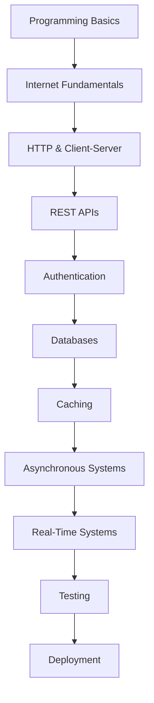

# Backend Engineering Roadmap

This roadmap outlines the recommended learning sequence for this repository.

The roadmap is intentionally ordered so that each module builds on knowledge from previous modules.

---

## Roadmap Overview

---

## Module 1 — Internet Fundamentals

**Folder:** `docs/01-internet-fundamentals`

### Topics
- Internet
- DNS
- Domain Names
- IP Address
- Routing
- TCP/IP
- Client Server Architecture
- Browser
- Server
- HTTP
- HTTPS
- TLS

### Prerequisites
None. This module starts from first principles.

---

## Module 2 — REST API Engineering

**Folder:** `docs/02-rest-api-engineering`

### Topics
- APIs
- REST
- Resources
- CRUD
- Endpoints
- API Design
- Validation
- Error Handling
- API Security

### Prerequisites
**Recommended:** Module 1 (Internet Fundamentals)
> Understanding HTTP requests and responses is important before learning API design.

---

## Module 3 — Authentication & Authorization

**Folder:** `docs/03-authentication-and-authorization`

### Topics
- Identity
- Authentication
- Authorization
- Sessions
- Cookies
- JWT
- OAuth
- RBAC

### Prerequisites
**Recommended:** Module 1 & Module 2
> Authentication is built on HTTP, cookies, headers, and APIs.

---

## Module 4 — Database Engineering

**Folder:** `docs/04-database-engineering`

### Topics
- Tables
- Schema Design
- Relationships
- Normalization
- Indexes
- Query Optimization
- Transactions
- ACID
- Replication
- Partitioning

### Prerequisites
No strict prerequisite.
> However, understanding REST APIs (Module 2) makes it easier to understand how applications interact with databases.

---

## Module 5 — Caching & Redis

**Folder:** `docs/05-caching-and-redis`

### Topics
- Redis
- Cache Aside
- Write Through
- Write Back
- Distributed Cache
- Cache Consistency

### Prerequisites
**Recommended:** Module 4 (Database Engineering)
> Caching makes more sense once you understand databases and application performance.

---

## Module 6 — Asynchronous Systems

**Folder:** `docs/06-asynchronous-systems`

### Topics
- Background Jobs
- Queues
- RabbitMQ
- Kafka
- Event Driven Architecture

### Prerequisites
**Recommended:** Module 2 & Module 4
> A basic understanding of APIs and databases is helpful before learning asynchronous architectures.

---

## Module 7 — Real-Time Systems

**Folder:** `docs/07-real-time-systems`

### Topics
- Polling
- Long Polling
- WebSockets
- Chat Architecture
- Notification Systems

### Prerequisites
**Recommended:** Module 1 & Module 2
> Knowledge of HTTP and networking concepts is useful before exploring real-time communication.

---

## Module 8 — Testing

**Folder:** `docs/08-testing`

### Topics
- Unit Testing
- Integration Testing
- API Testing
- Mocking

### Prerequisites
**Recommended:** Modules 2–7
> Testing becomes much more meaningful once you've built backend applications.

---

## Module 9 — Deployment

**Folder:** `docs/09-deployment`

### Topics
- Environment Variables
- Docker
- Docker Compose
- CI/CD
- Vercel
- Render
- Railway
- VPS

### Prerequisites
**Recommended:** Modules 1–8
> Deployment assumes you already have applications to package, test, and deploy.

---

## Before You Start

This repository assumes you already know:
- Basic programming concepts
- Variables
- Functions
- Loops
- Conditional statements

You **do not** need prior knowledge of:
- Backend frameworks
- Databases
- Networking
- Authentication
- Docker
- Cloud platforms

These topics are covered from the fundamentals.

---

## Recommended Companion Skills

While studying backend engineering, consider learning these alongside the repository:
- Git & GitHub
- Linux Command Line
- SQL Practice
- Data Structures & Algorithms
- Object-Oriented Programming
- Basic System Design

These are recommended but **not mandatory** to begin learning from this repository.

---

## A Note on Prerequisites

Some modules list **recommended prerequisites**, not strict requirements. You can explore any topic independently, but following the roadmap in order will provide the strongest conceptual foundation.
