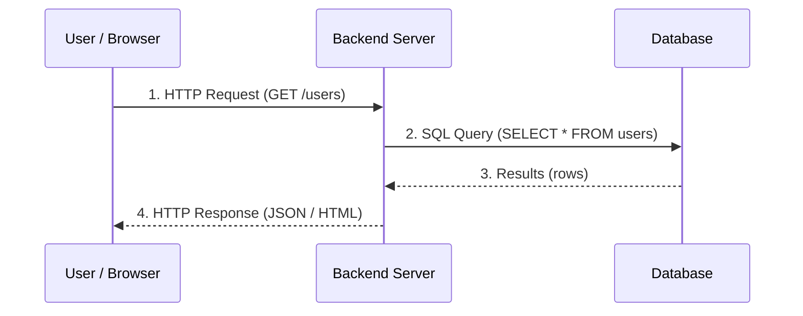
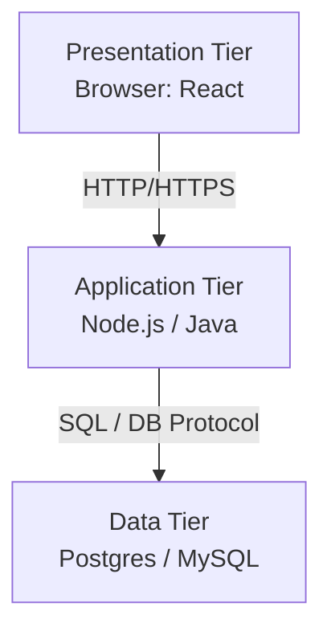
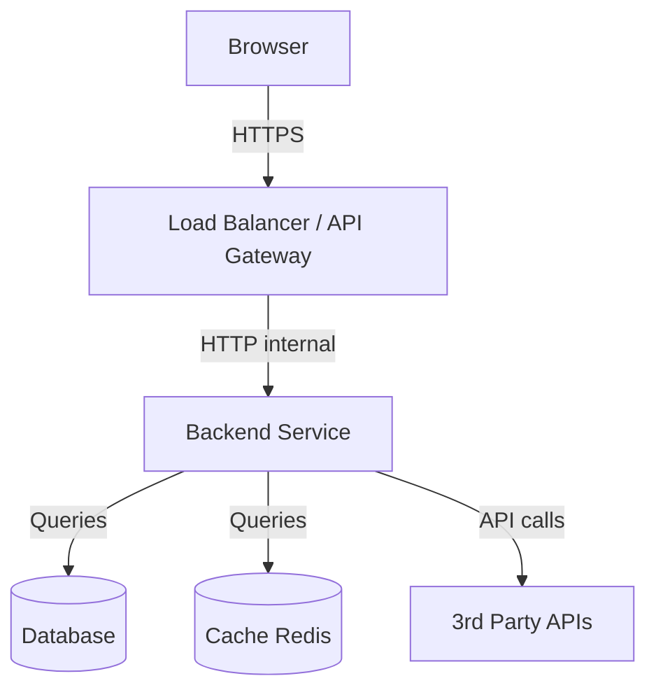

# Day 2: Client–Server Architecture & Request Flow
*(Textbook-style, from first principles — with intuition, diagrams, and production context)*

***

## SECTION 1: INTUITION

Think of a **restaurant**:

- **Client** = customer (you)  
- **Frontend** = menu + waiter’s interaction (what you see and click)  
- **Backend** = kitchen where chefs prepare food (business logic)  
- **Database** = storage room / fridge (where ingredients are kept)  

Flow:

1. You read the **menu** and tell the waiter your order → browser UI and clicks.  
2. Waiter writes order, takes it to the **kitchen** → frontend sends HTTP request to backend.  
3. Chef uses **ingredients from storage** → backend queries database.  
4. Chef plates food and gives it to waiter → backend forms response.  
5. Waiter serves food to you → frontend updates UI with data.

> [!TIP]
> **Simple Analogy:**  
> The browser says: "I need this data."  
> The server replies: "Okay, I will fetch it from the database, process it, and send it to you."  
> That is the **client–server model** in a nutshell.

***

## SECTION 2: THEORY – CLIENT, SERVER, FRONTEND, BACKEND

### Client–Server Model

- **Client**:  
  - A program that **initiates** requests and **consumes** responses.  
  - Examples: Web browser, mobile app, Postman, IoT device.  
- **Server**:  
  - A program that **listens** for requests on a network and **responds** with data or actions.  
  - Examples: Web server, API server, database server.  
- Communication happens over protocols like **HTTP/HTTPS** for web apps.

Key properties:

- Many clients → few servers.  
- Servers are usually always-on and more powerful.  
- Communication is typically **request–response**.

***

### Frontend vs Backend vs Database

#### Frontend (Client-Side)

- Runs in the user’s browser (or mobile app).  
- Technologies: HTML, CSS, JavaScript, React / Vue / Angular, etc.  
- Responsibilities:
  - Render UI.
  - Capture user actions (clicks, forms, etc.).
  - Make HTTP requests to backend (`fetch`, `axios`, etc.).
- Lives on the **client side**.

#### Backend (Server-Side)

- Runs on servers (in data centers / cloud).  
- Technologies: Node.js, Java/Spring, Go, Python/Django/FastAPI, Ruby/Rails, etc.  
- Responsibilities:
  - Business logic.
  - Authentication, authorization.
  - Talk to databases and other services.
  - Expose **APIs** (usually REST/HTTP).

#### Database (Data Tier)

- Dedicated system to store and query data.  
- Examples: PostgreSQL, MySQL, MongoDB, Redis.  
- Backend connects to DB, runs queries, gets results, and returns them to the client.

***

### Three-Tier Web Architecture (Common in Production)

Many modern web apps follow **3 tiers**:

1. **Presentation tier (Frontend)**  
   - Browser UI, HTML/CSS/JS.  
2. **Application tier (Backend)**  
   - API / business logic, runs on server.  
3. **Data tier (Database)**  
   - DBMS (Postgres, MySQL, etc.).  

Flow: **Browser → Web Server / App → Database → App → Browser**.

> ✅ **[Principal Engineer Note]: The Reality of N-Tier Architecture**
> *While textbooks teach "3-tier", a real Silicon Valley production environment is usually N-tier. We inject a CDN before the Presentation Tier, a Load Balancer before the Application Tier, an In-Memory Cache (Redis) before the Data Tier, and asynchronous Message Queues (Kafka) beside the Application Tier. 3-tier is just the logical starting point.*

***

## SECTION 3: VISUAL DIAGRAMS

### Diagram 1: Simple Client–Server Web App



***

### Diagram 2: Three-Tier Architecture



***

### Diagram 3: Typical Request Path in a Startup



In Day 2, focus is **Browser ↔ Backend ↔ DB**, not load balancers yet (we’ll do that in scaling).

***

## SECTION 4: PRODUCTION EXAMPLES

### Example 1: Swiggy / Zomato – See Restaurants List

Scenario: User opens app → sees nearby restaurants.

1. **Client (mobile app / web)**:
   - Calls `GET /restaurants?lat=...&lng=...` to backend API.  
2. **Backend**:
   - Validates query params.
   - Applies business rules (e.g., open/closed, rating filter).  
   - Queries database: restaurants near location.  
3. **Database**:
   - Returns rows matching lat/lng + filters.  
4. **Backend**:
   - Transforms rows into JSON: `[{id, name, rating, eta, ...}]`.  
5. **Client**:
   - Receives JSON, renders UI list.  

This is **client–server** with **frontend** (App) + **backend** (API) + **database**.

***

### Example 2: Modern SPA (Single Page Application)

For something like **Netflix** web:

- **Frontend**:
  - Built with React.
  - Fetches data via `fetch('/api/movies')`.  
- **Backend**:
  - Exposes REST APIs like `/api/movies`, `/api/user/profile`, `/api/watchlist`.  
- **Database**:
  - Stores users, movies, watch history.  

Front and back are often deployed separately (e.g., frontend on CDN, backend on cloud VMs/containers).

***

## SECTION 5: BACKEND IMPLEMENTATION VIEW

How does a backend dev see the request flow?

### 1. Request Flow Step-by-Step

Taking a simple `GET /users/42` (fetching user details):

1. **Browser**:
   - JS runs:  
     ```js
     fetch('https://api.example.com/users/42')
       .then(res => res.json())
       .then(data => console.log(data));
     ```  
2. **Network**:
   - DNS → TCP → TLS → HTTP (already learned Day 1).  
3. **Backend server**:
   - Receives HTTP request on `/users/42`.  
   - Router matches it to a handler.  
4. **Handler**:
   - Extracts `id = 42`.  
   - Calls DB: `SELECT * FROM users WHERE id = 42`.  
5. **Database**:
   - Returns row with user data.  
6. **Backend**:
   - Serializes data into JSON.  
   - Returns HTTP 200 with JSON body.  
7. **Browser**:
   - JS receives JSON and updates the DOM.

***

### 2. Example Backend Code (Node.js + Express)

```js
const express = require('express');
const app = express();

// JSON body parsing middleware
app.use(express.json());

// Route handler: GET /users/:id
app.get('/users/:id', async (req, res) => {
  const userId = req.params.id;

  try {
    // pseudo-code: dbClient.query(...) calls DB
    const user = await dbClient.query('SELECT * FROM users WHERE id = $1', [userId]);

    if (!user) {
      return res.status(404).json({ message: 'User not found' });
    }

    // Send JSON response
    res.json({ id: user.id, name: user.name, email: user.email });
  } catch (err) {
    console.error('Error fetching user', err);
    res.status(500).json({ message: 'Internal server error' });
  }
});

app.listen(3000, () => {
  console.log('API server listening on port 3000');
});
```

> ✅ **[Principal Engineer Note]: Connection Pooling**
> *In the code above, `dbClient.query(...)` hides a massive production secret. Beginners often open a new database connection for every single HTTP request. Establishing a TCP connection to PostgreSQL takes ~10-20ms and allocates ~10MB of RAM per connection. If 1,000 users hit this endpoint simultaneously, the database will instantly crash from OOM (Out of Memory). Production backends ALWAYS use a **Connection Pool** (a persistent set of 10-50 reusable database connections) to multiplex thousands of HTTP requests across a tiny number of actual DB connections.*

> [!NOTE]
> **Notice:**
> - Frontend doesn’t know DB details; it just knows `/users/42`.  
> - Backend hides **database schema** and **business logic**.  
> - This separation is core to **client–server architecture**.

***

## SECTION 6: COMMON MISTAKES & MISCONCEPTIONS

1. **Confusing “client” with “frontend code only in browser.”**  
   - Client can be anything: browser, mobile app, another server acting as a client.

2. **Tight coupling between frontend and backend.**  
   - Frontend should not depend on DB schema directly.  
   - Use clear API contracts (REST/JSON, well-defined endpoints).

3. **Putting too much logic on frontend.**  
   - Security-sensitive logic must be on backend (auth checks, business rules).  
   - Frontend can be reverse-engineered.

4. **Letting frontend query DB directly.**  
   - Very bad; DB must be in a private network behind backend.  
   - Always go through backend API.

5. **Not understanding statelessness.**  
   - HTTP is stateless; server does not “remember” previous requests by default.  
   - Backend uses sessions, tokens, or DB to maintain state.

6. **Not separating tiers.**  
   - For small apps, you might have everything in one server, but still think in terms of:
     - Presentation (views, templates).
     - Logic (handlers, services).
     - Data (repositories/DAOs).

***

## SECTION 7: INTERVIEW QUESTIONS (DAY 2 FOCUS)

1. Explain the **client–server model** in your own words.  
2. What is the difference between **frontend** and **backend**? Give examples of responsibilities of each.  
3. Why don’t browsers talk directly to databases in production systems?  
4. Explain the **request flow** when a user clicks “Login” and sends credentials.  
5. What is a **three-tier architecture**? Why is it better than having everything in one big script?  
6. What is a **database server** vs an **application server**?  
7. What would change in the flow if your client is a **mobile app** instead of a browser?  
8. Why is it beneficial to keep the **database in a private network**, not directly exposed to the Internet?  
9. How would you describe the difference between a **monolithic backend** and **microservices** in terms of client–server architecture?  
10. Can a server also be a client? Give an example (hint: backend calling another API).  

***

## SECTION 8: REVISION NOTES (CHEAT SHEET)

- **Client**: initiates requests, consumes responses (browser, mobile, other servers).  
- **Server**: listens for requests, processes them, sends responses (API, DB).  
- **Frontend**: presentation layer (HTML/CSS/JS, UI, fetches data).  
- **Backend**: application layer (business logic, auth, DB access).  
- **Database**: data layer (persistent storage).  
- **Request flow**:  
  ```text
  Client (UI) → HTTP Request → Backend (logic) → DB (query)
              ← HTTP Response ←         ← Data
  ```
- Use **clear API boundaries** between frontend and backend.  
- HTTP is **stateless**; state is managed via sessions/tokens, not by “remembering” connections.

***

## SECTION 9: HANDS-ON ASSIGNMENT

### Task 1: Pure Diagram

Draw (on paper or in a markdown file) a diagram showing:

- Browser → Backend → Database.  
- Label:
  - “HTTP request”, “HTTP response”.  
  - “SQL query”, “rows result”.  
- Show **arrows** and direction of data flow.

### Task 2: Build a Tiny Client–Server Demo

Use any stack you like (Node, Python, etc.).

1. **Backend**:
   - Expose endpoint `GET /time` that returns:
     ```json
     { "serverTime": "<current_time>" }
     ```
2. **Frontend**:
   - Simple HTML page with a button “Get server time”.
   - On click, call `/time` via `fetch` and display result on the page.

Pseudo-frontend:

```html
<button id="btn">Get server time</button>
<div id="output"></div>
<script>
  document.getElementById('btn').onclick = async () => {
    const res = await fetch('/time');
    const data = await res.json();
    document.getElementById('output').innerText = data.serverTime;
  };
</script>
```

You’ll see **client–server** in action: browser calling backend, backend responding with computed data.

### Task 3: Variations

- Change backend to also read from a file or DB (even a local JSON file).  
- Add endpoint `GET /hello?name=Raj` → returns `Hello, Raj`.  

***

## SECTION 10: MINI PROJECT (DAY 2)

**Project:** Design a simple “User Profile” system with clear client–server–DB boundaries.

Requirements:

1. **Endpoints** (backend):
   - `GET /users/:id` → returns user details `{id, name, email}`.  
   - `POST /users` → create new user.  
2. **Database schema** (logical, no need to actually create yet):
   - Table: `users(id, name, email, created_at)`.  
3. **Frontend pages**:
   - “Create User” form (name, email).  
   - “View User” page that fetches `/users/:id`.  
4. **Draw architecture**:
   - Show browser pages, backend endpoints, DB table, and how data flows.

Goal: think like a **product engineer**: UI flows + backend APIs + DB.

***

## ACTIVE LEARNING – YOUR TURN

To lock in Day 2, answer this in your own words:

> Consider a simple feature: “Show my profile” on a web app.  
> Describe the **complete request flow** when the user clicks “My Profile” in the navbar.  
> Include: browser, frontend code, backend, database, and what each layer is responsible for.

Try to be concrete (mention at least one example endpoint and one example DB query).
