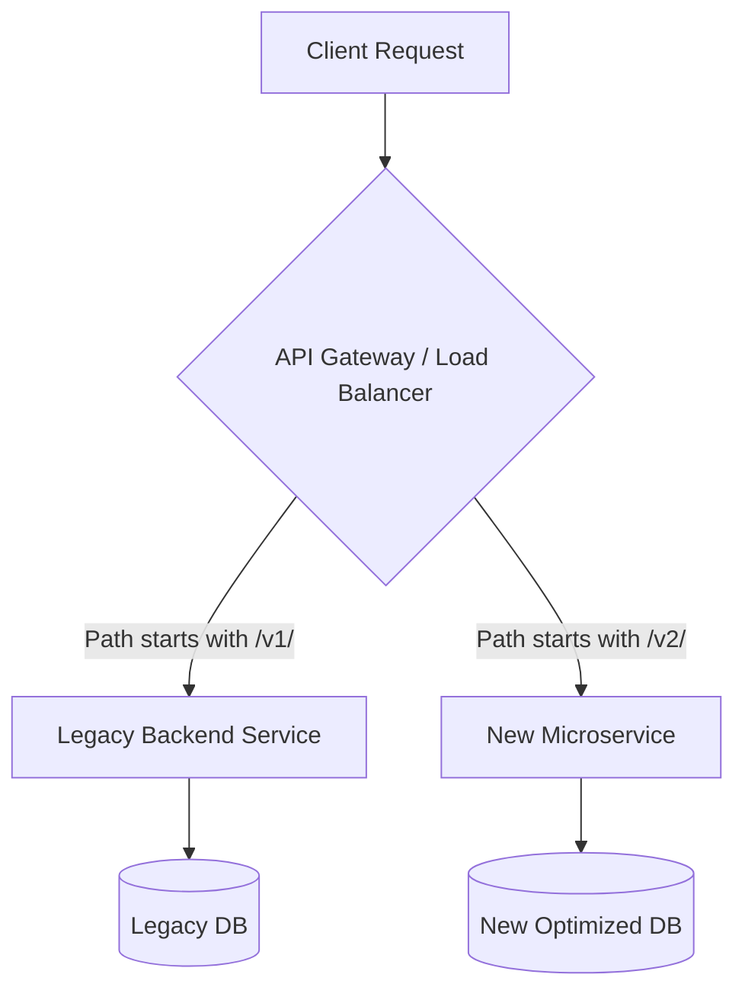

# Day 5: Professional API Design (Expanded Deep Dive)
*(Deep dive: naming conventions, advanced pagination, complex filtering, sorting, versioning – from first principles, production-grade, with tradeoffs)*

***

## SECTION 1: INTUITION

Imagine you’re building a **library catalog API**.

You want to:
- List all books.
- Search by title, author, category.
- Show results page by page (not 100,000 books at once).
- Let users sort by relevance, date, rating.
- Evolve the API over time without breaking existing clients.

This is exactly what **professional API design** is about:
- **Naming:** clear, consistent, predictable URLs.
- **Pagination:** handle large datasets without blowing up memory or latency.
- **Filtering:** support searches like “books by author X” or “order status = pending”.
- **Sorting:** support `?sort=created_at&order=desc`.
- **Versioning:** change API safely as product grows.

> [!TIP]
> **Simple Analogy:**  
> "An API is a public contract. Once published and used by 1000 clients, any change can be a breaking change.  
> So we design it such that it is:
> - easy to use,
> - scalable,
> - and can be changed later without panic."

***

## SECTION 2: THEORY – CORE CONCEPTS

### 2.1 Why “Professional” API Design Matters

Early-stage startups often write **quick, messy APIs**:
- `/getAllUsers`
- `/getUserById`
- No pagination
- No consistent error format
- No versioning

This works for a few internal endpoints. But when:
- You have **external clients** (mobile apps, partners),
- You need to **scale** to thousands of requests/sec,
- You want to **change** behavior without breaking clients,

then you need **professional API design**.

**Key goals:**
1. **Consistency** – predictable patterns across all endpoints.
2. **Discoverability** – easy for developers to understand without reading massive docs.
3. **Efficiency** – no wasteful data, no huge payloads.
4. **Evolvability** – can change without breaking existing clients.

***

### 2.2 Naming Conventions in Depth

#### 2.2.1 Use Resource-Oriented Names (Nouns, Not Verbs)

RESTful APIs use **nouns** for resources:
- **Good**: `/users`, `/orders`, `/products`
- **Bad**: `/getUsers`, `/createOrder`, `/deleteProductById`

**Why?**
- HTTP methods are verbs (`GET`, `POST`, `DELETE`).  
- The URL should be the **resource** (noun).  
- This makes API design **uniform** and **intuitive**.

> **Rule:**  
> **URL = path to a resource (noun).**  
> **Method = action (verb).**

#### 2.2.2 Handle "Actions" (The Exception to the Noun Rule)
Sometimes an operation doesn't cleanly map to CRUD. For instance, "Activating" a user or "Refunding" an order.
**Best Practice:** Treat the action as a sub-resource or use a verb as a suffix.
- `POST /users/{id}/activate` (Preferred)
- `POST /orders/{id}/refund` (Preferred)

> ✅ **[Principal Engineer Note]: The REST Purism Trap**
> *A massive mistake mid-level engineers make is trying to force complex state-machine transitions into pure CRUD REST. If refunding an order involves 14 different side-effects (emailing the user, hitting Stripe, updating inventory), do NOT try to do `PATCH /orders/{id} { "status": "refunded" }`. Use an RPC-style action endpoint like `POST /orders/{id}/refund`. Pragmatism > Purism in production!*

#### 2.2.3 Use Hierarchical Paths for Relationships

For related resources:
- `/users/{userId}/orders` → List all orders for a specific user.
- `/orders/{orderId}/items` → List items in an order.

This is **natural hierarchy**:
```text
/users/{id}          → single user
/users/{id}/orders   → user’s orders
/orders/{id}/items   → items in an order
```

**Avoid nesting too deeply:** `/users/{id}/orders/{id}/items/{id}` is too long. If you need a specific item, just use `/items/{id}`.

#### 2.2.4 Path Casing

**Best practice:**
- Paths: lowercase, hyphens (kebab-case) for readability.
- Examples: `/user-profiles`, `/order-items`, `/product-categories`

***

### 2.3 Advanced Pagination

#### Why Pagination Exists

If you have 10M users and do `GET /users`, returning all users causes:
- Huge JSON payloads (100MB+).
- Slow DB queries that lock tables.
- Out-Of-Memory (OOM) crashes on the server.

#### 2.3.1 Offset-Based Pagination
Client sends:
- `page`: which page number.
- `limit`: how many items per page.

```http
GET /orders?page=1&limit=20
```
- **Pros:** Simple, intuitive. Allows jumping to a specific page.
- **Cons:** 
  - **Page Skipping:** If an item is added to page 1 while the user is viewing page 1, when they click page 2, the last item of page 1 shifts to page 2 (they see a duplicate).
  - **Deep Pagination Performance:** `OFFSET 100000 LIMIT 20` requires the DB to scan and discard 100,000 rows. It becomes incredibly slow.

> ✅ **[Principal Engineer Note]: Why OFFSET Kills Databases**
> *In a SQL database (like Postgres), `OFFSET 1,000,000` forces the database engine to perform a **Sequential Scan**. It literally reads one million rows from the hard drive, counts them, throws them in the trash, and then reads the next 20 to return to you. This consumes massive I/O and CPU, leading to cascading outages. Never allow users to input arbitrary offsets!*

#### 2.3.2 Cursor-Based Pagination
Instead of an offset, the client sends a `cursor` (a pointer to the last item they saw).

```http
GET /orders?cursor=eyJpZCI6MTIzLCJkYXRlIjoiMjAyNiJ9&limit=20
```
*(Notice the cursor is often Base64 encoded JSON to hide DB internals from the client).*

- **Pros:** 
  - Highly performant. The DB can use an index: `WHERE id > 123 LIMIT 20`.
  - Immune to page skipping when new items are added.
- **Cons:** Cannot jump directly to “page 100”. Must navigate sequentially.
- **Use when:** Infinite scrolling feeds, large scale datasets.

#### 2.3.3 Keyset Pagination (The SQL behind Cursors)
Keyset pagination relies on a stable, indexed sorting key.
```sql
SELECT * FROM orders 
WHERE (created_at, id) < ('2026-06-01T12:00:00Z', 123)
ORDER BY created_at DESC, id DESC
LIMIT 20;
```
This guarantees an instant index seek, making it O(1) time complexity regardless of how deep the pagination goes.

#### 2.3.4 Pagination Response Format

**Include pagination links (RESTful HATEOAS style):**
```json
{
  "data": [ ... ],
  "meta": {
    "total": 10000,
    "has_next": true
  },
  "links": {
    "self": "https://api.example.com/orders?cursor=abc",
    "next": "https://api.example.com/orders?cursor=def"
  }
}
```

***

### 2.4 Complex Filtering

#### 2.4.1 Simple Filters & Arrays
```http
GET /orders?status=pending
```
For multiple values, support comma-separated lists or multiple query params:
```http
GET /orders?status=pending,shipped
GET /orders?status=pending&status=shipped
```
SQL equivalent: `WHERE status IN ('pending', 'shipped')`

#### 2.4.2 Range Filters
Use suffixes for ranges:
```http
GET /products?price_gte=500&price_lte=2000
```
(`gte` = greater than or equal, `lte` = less than or equal).

#### 2.4.3 Object-Based Filtering (JSON in Query)
For highly complex APIs, some teams use bracket notation:
```http
GET /users?filter[name][like]=john&filter[age][gt]=18
```
This requires a sophisticated query parser on the backend but offers immense flexibility.

***

### 2.5 Sorting and Database Indexing

#### 2.5.1 Basic Sorting
```http
GET /users?sort=-created_at,name
```
*(A common convention: `-` prefix means descending, no prefix means ascending).*

#### 2.5.2 Indexing Implications
Allowing clients to sort by *any* column is a massive performance risk.
If a client sorts by an unindexed column on a 10-million row table, the database must perform a "File Sort" in memory, which can take seconds and spike CPU.
**Best Practice:** Only allow sorting on specific, whitelisted columns that have B-Tree indexes in the database.

***

### 2.6 Versioning Strategies

APIs evolve. If you change a response structure, you break existing mobile apps that haven't been updated.

#### 2.6.1 URL-Based Versioning (Most Common & Recommended)
```http
GET /v1/users
GET /v2/users
```
- **Pros:** Explicit, easy to test in a browser, easily routed by API Gateways (AWS API Gateway, Nginx) to completely different backend microservices.
- **Cons:** Technically violates REST purism (the resource is a user, not a "v1 user").

#### 2.6.2 Header-Based Versioning (Content Negotiation)
```http
GET /users
Accept: application/vnd.mycompany.v2+json
```
- **Pros:** Clean URLs. Pure REST.
- **Cons:** Hard to test via simple browser clicks. Harder to cache at the CDN layer.

#### 2.6.3 Evolving APIs Safely
- **Additive changes are safe:** Adding a new field to a JSON response won't break clients.
- **Destructive changes are breaking:** Removing a field, renaming a field, or changing a data type (string to int).
- **Deprecation Policy:** Add a `Sunset` HTTP header to responses to warn developers that a v1 endpoint will be deactivated on a specific date.

> ✅ **[Principal Engineer Note]: The Move to GraphQL**
> *Because REST versioning and payload sizes (Over-fetching) become incredibly painful at massive scale, companies like Meta invented **GraphQL**. In GraphQL, there is typically only one endpoint (`POST /graphql`). Clients query exactly the fields they want. If you need to deprecate a field, you simply mark it `@deprecated` in the schema and track exactly which clients are still requesting it before safely deleting it.*

***

## SECTION 3: VISUAL DIAGRAMS

### Diagram 1: Keyset/Cursor Pagination vs Offset Pagination

```mermaid
graph TD
    subgraph Offset Pagination (Slow at scale)
        A[GET /orders?offset=100000] --> B[DB scans 100,020 rows]
        B --> C[DB discards 100,000 rows]
        C --> D[Returns 20 rows]
    end

    subgraph Cursor Pagination (Fast at scale)
        E[GET /orders?cursor=last_id_99999] --> F[DB uses B-Tree Index]
        F --> G[Instantly jumps to ID 99999]
        G --> H[Returns next 20 rows]
    end
```

***

### Diagram 2: Advanced API Versioning Routing



***

## SECTION 4: BACKEND IMPLEMENTATION

Let’s build a **professional-style API** for `orders` handling pagination, filtering, and sorting robustly.

### Request Parsing (Node.js + Express)

```js
app.get('/v1/orders', async (req, res) => {
  const {
    status,
    min_total,
    sort = '-created_at', // Default sort descending
    cursor, // For cursor pagination
    limit = 20
  } = req.query;

  const limitNum = Math.min(100, Math.max(1, parseInt(limit, 10))); // Cap limit at 100

  // 1. Build dynamic WHERE clause safely
  const conditions = [];
  const values = [];
  let paramIndex = 1;

  if (status) {
    conditions.push(`status = $${paramIndex++}`);
    values.push(status);
  }
  
  if (min_total) {
    conditions.push(`total >= $${paramIndex++}`);
    values.push(parseFloat(min_total));
  }

  // 2. Cursor Pagination Logic
  if (cursor) {
    // Decode base64 cursor -> { id: 1234, created_at: '...' }
    const decodedCursor = JSON.parse(Buffer.from(cursor, 'base64').toString('ascii'));
    
    // Keyset pagination condition (assuming sorting by created_at DESC, id DESC)
    conditions.push(`(created_at, id) < ($${paramIndex++}, $${paramIndex++})`);
    values.push(decodedCursor.created_at, decodedCursor.id);
  }

  const whereClause = conditions.length ? `WHERE ${conditions.join(' AND ')}` : '';

  // 3. Sorting (Whitelist allowed columns!)
  const allowedSorts = {
    '-created_at': 'created_at DESC, id DESC',
    'created_at': 'created_at ASC, id ASC',
    'total': 'total ASC, id ASC',
    '-total': 'total DESC, id DESC'
  };
  const sqlSort = allowedSorts[sort] || allowedSorts['-created_at'];

  // 4. Execute Query
  const sql = `
    SELECT * FROM orders
    ${whereClause}
    ORDER BY ${sqlSort}
    LIMIT ${limitNum}
  `;

  const rows = await db.query(sql, values);

  // 5. Generate next cursor
  let nextCursor = null;
  if (rows.length === limitNum) {
    const lastRow = rows[rows.length - 1];
    const cursorObj = { id: lastRow.id, created_at: lastRow.created_at };
    nextCursor = Buffer.from(JSON.stringify(cursorObj)).toString('base64');
  }

  res.json({
    data: rows,
    meta: {
      has_next: nextCursor !== null,
      next_cursor: nextCursor
    }
  });
});
```

**Key production points:**
- Limits are hard-capped (e.g., `Math.min(100, limit)`). You cannot allow a client to request 1,000,000 items.
- Sorting uses a strict dictionary mapping (`allowedSorts`) preventing SQL injection.
- The cursor is Base64 encoded to abstract internal column structures from the frontend.

***

## SECTION 5: COMMON MISTAKES

1. **Allowing deep offset pagination:** Results in database DOS (Denial of Service) attacks. 
2. **Not hard-capping `limit`:** Client requests `?limit=99999999`, crashing your API. (Fix: enforce a max limit of 50-100).
3. **Not validating sort/order:** Allowing arbitrary column names opens up SQL injection risk. (Fix: validate against allowed fields).
4. **Breaking contracts:** Renaming a field from `userId` to `customer_id` without bumping the API version.
5. **Over-filtering in URL:** Too many params create long URLs that hit HTTP max length limits. (Fix: use `POST /search` with a JSON body for complex filters).

***

## SECTION 6: INTERVIEW QUESTIONS

1. Why do we use **plural nouns** in REST endpoints?  
2. Detail the exact database performance differences between **offset-based** and **cursor-based** pagination.
3. How do you implement filtering by multiple statuses (e.g., pending OR shipped) in a RESTful way?
4. How do you handle **sorting** safely without allowing arbitrary column injection? What indexes do you need?
5. Why is API **versioning** important? Give examples of additive vs destructive breaking changes.
6. What are the tradeoffs of **URL-based** vs **header-based** versioning from an infrastructure (CDN/Gateway) perspective?
7. Explain Keyset pagination and write the SQL `WHERE` clause for it.
8. What is a “deep pagination” problem, and why does `OFFSET` get slower the deeper you go?

***

## SECTION 7: REVISION NOTES (CHEAT SHEET)

- **Naming**: Use plural nouns (`/users`). Treat actions as sub-resources (`/users/{id}/activate`).
- **Pagination**: 
  - Offset: `page`, `limit` (Simple, but slow at scale).
  - Cursor/Keyset: `cursor`, `limit` (Fast, relies on indexing, immune to data shifting). Always hard-cap the `limit`.
- **Filtering**: Use query params. Map to SQL `WHERE`. Use arrays for multiple values (`?status=A,B`).
- **Sorting**: Map clean query params (`-created_at`) to secure, whitelisted SQL columns. Require B-Tree indexes on sort columns.
- **Versioning**: URL (`/v1/users`) is most pragmatic. Additive changes are safe; destructive changes require a new version.

***

## SECTION 8: HANDS-ON ASSIGNMENT

Design a **professional REST API** for `products` with:
- Cursor-based pagination.
- Filtering by `category`, `price_gte`, `price_lte`, `in_stock`.
- Sorting by `-price`, `price`, `-created_at`.
- Versioning: `/v1/products`.

**Tasks:**
1. Write the full URL for: List products in category “shoes”, price >= 500 and <= 2000, sorted by price asc, requesting 20 items and passing a cursor.
2. Write the secure Node.js pseudo-code to parse the query parameters and build the SQL query.
3. Define response JSON including HATEOAS `links` for the next page.

***

## ACTIVE LEARNING – YOUR TURN

Design the full URL for:

> “List orders with status = pending, total >= 100, sorted by created_at descending, capped at 50 per page.”

Then write the corresponding SQL query (with `WHERE`, `ORDER BY`, `LIMIT`) assuming this is the first page (no cursor provided yet).
