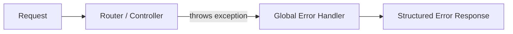

# Day 6: Error Handling & Validation
*(Deep dive: structured errors, HTTP status codes, validation layers, and global exception handling)*

***

## SECTION 1: INTUITION

Think of an API like a conversation between two engineers on Slack.

- **Bad conversation:**  
  - “Something broke.”  
  - “Error.”  
- **Good conversation:**  
  - “Your request is invalid because the `email` field is not a valid address. Please send a valid email. Example: `user@example.com`.”

**For APIs:**
- You *will* have errors: bad inputs, missing authentication, database downtime, timeouts, and bugs.  
- What matters is:
  - **Correct HTTP status code**
  - **Consistent error body shape**
  - **Enough detail for the caller (but no sensitive internals)**
  - **Errors handled in one place (globally)** rather than copy–pasting `try/catch` everywhere.

> [!TIP]
> **Simple Analogy:**  
> "Errors will inevitably happen. The question is: does the client understand what went wrong, and can you log/monitor it effectively? A professional API means predictable, structured errors."

***

## SECTION 2: THEORY – TYPES OF ERRORS & STATUS CODES

### 2.1 Broad Error Categories

From a REST API point of view, errors roughly fall into two groups:

1. **Client errors (4xx)** – The request is wrong.
   - Invalid JSON, missing fields, failed validation.
   - Auth missing or invalid, forbidden access, resource not found, too many requests.
2. **Server errors (5xx)** – The server failed while processing a valid request.
   - Unhandled exceptions, database down, downstream service failure.

**Design Rule:** Use **specific 4xx codes** for client mistakes, and reserve **5xx** for actual server-side faults.

***

### 2.2 Status Code Mapping (Error-Focused)

A professional mapping of error HTTP status codes:

**Client Errors:**
- **400 Bad Request**: Request is malformed (invalid JSON, wrong `Content-Type`, invalid query param format).
- **401 Unauthorized**: Missing or invalid authentication (no token or invalid token).
- **403 Forbidden**: Authenticated, but not allowed (missing permission or role).
- **404 Not Found**: Resource does not exist (e.g., user ID 9999 not found).
- **409 Conflict**: State conflict (e.g., duplicate unique field, version conflict).
- **422 Unprocessable Entity**: Request body is structurally correct but **fails business/validation rules** (e.g., invalid email, password too short).
- **429 Too Many Requests**: Rate limit exceeded.

> ✅ **[Principal Engineer Note]: The 429 Retry-After Header**
> *In production, returning a 429 without telling the client when to retry is a cardinal sin. If you just return 429, thousands of clients will immediately retry in a tight loop, acting as a DDoS attack against your own servers. Always include the `Retry-After: 30` header (retry in 30 seconds) and `X-RateLimit-Reset` so well-behaved clients back off gracefully.*

**Server Errors:**
- **500 Internal Server Error**: Unknown/unhandled exception.
- **502 Bad Gateway**: Reverse proxy / gateway got an invalid response from upstream.
- **503 Service Unavailable**: Temporary outage, overloaded, or maintenance.
- **504 Gateway Timeout**: Upstream service timed out.

> **Key Practice:** Don’t overload 400 or 500 for *everything*. Use specific codes so clients can respond intelligently.

***

## SECTION 3: ERROR RESPONSE DESIGN

### 3.1 Why Structured Error Bodies?

Frontend developers and API consumers need to:
- Show **user-friendly messages**.
- Programmatically react (e.g., highlight which fields are invalid on a form).
- Log error IDs for customer support.

**Best practice:** Define a **standard error schema** and use it everywhere.

### 3.2 Simple Custom Error Format

A common, clean pattern:

```json
{
  "error": "VALIDATION_ERROR",
  "message": "One or more fields are invalid.",
  "details": [
    {
      "field": "email",
      "issue": "INVALID_FORMAT",
      "message": "Email must be a valid email address."
    },
    {
      "field": "password",
      "issue": "TOO_SHORT",
      "message": "Password must be at least 8 characters long."
    }
  ],
  "requestId": "c91a4f01-..."
}
```

**Fields:**
- `error`: Short, machine-readable code.
- `message`: Human-readable summary.
- `details`: Field-level issues (crucial for validation).
- `requestId`: Correlation ID for logs and tracing.

***

### 3.3 RFC “Problem Details” Standard

The modern best-practice is to use **Problem Details** (RFC 9457).

**Canonical fields:**
- `type`: URI identifying the error type (can be a docs link).
- `title`: Short, human-readable summary.
- `status`: HTTP status code.
- `detail`: Human-readable explanation.
- `instance`: URI/ID for this occurrence (e.g., requestId).

**Example:**
```json
{
  "type": "https://api.example.com/errors/validation",
  "title": "Invalid request parameters.",
  "status": 422,
  "detail": "One or more fields are invalid.",
  "instance": "urn:uuid:c91a4f01-...",
  "errors": {
    "email": ["Email must be a valid email address."],
    "password": ["Password must be at least 8 characters long."]
  }
}
```
*(Note: Many modern frameworks have built-in support for Problem Details.)*

***

## SECTION 4: VALIDATION

### 4.1 What is Validation?

Validation means checking that the **input is acceptable** before processing it:
- **Syntax validation:** Is the JSON valid? Are required fields present?
- **Semantic validation:** Is the email valid? Is the password long enough? Does it follow business rules (e.g., "checkout amount must be > 0")?

Validation runs **before** your core logic to:
- Avoid corrupt data in the DB.
- Avoid unnecessary, expensive calls (like payment processing).
- Provide clear, immediate feedback to the client.

***

### 4.2 Where to Put Validation?

Typical layering:
1. **Request parsing layer** (framework/controller):
   - Parse JSON, check `Content-Type`. If parsing fails → **400**.
2. **Validation layer**:
   - Check field-level rules using libraries (e.g., class-validator, Joi, Zod, Yup).
   - If it fails → **422** with structured field errors.
3. **Business logic**:
   - Handles domain-specific rules (e.g., product is out of stock).
   - Throws domain errors, which are mapped later to HTTP codes (like 409 Conflict).

***

### 4.3 Status Code for Validation Errors: 400 vs 422

- **400 Bad Request:** Use when the request is *syntactically bad* (malformed JSON, wrong `Content-Type`, missing required query param).
- **422 Unprocessable Entity:** Use when the request is syntactically OK (valid JSON) but **fails validation rules**.

> **Example:** Body `{ "email": "not-an-email", "password": "123" }` is well-formed JSON, but contains invalid data. Use **422**.

***

## SECTION 5: GLOBAL EXCEPTION HANDLING

### 5.1 Why Global?

**Without global handling:**
- Every controller/action requires a `try/catch` and custom error shaping.
- Inconsistent responses are inevitable.
- It’s easy to forget logging.

**With global exception handling:**
- One central place transforms all exceptions into standard HTTP responses.
- Consistent formatting.
- Clean controllers (they just `throw` errors, they don't format responses).

> [!TIP]
> **Simple Analogy:**  
> "Let controllers focus on business logic. The global handler will catch their thrown exceptions and format a proper error response."

***

### 5.2 Pattern: Custom Error Classes

In your backend, define custom error types:
- `ValidationError`
- `NotFoundError`
- `UnauthorizedError`
- `ForbiddenError`
- `ConflictError`
- `RateLimitError`
- `DomainError`

Controllers and services **throw** these errors. The global handler looks at the error type and returns the appropriate HTTP response.

***

### 5.3 Global Error Handler (Conceptual Flow)



**Responsibilities of the handler:**
- Log the exception (with `requestId` and stack trace).
- Map known error types to standard HTTP status codes and JSON formats (like Problem Details).
- For unknown/unexpected exceptions:
  - Return **500** with a generic message (do **not** leak the stack trace to the client).
  - Log full details internally.

> ✅ **[Principal Engineer Note]: Structured Logging & Distributed Tracing**
> *When your global error handler logs an exception, NEVER log simple text like `console.log('Error:', err.message)`. In microservices, text logs are useless. You must log **Structured JSON** containing the `requestId`, `userId`, `route`, and the full `stack`. Tools like Datadog, Splunk, or ElasticSearch parse this JSON automatically, allowing you to instantly correlate an error on the API Gateway with a failure deep inside the Database service using Distributed Tracing.*

***

## SECTION 6: COMMON MISTAKES

1. **Returning 200 for everything, including errors:** Forces clients to parse the body for `"success": false`. Breaks standard HTTP semantics.
2. **Using 500 for all errors:** The client can’t distinguish between validation, auth, or server issues. Makes retries and UX much harder.
3. **Leaking internal details:** Returning stack traces or raw SQL queries in production is a massive security risk and confusing for clients.
4. **No structured error format:** Each endpoint returning a different shape makes life hard for frontend teams and SDKs.
5. **Validation scattered everywhere:** Duplicated rules and inconsistent messages. Hard to update later.
6. **No global handler:** Inconsistent responses, missed logs, and swallowed exceptions.
7. **Using wrong status codes:** For example, using 401 for validation, or 404 for “wrong password”. (Wrong password is often 401, but validation input issues are 400/422).

***

## SECTION 7: INTERVIEW-STYLE QUESTIONS

1. Why should a REST API use **standard HTTP status codes** instead of returning 200 for everything?
2. When would you use 400 vs 422 vs 409 vs 500? Give examples.
3. What should a good API error response body contain? Why is consistency important?
4. How would you design validation error responses so that a frontend UI can highlight specific invalid fields?
5. What is **global exception handling**, and why is it better than a try/catch in every controller?
6. How do you prevent leaking sensitive details in error responses in a production environment?
7. What is the “Problem Details” format and what fields does it contain?
8. How can proper error handling support system reliability (e.g., retries, idempotency)?

***

## SECTION 8: REVISION NOTES (CHEAT SHEET)

- Use **specific HTTP status codes** for different classes of errors; don’t overload 400 or 500.
- Define a **standard error response format** (preferably Problem Details) with fields like `type`, `title`, `status`, `detail`, `instance`, plus field-level errors.
- **Validation**:
  - `400` for malformed input (e.g., invalid JSON syntax).
  - `422` for semantically invalid data (e.g., valid JSON, but fails rules like string length).
- Implement **global exception handling** to map exceptions to consistent responses and centralize your logging.
- Never return raw stack traces or database errors to clients in production.

***

## SECTION 9: HANDS-ON ASSIGNMENT

Take your API from the previous days (e.g., `POST /users`, `GET /users`) and add **proper error handling & validation**:

1. For `POST /users`:
   - Require `name` (min length 2) and `email` (valid format).
   - If JSON is invalid → `400 Bad Request` with an error body.
   - If validation fails → `422 Unprocessable Entity` with field-level errors.
2. For `GET /users/:id`:
   - If user is not found → `404 Not Found` with a clear error.
3. Implement a **global error handler**:
   - Map `ValidationError` → 422.
   - Map `NotFoundError` → 404.
   - Map unknown errors → 500 with a generic message.

*(Don't forget to log all 5xx errors with a `requestId` and include that ID in the client's error response.)*

***

## SECTION 10: MINI PROJECT

Build a small **Error Handling & Validation Demo API**:

- **Resource:** `orders`.
- **Endpoints:**
  - `POST /orders`
    - Required fields: `userId`, `items` (array, non-empty), `total` (> 0).
    - Handle invalid JSON → 400.
    - Handle validation issues → 422 with field details.
  - `GET /orders/:id`
    - 404 if not found.
- Implement a global error handler using a structured format (Problem Details-style).

*Test your endpoints by triggering each error in Postman or Insomnia and verifying the structured responses.*

***

## ACTIVE LEARNING – YOUR TURN

Imagine you have this endpoint:
```http
POST /v1/users
```
**Requirements:**
- Body must include `name` (string, min 2 chars) and `email` (valid email).
- If JSON is malformed → return 400.
- If JSON is valid but fields fail validation → return 422.

Describe, in your own words:
1. The **status code** and **error response body** you would return for:
   - (a) Malformed JSON.
   - (b) Valid JSON but `email = "abc"` and `name = ""`.
2. How your **global error handler** would distinguish between these two cases.
