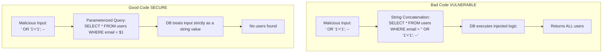
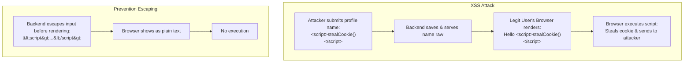
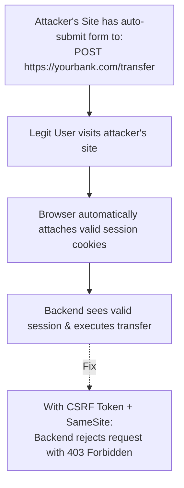

# Day 7: API Security
*(Input Validation, SQL Injection, XSS, CSRF, Rate Limiting – from first principles and production tradeoffs)*

***

## SECTION 1: INTUITION

Think of your API like a **bank teller window**:

- Customers (clients) send requests.
- The Teller (your backend) checks:
  - Is this ID valid?
  - Is this person authorized?
  - Is this input safe?
  - Is this person sending too many requests?

If you skip these checks, an attacker can:
- Run fake queries to steal data (SQL Injection).
- Trick the browser into showing fake content (XSS).
- Use someone else’s session to execute unauthorized actions (CSRF).
- Spam your API and crash the server (No rate limiting).

> [!TIP]
> **Simple Analogy:**  
> API security means:  
> 1. The client only gets exactly what they are allowed to get.  
> 2. And whatever they request is executed safely.  
> Otherwise, a hacker could just ask for free data and steal everything.

***

## SECTION 2: THEORY – INPUT VALIDATION

### 2.1 Why Input Validation is Critical

Input validation is the **first line of defense** for any API.

Without it, you might:
- Accept malicious SQL.
- Store broken data.
- Allow impossible business states.
- Let attackers bypass authentication.

**Goals:**
1. **Sanity** – data is well-formed.
2. **Safety** – no attack vectors exist in the input.
3. **Correctness** – business rules are satisfied.

**Validation rules:**
- **Type**: string, number, boolean, array.
- **Format**: email, URL, phone, date.
- **Range**: min/max length, min/max numbers.
- **Constraints**: enum values, regex patterns, uniqueness.

> **Rule:** Always validate on the **server side**. Frontend validation is strictly for UX and can easily be bypassed.

***

### 2.2 Validation Layers

Typical flow:

1. **Request parsing**  
   - Verify `Content-Type` is `application/json`.
   - Parse JSON; if invalid → 400 Bad Request.
2. **Schema validation**  
   - Use a library (Joi, class-validator, Zod, Yup) to check required fields, types, and formats.
   - If it fails → 422 Unprocessable Entity with detailed errors.
3. **Business validation**  
   - Cross-check with DB: e.g., verify email is not already taken, or user is not over their quota.
   - If it fails → domain-specific error (e.g., 409 Conflict).

**Never trust raw input. Always validate against a defined schema.**

***

## SECTION 3: SQL INJECTION

### 3.1 What is SQL Injection?

Attackers inject **malicious SQL code** via inputs into your queries.

**Classic Example:**
```sql
SELECT * FROM users WHERE email = '" + emailInput + "'";
```

If `emailInput` is:
```text
' OR '1'='1'; --
```
The query evaluates to:
```sql
SELECT * FROM users WHERE email = '' OR '1'='1'; --';
```
Since `'1'='1'` is always true, this returns **all users**. More dangerously, attackers can append `DELETE` or `DROP TABLE` commands. SQL injection is one of the most severe web vulnerabilities.

***

### 3.2 How to Prevent SQL Injection

**Rule #1: Never build SQL by concatenating strings with user input.**

#### 1. Use Parameterized Queries (Prepared Statements)

Example in Node.js:
```js
// ❌ Bad (Vulnerable to SQLi):
const sql = `SELECT * FROM users WHERE email = '${emailInput}';`;
const user = await db.query(sql);

// ✅ Good (Secure):
const sql = `SELECT * FROM users WHERE email = $1;`;
const user = await db.query(sql, [emailInput]);
```
The database driver treats `$1` strictly as a **string value**, not as executable SQL code.

#### 2. Use an ORM / Query Builder
ORMs (like Prisma, Sequelize, TypeORM) automatically use parameterized queries under the hood.
```js
const user = await prisma.user.findOne({
  where: { email: emailInput }
});
```

#### 3. Avoid Dynamic SQL Unless Necessary
If you absolutely need dynamic columns or an `ORDER BY` clause, validate the column names against a strict whitelist.
```js
const allowedSort = ['created_at', 'email', 'name'];
if (!allowedSort.includes(sortBy)) {
  throw new ValidationError('Invalid sort field');
}
const sql = `SELECT * FROM users ORDER BY ${sortBy}`; // Safe because of whitelist
```

> ✅ **[Principal Engineer Note]: Second-Order SQL Injection**
> *Junior engineers often parameterize the `INSERT` query when a user signs up, thinking they are safe. But if an attacker sets their username to `' OR 1=1; --`, it is safely stored in the database. Later, an internal admin dashboard runs a poorly written query like `SELECT * FROM logs WHERE username = '${user.username}'`. The payload is pulled from the DB and executed, dropping your tables. This is called Second-Order SQL Injection. Parameterize ALL queries, everywhere, without exception.*

***

## SECTION 4: XSS (Cross-Site Scripting)

### 4.1 What is XSS?

XSS occurs when an attacker injects **malicious JavaScript** into your site, which the browser then executes.

**Example:**
- An attacker sets their profile name to `<script>stealCookie()</script>`.
- When another user views the profile, the page renders:
  ```html
  <h1>Hello <script>stealCookie()</script></h1>
  ```
- The browser executes the script, stealing cookies and hijacking the session.

***

### 4.2 How to Prevent XSS

#### 1. Escape / Encode Output
When rendering user input in HTML, escape special characters (`<`, `>`, `&`, `"`, `'`).
- Input: `<script>alert(1)</script>`
- Escaped: `&lt;script&gt;alert(1)&lt;/script&gt;`

*Modern frameworks (React, Vue, Angular) do this automatically for text bindings.*

#### 2. Use Safe Frontend Practices
- Prefer `textContent` over `innerHTML`.
- Don’t insert user data directly into `<script>` tags.

#### 3. Content Security Policy (CSP)
Use HTTP headers to restrict where scripts can run from:
```http
Content-Security-Policy: default-src 'self'; script-src 'self';
```
This blocks external malicious JS and inline scripts.

***

## SECTION 5: CSRF (Cross-Site Request Forgery)

### 5.1 What is CSRF?

In CSRF, an attacker tricks a logged-in user’s browser into sending a request to your site.

**Attack Flow:**
- A logged-in user visits an attacker’s site.
- The attacker’s site contains a hidden form targeting your bank API:
  ```html
  <form action="https://yourbank.com/transfer" method="POST">
    <input name="amount" value="10000">
    <input name="to" value="attacker">
  </form>
  <script>document.forms[0].submit();</script>
  ```
- The user’s browser automatically attaches their valid session cookies.
- Your backend processes the transfer, thinking the user initiated it.

**CSRF = an unused session becomes a weapon.**

***

### 5.2 How to Prevent CSRF

#### 1. Use SameSite Cookies (Modern standard)
Configure your session cookie securely:
```http
Set-Cookie: sessionId=abc123; SameSite=Lax; Secure; HttpOnly
```
- `Lax`: The cookie is not sent on cross-site POST requests.
- `Strict`: The cookie is not sent on any cross-site request.

#### 2. CSRF Tokens
For state-changing actions (POST, PUT, DELETE):
- The server generates a random token and shares it with the client.
- The client includes this token in a custom header (e.g., `X-CSRF-Token: abc123`).
- The server verifies that the token matches the session.

#### 3. Check Origin / Referer
Ensure the `Origin` and `Referer` headers match your expected domain. While not foolproof, it's a solid defense-in-depth measure.

***

## SECTION 6: RATE LIMITING

### 6.1 Why Rate Limiting is Needed

Without rate limiting:
- Attackers can brute-force passwords or spam endpoints.
- Legitimate clients with bugs can accidentally overload your CPU/DB.

**Rate limiting** restricts the number of requests from a specific client within a time window.

### 6.2 Common Rate Limiting Strategies

1. **Fixed Window**: 100 requests per minute. Resets at the start of every clock minute. Simple, but vulnerable to edge spikes.
2. **Sliding Window**: Evaluates request count smoothly over the trailing 60 seconds.
3. **Token Bucket**: A bucket holds N tokens. Each request consumes a token. Tokens refill at a steady rate. Used by most professional APIs.

> ✅ **[Principal Engineer Note]: Distributed Rate Limiting at Scale**
> *At massive scale, storing rate limit counters in a single Redis instance creates a bottleneck. If you handle 50,000 requests per second, you can't run `INCR` in Redis 50,000 times a second on a single thread. Production architectures push rate limiting to the Edge using API Gateways (like Kong, Envoy, or AWS API Gateway) which batch counters or use local memory combined with async Redis syncing to reduce network hops.*

### 6.3 Implementation Example

Typically implemented in Redis (in-memory, fast):
```js
// Pseudo-code for a login route (Max 5 requests per minute per IP)
const key = `rate:login:${ip}`;
const count = await redis.incr(key);

if (count === 1) {
  await redis.expire(key, 60); // Window of 60 seconds
}

if (count > 5) {
  res.status(429).json({
    error: 'RATE_LIMITED',
    message: 'Too many login attempts. Please try again later.'
  });
}
```

***

## SECTION 7: VISUAL DIAGRAMS

### Diagram 1: SQL Injection Protection



***

### Diagram 2: XSS Attack Flow & Prevention



***

### Diagram 3: CSRF Attack Flow



***

## SECTION 8: COMMON MISTAKES

1. **Validating only on the frontend:** Attackers can easily bypass UI limits. Always validate on the server.
2. **Building SQL with string concatenation:** A massive SQL injection risk. Use parameterized queries.
3. **Rendering user input without escaping:** Causes XSS. Escape data or rely on modern UI frameworks that handle it by default.
4. **Not using SameSite cookies:** Massive CSRF risk. Always set `SameSite=Lax` or `Strict`.
5. **No rate limit on auth endpoints:** Allows brute-force password cracking. Add aggressive rate limits on `/login`, `/register`, and `/password-reset`.

***

## SECTION 9: INTERVIEW-STYLE QUESTIONS

1. What is SQL injection? How do you prevent it?
2. Why is a parameterized query safer than string concatenation?
3. What is XSS? How do you prevent it in a web app?
4. What is CSRF? How do CSRF tokens and SameSite cookies help mitigate it?
5. Why is rate limiting specifically important on login/password endpoints?
6. What HTTP status code do you return for rate-limited requests?
7. What are common secure cookie flags, and what does each do?
8. How do you safely utilize user input in an `ORDER BY` clause?
9. Why is server-side validation strictly more important than frontend validation?
10. How would you design authentication for a high-security API?

***

## SECTION 10: REVISION NOTES (CHEAT SHEET)

- **Input validation**: Server-side, schema-based, checking type/format/range constraints.
- **SQL Injection**: 
  - Use parameterized queries (or an ORM). 
  - Never concatenate SQL strings.
  - Whitelist dynamic variables like table or column names.
- **XSS**: 
  - Escape all user input before HTML rendering. 
  - Use a strict Content Security Policy (CSP).
- **CSRF**: 
  - Use CSRF tokens. 
  - Set `SameSite=Lax` or `Strict` on cookies.
- **Rate limiting**: 
  - Limit request volume per user/IP using Redis. 
  - Return **429 Too Many Requests** when the limit is exceeded.

***

## SECTION 11: HANDS-ON ASSIGNMENT

Add the following concepts to a demo API:

1. **Input validation**: For `POST /login`, strictly validate that `email` is correctly formatted and `password` meets minimum length requirements.
2. **SQL injection protection**: Use an ORM or parameterize all raw SQL queries.
3. **CSRF protection**: Ensure all cookies are set with `SameSite=Lax; Secure; HttpOnly`.
4. **Rate limiting**: Implement a rate limit on `/login` capping IPs at 5 requests per minute.

**Demonstrate:**
- Try bypassing validation via raw cURL/Postman.
- Observe that SQL injection attempts are safely rejected.
- Spam the login route and verify the 429 response triggers.

***

## ACTIVE LEARNING – YOUR TURN

Answer these prompt scenarios:

1. You have this query in your backend:
   ```js
   const sql = `SELECT * FROM users WHERE email = '${emailInput}';`;
   ```
   Explain what the vulnerability is and write code to fix it.

2. Your app utilizes cookies for user sessions. How do you configure the cookie headers to massively reduce both CSRF and XSS risks? List the required flags and explain why each is important.

3. You want to prevent brute-force attacks on `/login`. Design a simple rate-limiting rule (limit + window + key strategy) and specify the HTTP status code you’ll return when the threshold is exceeded.
