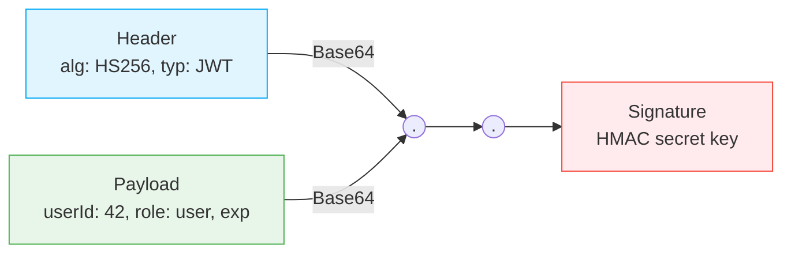
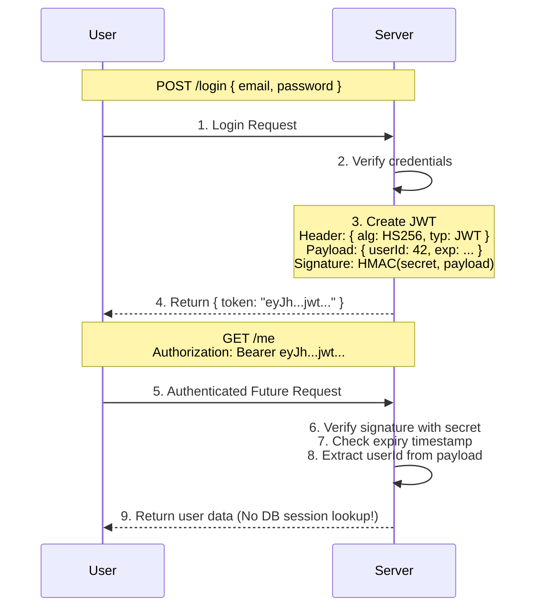

# Day 10: JWT (JSON Web Tokens)
*(Detailed, step-by-step, from first principles — with simple language, intuition, diagrams, production examples, and security best practices)*

***

## SECTION 1: INTUITION (Why JWTs Exist)

Think of a **concert ticket**:

1. You buy a ticket online.
2. You get a **QR code** on your phone.
3. At the concert:
   - You show the QR code.
   - Staff scans it.
   - They check:
     - Is the QR valid? (Signature verification)
     - Does it say “entered = no”? (Not used already)
     - What seat/time does it allow? (Permissions)
   - If valid → they let you in.
   - *Crucially, they don't need to call the central database for every single person to verify the ticket.*

**JWT is like that QR code:**
- The server gives you a **token** (a signed string).
- The token contains user info (`userId`, `role`, `expiry`).
- The client sends this token on every request.
- The server mathematically verifies the token signature and uses the data inside.
- **No need to look up a session in DB/Redis.**

> [!TIP]
> **Simple Analogy:**  
> - **JWT** = A signed ticket that the server gives you.  
> - The ticket says: "user 42, role=user, expiry=2026-07-08".  
> - The server checks the signature on every request and uses the data.  
> - No need to save a session in a database or Redis. It is fast and stateless!

This is **token-based authentication**.

***

## SECTION 2: CORE CONCEPTS

### 2.1 What is a JWT?

**JWT = JSON Web Token** (RFC 7519).

It’s a **single string** that represents:
- Who the user is.
- What they’re allowed to do.
- When the token expires.

**Example JWT (simplified):**
```text
eyJhbGciOiJIUzI1NiIsInR5cCI6IkpXVCJ9.
eyJ1c2VySWQiOjQyLCJyb2xlIjoidXNlciIsImV4cCI6MTcyMDMwMzYwMH0.
SflKxwRJSMeKKF2QT4fwpMeJf36POk6yJV_adQssw5c
```

Notice the two dots? A JWT consists of exactly **3 parts**:
```text
Header.Payload.Signature
```

> **Key Idea:** A JWT is **self-contained** (has all the data needed) and **signed** (cannot be tampered with).

***

### 2.2 JWT Structure: The 3 Parts

A JWT has **3 base64-encoded parts**, separated by dots.

#### 1. Header
Contains metadata about how the token is signed:
- `alg`: algorithm (e.g., `HS256`, `RS256`).
- `typ`: token type (`JWT`).

```json
{
  "alg": "HS256",
  "typ": "JWT"
}
```
*(This JSON is Base64Url encoded to form the 1st part).*

***

#### 2. Payload (Claims)
Contains **claims** (the actual data about the user + token):

**Common claims:**
- `sub`: subject (usually user id).
- `role`: user role (admin, user).
- `iat`: issued at (timestamp).
- `exp`: expires at (timestamp).
- `nbf`: not before (timestamp).
- `jti`: JWT ID (unique identifier for this token).

```json
{
  "userId": 42,
  "role": "user",
  "iat": 1720300000,
  "exp": 1720303600
}
```
*(This JSON is Base64Url encoded to form the 2nd part).*

***

#### 3. Signature
The server creates the signature to ensure the payload hasn't been modified by a hacker.

1. Takes `encoded_header` + `.` + `encoded_payload`.
2. Signs it using a **secret key** (or a private key).

```text
signature = HMACSHA256(
  base64UrlEncode(header) + "." + base64UrlEncode(payload),
  YOUR_SUPER_SECRET_KEY
)
```

**How Verification Works:**
- When a client sends a token, the server takes the header and payload from it.
- The server re-signs them using its secret key.
- If the server's generated signature matches the signature attached to the token → **Valid and Untampered.**

> ✅ **[Principal Engineer Note]: The "alg: none" Vulnerability**
> *Historically, many JWT libraries had a catastrophic flaw. An attacker would decode the JWT, change the header to `{"alg": "none"}`, change their `userId` to `1` (admin), and strip the signature entirely. Because the header said "no signature required", the server accepted it! In production, you must explicitly tell your JWT verification library which algorithms are allowed (e.g., strictly `['HS256']`).*

***

### 2.3 How JWT Works (Simple Flow)

1. **Login:**
   - User sends `email` + `password`.
   - Server verifies credentials.
   - Server creates a JWT (Header + Payload + Signature).
   - Server returns the token:
     ```json
     {
       "token": "eyJhb...jwt...",
       "userId": 42
     }
     ```

2. **Future requests:**
   - Client sends token in the `Authorization` header:
     ```http
     GET /me
     Authorization: Bearer eyJhb...jwt...
     ```

3. **Server Execution:**
   - Reads the token.
   - Verifies the signature using its secret.
   - Checks `exp` (ensures it is not expired).
   - Extracts `userId`, `role` from the payload.
   - *Processes the request without ever hitting a database for session verification!*

***

## SECTION 3: VISUAL DIAGRAMS

### Diagram 1: JWT Structure Breakdown



***

### Diagram 2: JWT Login & Request Flow



***

## SECTION 4: ACCESS TOKEN vs REFRESH TOKEN

In production, you don't just use one JWT. You use **two tokens**:
1. **Access Token** (short-lived).
2. **Refresh Token** (long-lived).

### 4.1 Access Token
- **Size:** Small JWT.
- **Expiry:** Short (5–15 minutes).
- **Contains:** `userId`, `role`, `exp`, `iat`.
- **Used for:** API calls (`GET /me`, `POST /orders`).
- **Why short-lived?** If a hacker steals it, it is only valid for a tiny window of time, minimizing the risk.

### 4.2 Refresh Token
- **Expiry:** Long-lived (Days, weeks, months).
- **Format:** Can be a JWT (with long expiry) or a random opaque string stored in DB/Redis.
- **Used for:** Requesting a brand new access token when the current one expires.
- **Why separate?** Access tokens are fast and stateless. Refresh tokens act as the "master key" to get new access tokens. If a refresh token is stolen, the server can revoke it from the database.

***

### 4.3 Token Refresh Flow

1. Client holds:
   - `accessToken` (expires in 15 mins).
   - `refreshToken` (expires in 7 days).
2. Access token expires. An API request fails with `401 Unauthorized`.
3. Client immediately calls the refresh endpoint:
   ```http
   POST /refresh
   { "refreshToken": "abc123..." }
   ```
4. Server validates the refresh token. If valid:
   - Creates a new `accessToken`.
   - Returns it to the client.
5. Client retries the original API request with the new access token.

***

## SECTION 5: TOKEN ROTATION & SECURITY

### 5.1 Why Token Rotation?

**Token rotation** = replacing old tokens with new ones continuously.

When using refresh tokens:
- Every time the client gets a new access token, the server **also issues a new refresh token**.
- The old refresh token becomes instantly invalid.

**Benefits:**
If a hacker steals a refresh token and uses it, the server rotates it. When the legitimate user tries to use their (now old) refresh token, the server detects the reuse anomaly, revokes *all* tokens for that user, and forces them to re-login.

***

### 5.2 Storing JWTs Safely

Where should the frontend store these tokens?

#### Option 1: In Memory (JavaScript variables)
```js
let accessToken = "eyJh...";
let refreshToken = "abc123...";
```
- **Pros:** Completely immune to XSS (hackers can't read variables from memory easily).
- **Cons:** Lost on page reload. (Often paired with an HttpOnly refresh cookie to get a new access token on reload).

#### Option 2: In Cookies (Recommended)
```http
Set-Cookie: accessToken=eyJh...; Secure; HttpOnly; SameSite=Lax
Set-Cookie: refreshToken=abc123...; Secure; HttpOnly; SameSite=Strict
```
- **Pros:** `HttpOnly` completely blocks malicious JavaScript (XSS) from reading the tokens.
- **Cons:** Requires CSRF protection (via `SameSite` flags).

#### Option 3: In LocalStorage (Anti-Pattern)
```js
localStorage.setItem("accessToken", "eyJh...");
```
- **Pros:** Easy to implement, persists across tabs/reloads.
- **Cons:** **Massive Security Risk.** Any malicious JavaScript (XSS) running on your page can easily steal the tokens and send them to a hacker. Avoid this in strict production apps.

***

## SECTION 6: JWT vs SESSION-BASED AUTH (COMPARISON)

### Sessions (Day 9)
- Session stored in DB/Redis.
- Cookie contains a random `sessionId`.
- Server looks up session on *every single request*.
- **Pros:** Very easy to revoke (just delete the session).
- **Cons:** Extra DB/Redis lookup latency. Stateful.

### JWT (Day 10)
- Token contains user info and is cryptographically signed.
- Server verifies signature mathematically, NO DB lookup required.
- **Pros:** Extremely fast. Stateless (perfect for distributed microservices).
- **Cons:** Harder to immediately revoke (the token is valid until its `exp` time). Requires building refresh token rotation logic.

> ✅ **[Principal Engineer Note]: The JWT Revocation Paradox (Denylists)**
> *The biggest lie told about JWTs is that they are perfectly stateless. What happens if a user clicks "Logout" but their JWT is still valid for 15 minutes? If an attacker steals it, they can use it. To truly solve logout with JWTs in production, companies build a **Redis Denylist**. When a user logs out, the JWT's unique ID (`jti` claim) is stored in Redis until its natural expiration time. The API Gateway checks this Redis Denylist on every request. Ironically, this DB lookup makes JWTs stateful again!*

***

## SECTION 7: COMMON MISTAKES

1. **Putting sensitive data in the JWT payload:** JWTs are Base64 encoded, **not encrypted**. Anyone can decode them. Never put passwords or SSNs inside them.
2. **Using a very long access token expiry:** If stolen, the attacker has access for months. Keep them short (15 mins).
3. **Not verifying the signature:** Relying on the payload without verifying the cryptographic signature means anyone can forge a token.
4. **Not checking `exp` (expiry):** Old tokens will stay valid forever.
5. **Storing tokens in `localStorage`:** Exposes them to XSS theft. Use `HttpOnly` cookies when possible.

***

## SECTION 8: INTERVIEW-STYLE QUESTIONS

1. What is a JWT? What are its 3 distinct parts?  
2. What is inside the JWT payload? What should NEVER be inside it?  
3. Exactly how does a server verify a JWT without hitting a database?  
4. What is the architectural difference between an **access token** and a **refresh token**?  
5. Why must an access token's expiry be short while a refresh token's is long?  
6. What is **Refresh Token Rotation** and what specific attack does it mitigate?  
7. How do you implement logout with stateless JWTs?  
8. If a JWT is stateless, how do you revoke a user's access immediately (e.g., if they are banned)?  
9. Compare the pros and cons of JWT vs Session-based auth.  
10. Why is storing JWTs in `localStorage` considered an anti-pattern?

***

## SECTION 9: REVISION NOTES (CHEAT SHEET)

- **JWT Structure**: `Header.Payload.Signature`
- **Payload Claims**: `userId`, `role`, `exp` (expiry), `iat` (issued at). No sensitive data.
- **Verification**: Server hashes `Header + Payload` with its secret key and compares it to the attached signature.
- **Access Token**: Short-lived (15 min). Used for API requests.
- **Refresh Token**: Long-lived (days). Used strictly to get new access tokens.
- **Storage Strategy**: Prefer `HttpOnly` + `Secure` cookies. Avoid `localStorage` due to XSS risks.

***

## SECTION 10: HANDS-ON ASSIGNMENT

Implement a **simple JWT-based login system**:

### Endpoints
- `POST /register`: Create a user.
- `POST /login`: Verify password. Create a JWT access token (Payload: `userId`, `exp` set to 15 mins). Return it to the client.
- `GET /me`: Extract token from `Authorization: Bearer <token>`. Verify signature. Check `exp`. Return user data.
- `POST /logout`: Client deletes the token locally. (No server action required for stateless JWTs).

### Requirements
- Use `bcrypt` for passwords.
- Use a standard library (`jsonwebtoken` in Node).
- Test failing states: Expired token, tampered signature.

***

## SECTION 11: MINI PROJECT

Build a **JWT-based blog app**:
- Users can register, login (receive JWT), view their profile, and create posts.
- Ensure protected endpoints correctly verify the JWT signature before proceeding.
- Validate that an expired token correctly returns a `401 Unauthorized`.

***

## ACTIVE LEARNING – YOUR TURN

Answer these in your own words:

1. What are the **3 parts** of a JWT? What data resides in each part?  
2. What should NOT be placed in the JWT payload and why?  
3. How does the server verify a JWT without doing a DB lookup?  
4. Why do we need a separate **refresh token** instead of just using one long-lived access token?  
5. What is **token rotation**? Why is it a critical security feature?  
6. Where is the absolute safest place to store a JWT in a frontend web app?
