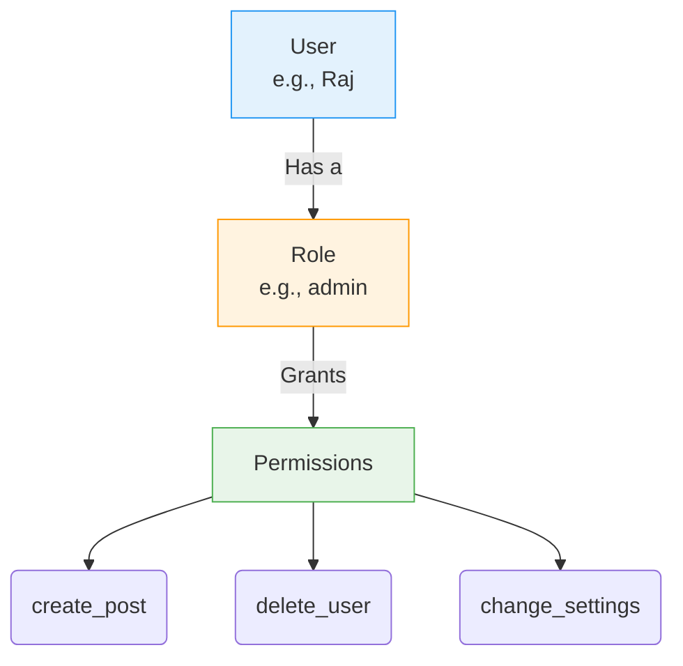
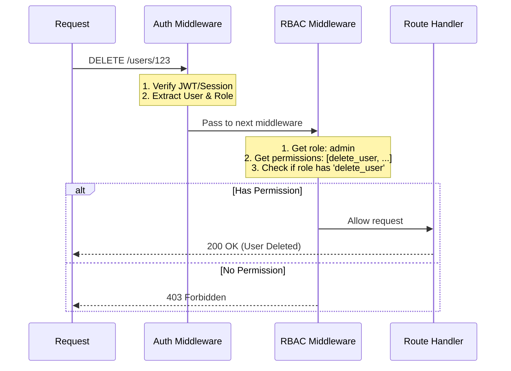

# Day 12: Role-Based Access Control (RBAC)
*(Simple language, step-by-step, from first principles — with intuition, diagrams, production examples, and security best practices)*

***

## SECTION 1: INTUITION (Why RBAC Exists)

Think of a **company**:

1. You have different people:
   - **Employees**: can view their own data, create posts.
   - **Managers**: can view employees, approve requests.
   - **Admins**: can create users, delete users, change settings.
2. You don’t want:
   - An employee to delete another employee.
   - A manager to change global system settings.
   - Anyone but an admin to access admin-only pages.
3. **RBAC** = Assign **roles to users**, and **permissions to roles**.
   - User: `Raj` → role: `employee`.
   - Role `employee`:
     - Can: view own profile, create posts.
     - Cannot: delete users, change settings.
   - Role `admin`:
     - Can: everything.

> [!TIP]
> **Simple Analogy:**  
> - **RBAC** = You assign a **role** to a user (e.g., user, admin, moderator).  
> - Each role has **permissions** (what they can and cannot do).  
> - When a request comes in → first check the user's role: "Does this role have permission to do this task or not?"

***

## SECTION 2: CORE CONCEPTS

### 2.1 What is RBAC?

**RBAC = Role-Based Access Control**.

It’s a way to control access where:
- **Users** are assigned **roles**.
- **Roles** are assigned **permissions**.
- Access is granted based on the **user’s role**, not their specific identity.

**Key entities:**
1. **User**: e.g., Raj, Priya.
2. **Role**: e.g., `user`, `admin`, `moderator`.
3. **Permission**: e.g., `create_post`, `delete_user`, `change_settings`.

**Relationship:**
```text
User → has Role(s)
Role → has Permissions
```

**Example:**
```text
User: Raj
Role: user

Role: user
Permissions:
  - create_post
  - view_own_profile
  - edit_own_post

Role: admin
Permissions:
  - create_post
  - view_all_users
  - delete_user
  - change_settings
```

***

### 2.2 RBAC vs Ownership-Based Access

**Ownership-based**:
- Check: *“Is this user the owner of this resource?”*
- Example: User 42 can delete post 100 **only if** `post.userId == 42`.

**RBAC**:
- Check: *“Does this user’s role have permission for this action?”*
- Example: Role `admin` can delete *any* post.

**Often you combine both:**
- A user can delete their own posts (Ownership).
- An admin can delete any post (RBAC).

***

## SECTION 3: VISUAL DIAGRAMS

### Diagram 1: RBAC Model Architecture



***

### Diagram 2: RBAC Flow for an API Request



***

## SECTION 4: BASIC RBAC IMPLEMENTATION

### 4.1 User Table with Role
In a simple app, you just add a `role` column to the users table.

```sql
CREATE TABLE users (
  id BIGINT PRIMARY KEY,
  email VARCHAR(255) UNIQUE,
  name VARCHAR(255),
  role VARCHAR(50) NOT NULL DEFAULT 'user',
  password_hash VARCHAR(255)
);
```

***

### 4.2 Simple Permission Check in Code (Node.js)

```js
app.delete('/users/:id', async (req, res) => {
  const user = req.user; // Set by your auth middleware

  // RBAC check
  if (user.role !== 'admin') {
    return res.status(403).json({ message: 'Admin only' });
  }

  // proceed to delete user
  await deleteUserById(req.params.id);
  res.status(200).json({ message: 'User deleted' });
});
```
- If `user.role` is not `admin` → **403 Forbidden**.

***

### 4.3 Handling Multiple Roles
You can allow multiple roles to access an endpoint:
```js
const allowedRoles = ['admin', 'moderator'];
if (!allowedRoles.includes(user.role)) {
  return res.status(403).json({ message: 'Not allowed' });
}
```

***

## SECTION 5: PERMISSION TABLE (ADVANCED RBAC)

For more complex apps (like enterprise SaaS), you don’t hardcode permissions in code. You store them in the database.

### 5.1 Tables
```sql
CREATE TABLE roles (
  id BIGINT PRIMARY KEY,
  name VARCHAR(50) UNIQUE
);

CREATE TABLE permissions (
  id BIGINT PRIMARY KEY,
  name VARCHAR(100) UNIQUE,
  description TEXT
);

CREATE TABLE role_permissions (
  role_id BIGINT REFERENCES roles(id),
  permission_id BIGINT REFERENCES permissions(id),
  PRIMARY KEY (role_id, permission_id)
);

CREATE TABLE users (
  id BIGINT PRIMARY KEY,
  email VARCHAR(255) UNIQUE,
  name VARCHAR(255),
  role_id BIGINT REFERENCES roles(id)
);
```

> ✅ **[Principal Engineer Note]: Beyond RBAC → ABAC (Attribute-Based Access Control)**
> *At massive scale (like AWS IAM), basic RBAC isn't enough. You need **ABAC**. In ABAC, permissions are based on attributes. Example: "You can delete this EC2 instance, BUT ONLY IF you logged in with Multi-Factor Authentication (MFA) AND your IP is on the corporate VPN AND it is between 9 AM and 5 PM." Enterprise software often evolves from simple roles to complex policy engines (like OPA - Open Policy Agent) evaluating JSON rules on every request.*

### 5.2 Advanced Permission Check in Code

```js
app.delete('/posts/:id', async (req, res) => {
  const user = req.user;
  const postId = req.params.id;

  // 1. Load user's role permissions from DB
  const permissions = await getUserPermissions(user.role_id);

  // 2. Check if user has global permission
  if (!permissions.includes('delete_any_post')) {
    
    // 3. Fallback: Combine with Ownership
    const post = await getPostById(postId);
    if (post.userId !== user.id || !permissions.includes('delete_own_post')) {
      return res.status(403).json({ message: 'Not allowed' });
    }
  }

  // proceed to delete
  await deletePostById(postId);
  res.status(200).json({ message: 'Post deleted' });
});
```

***

## SECTION 6: RBAC + AUTH MIDDLEWARE

The cleanest way to implement RBAC is using middleware.

1. **Auth Middleware**: Verifies token/session. Attaches user to `req.user`.
2. **RBAC Middleware**: Checks if the user's role has the required permission.

```js
// Auth middleware
function authMiddleware(req, res, next) {
  const token = req.headers.authorization?.split(' ')[1];
  if (!token) return res.status(401).json({ message: 'No token' });

  const user = verifyToken(token);
  req.user = user;
  next();
}

// RBAC middleware (Factory function)
function rbacMiddleware(requiredPermission) {
  return (req, res, next) => {
    const user = req.user;
    const permissions = getUserPermissions(user.role);

    if (!permissions.includes(requiredPermission)) {
      return res.status(403).json({ message: 'Permission denied' });
    }
    
    next();
  };
}

// Usage on a route
app.delete('/users/:id',
  authMiddleware,
  rbacMiddleware('delete_user'), // Clean!
  deleteUserHandler
);
```

> ✅ **[Principal Engineer Note]: The GraphQL RBAC Bypass Vulnerability**
> *A very common mistake mid-level engineers make is securing all their REST routes (`app.delete(...)`) beautifully with middleware, but then they add a GraphQL endpoint (`/graphql`) later and forget to add RBAC inside the individual GraphQL Resolvers. Since GraphQL only uses one POST endpoint, the route-level middleware is useless. Hackers query the graph directly and bypass all your security. Always enforce authorization closest to the data fetching layer, not just the HTTP routing layer!*

***

## SECTION 7: COMMON MISTAKES

1. **Hardcoding roles in every endpoint:** Messy and hard to maintain. Use RBAC middleware or centralized checks.
2. **Not checking permissions at all:** Anyone can perform admin actions.
3. **Using only RBAC, ignoring ownership:** A normal user could delete *anyone's* post. Combine RBAC + ownership for user-owned resources.
4. **Too many roles:** Overcomplicates the system. Start simple: `user`, `admin`, `moderator`.
5. **Not documenting permissions:** Developers get confused. Document which roles map to which permissions.

***

## SECTION 8: INTERVIEW-STYLE QUESTIONS

1. What is RBAC? Why is it essential for scalable applications?  
2. What are the 3 main entities in a relational RBAC model?  
3. How is RBAC fundamentally different from ownership-based access control?  
4. How do you implement a simple role check in code?  
5. Write the SQL schema to implement an advanced RBAC system with a permission table.  
6. Explain how Auth middleware and RBAC middleware chain together in Node.js.  
7. How do you safely combine RBAC with ownership for deleting a blog post?  
8. What HTTP status code do you return for a permission denied error vs an unauthenticated error?  
9. Why is hardcoding roles (`if role === 'admin'`) inside business logic considered a bad practice in enterprise apps?  
10. How would you design roles for a collaborative document editing app (like Google Docs)?

***

## SECTION 9: REVISION NOTES (CHEAT SHEET)

- **RBAC**: User → Role → Permissions. Access is based on role, not identity.
- **Simple implementation**: Add a `role` column to the `users` table. Check `if (user.role !== 'admin') -> 403`.
- **Advanced implementation**: Store permissions in a DB (`roles`, `permissions`, `role_permissions`).
- **Middleware pattern**: `Auth Middleware` (verifies token) → `RBAC Middleware` (checks permission) → `Route Handler`.
- **Ownership Combination**: Use RBAC for global actions (`delete_any_post`) and ownership for local actions (`delete_own_post`).
- **HTTP Status Codes**:
  - `401 Unauthorized` = You are not logged in.
  - `403 Forbidden` = You are logged in, but you lack the role/permission to do this.

***

## SECTION 10: HANDS-ON ASSIGNMENT

Implement **RBAC for a blog app**:

### Roles
- `user`: Can create post, view own profile, edit/delete own posts.
- `admin`: Can do all user actions + delete any post, delete any user, view all users.

### Endpoints
- `POST /posts` (authenticated, any user).
- `DELETE /posts/:id`:
  - If user owns post → allow.
  - If user is admin → allow.
  - Else → 403.
- `DELETE /users/:id` (admin only).
- `GET /users` (admin only).

### Requirements
- Use role checks in code.
- Combine RBAC + ownership for posts.
- Return `403 Forbidden` for permission denied.

***

## SECTION 11: MINI PROJECT

Build a **RBAC-enabled backend API**:
- Users can login (JWT or session), create posts, edit/delete own posts, and view their own profile.
- Admins can delete any post, delete any user, and view all users.
- Implement reusable middleware for both Auth and RBAC.

***

## ACTIVE LEARNING – YOUR TURN

Answer these in your own words:

1. What is RBAC? Why do we use it?  
2. What are the 3 main entities in RBAC?  
3. How is RBAC different from ownership-based access control?  
4. How do you implement a simple role check in code?  
5. How would you implement RBAC for `DELETE /posts/:id` where:
   - A user can delete their own post.
   - An admin can delete any post.  
6. What HTTP status code do you return for permission denied?  
7. Why is hardcoding roles in every endpoint bad?
