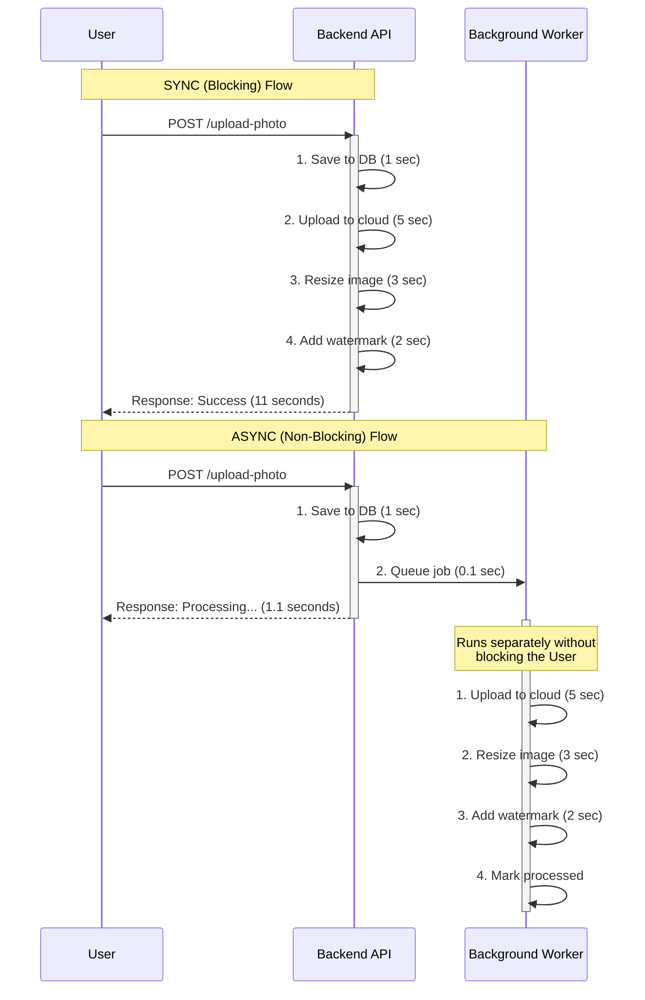
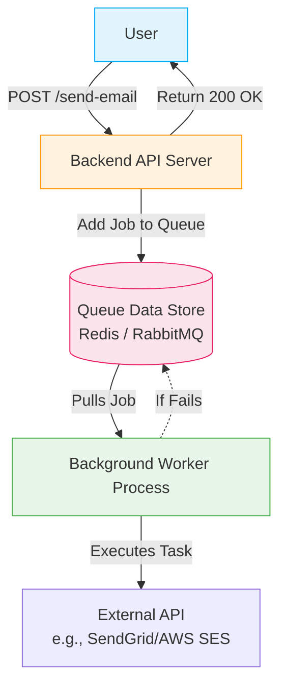
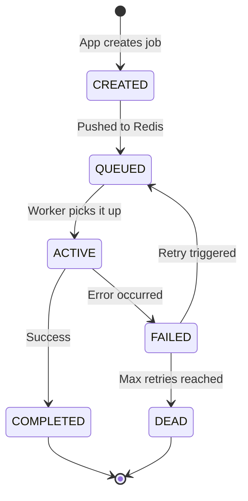

# Day 23: Background Jobs & Async Processing
*(From absolute fundamentals, with simple analogies, diagrams, production examples, and tradeoffs - strictly in the MERN stack context)*

***

## SECTION 1: INTUITION (Why Async Processing Exists)

Think of a **restaurant**:

### Scenario 1: No Async (Blocking)
You order food at the counter:
```text
Customer: "I want pasta"
Chef: "Okay, I'll make it NOW"
  - Wash vegetables (2 min)
  - Cook pasta (10 min)
  - Add sauce (3 min)
Chef: "Done! Your pasta is ready"
```
**Problem**: You wait 15 minutes. The chef can't serve anyone else. The restaurant is slow.

### Scenario 2: With Async (Non-Blocking)
You order food:
```text
Customer: "I want pasta"
Waiter: "Taking order... ✅ Order #1 accepted"
  - Give order ticket to kitchen
  - Kitchen works on it in background
  - Customer gets SMS: "Your pasta is ready!"
```
**Benefit**: You don't wait at the counter. The kitchen works on multiple orders simultaneously. The restaurant is fast.

***

### In Web Development:

**Without Async (Blocking)**:
```javascript
// User uploads photo
app.post('/upload-photo', async (req, res) => {
  const photo = req.file;
  
  // Upload to cloud (5 seconds)
  await uploadToCloud(photo);
  
  // Resize image (3 seconds)
  await resizeImage(photo);
  
  // Add watermark (2 seconds)
  await addWatermark(photo);
  
  // Save to database (1 second)
  await saveToDatabase(photo);
  
  res.json({ success: true }); // Takes 11 seconds total!
});
```
**Problem**: The user stares at a loading spinner for 11 seconds. During this time, the server thread is tied up and struggles to handle other incoming requests.

***

**With Async (Non-Blocking)**:
```javascript
// User uploads photo
app.post('/upload-photo', async (req, res) => {
  const photo = req.file;
  
  // Save to database immediately (1 second)
  const savedPhoto = await saveToDatabase(photo);
  
  // Queue background job (0.1 seconds)
  await queueBackgroundJob('process-photo', {
    photoId: savedPhoto.id
  });
  
  res.json({ 
    success: true,
    message: 'Photo uploaded! Processing in background...' 
  }); // Takes 1.1 seconds total!
});

// Background worker (runs separately)
worker.on('process-photo', async (job) => {
  const photo = await getPhoto(job.photoId);
  
  await uploadToCloud(photo);
  await resizeImage(photo);
  await addWatermark(photo);
  
  await markPhotoProcessed(photo);
});
```
**Benefit**: The user gets a response in just 1.1 seconds. A dedicated worker processes the photo later. The main system stays fast and responsive.

> [!TIP]
> **Simple Analogy:**  
> - **Background job** = Doing a task "later" instead of "right now".  
> - Give the user a response immediately, and let a "worker" finish the heavy lifting in the background.  
> - It is exactly like taking a ticket at a restaurant—your order is accepted immediately, but the food is prepared in the background.

***

## SECTION 2: THEORY (What Are Background Jobs?)

### 2.1 Definition

A **Background Job** is a task that:
1. Is **queued** (added to a list of tasks).
2. Executes **later** (not immediately during the HTTP request).
3. Runs **asynchronously** (without blocking the main API response).

**Key properties**:
- **Non-blocking**: The main request completes quickly.
- **Delayed execution**: The job runs when resources are available.
- **Independent**: The job often runs in a completely separate process or server (a "Worker").

***

### 2.2 Why Async Processing Exists?

#### Problems it solves:

1. **Slow operations**:
   - Email sending (5-10 seconds via SMTP).
   - Image processing / resizing (10-30 seconds).
   - Video encoding (minutes to hours).
   - API calls to slow external third-party services.

2. **High throughput**:
   - You need to send 10,000 promotional emails.
   - You can't do this synchronously in a single request—it would time out.
   - Instead, queue them and let a worker send them over time.

3. **Reliability & Resilience**:
   - If an email API fails, a background job can automatically **retry** it later.
   - Synchronous failures result in lost data; async queues store the task safely until it succeeds.

4. **Scalability**:
   - You can separate the "Web Servers" (handling HTTP requests) from the "Worker Servers" (doing the heavy lifting).
   - Handle thousands more web requests without slowing down.

***

### 2.3 When to Use Background Jobs?

**Use async for**:

| Task | Why Async? |
|------|-----------|
| Send email | Network latency takes 5-10 seconds; shouldn't block the user. |
| Send push notification | Network call, can fail, needs retry logic. |
| Process image/video | CPU intensive and slow (10-60 seconds). |
| Generate PDF report | Heavy computation; user can download it later. |
| Send SMS | External API call, can fail or timeout. |
| Webhook calls | External API, can timeout. |
| Data export (CSV) | Large computation over thousands of rows. |
| Clean up old data | Maintenance task; not urgent, can run at midnight. |

**Don't use async for**:

| Task | Why Not? |
|------|----------|
| Validate input | The user must know immediately if their password is too short. |
| Save primary data | The user needs immediate confirmation that their post was saved. |
| Check authentication | Must be immediate to block unauthorized access. |
| Return data to user | The user is actively waiting for this data on the screen. |

***

## SECTION 3: VISUAL DIAGRAMS

### Diagram 1: Sync vs Async Request Flow



***

### Diagram 2: Background Job Architecture



***

### Diagram 3: Job Lifecycle



***

## SECTION 4: PRODUCTION EXAMPLES

### 4.1 Real-World Example: Email Sending (e.g., SaaS Signup)

**The Scenario:**
When a user signs up, you need to save them to the database and send a welcome email.

```javascript
// User signs up
app.post('/signup', async (req, res) => {
  const { email, name } = req.body;
  
  // Save user to DB (Sync - Critical)
  const user = await createUser({ email, name });
  
  // Queue email job (Async - Non-critical)
  await emailQueue.add('send-welcome-email', {
    userId: user.id,
    email: user.email,
    name: user.name
  });
  
  res.json({ success: true, message: 'Account created!' });
  // Response time: ~0.5 seconds
});

// Background worker (Runs in a separate file/process)
emailWorker.process('send-welcome-email', async (job) => {
  const { userId, email, name } = job.data;
  
  // Get user template
  const template = await getEmailTemplate('welcome');
  
  // Send email (Takes 5-10 seconds)
  await sendEmail({
    to: email,
    subject: 'Welcome to our App!',
    html: template({ name })
  });
  
  // Mark email sent in DB
  await markEmailSent(userId);
});
```

**Why async?**
- The email taking 5-10 seconds doesn't block the user's signup flow.
- The user gets an immediate success response and can start using the app.
- If the email service is temporarily down, the worker can automatically retry sending it later without the user knowing there was an issue.

***

### 4.2 Real-World Example: Payment Processing (e.g., E-commerce)

**The Scenario:**
A user checks out. Payment processing MUST be synchronous, but inventory updates and receipts should be asynchronous.

```javascript
// User completes purchase
app.post('/purchase', async (req, res) => {
  const { userId, productId, amount } = req.body;
  
  // Create order in DB (Sync)
  const order = await createOrder({ userId, productId, amount });
  
  // Process payment (Sync - must be immediate)
  const paymentResult = await processPayment({
    orderId: order.id,
    amount: amount
  });
  
  if (!paymentResult.success) {
    return res.json({ success: false, error: 'Payment failed' });
  }
  
  // Queue post-payment jobs (Async)
  await postPaymentQueue.add('send-receipt-email', {
    orderId: order.id,
    userId: order.userId
  });
  
  await postPaymentQueue.add('update-inventory', {
    productId: order.productId,
    quantity: 1
  });
  
  res.json({ success: true, orderId: order.id });
  // Response time: ~2 seconds (Payment is sync, but emails/inventory are async)
});
```

**Why async?**
- You must hold the user's connection to confirm their credit card works (Sync).
- Once the money is secured, updating the inventory and sending the receipt can happen immediately after in the background.

> ✅ **[Principal Engineer Note]: Idempotency in Background Jobs**
> *In production, background jobs fail. That's why we have retries. But what if a job charges a credit card, and the network drops exactly as it tries to record the success in the database? The job fails, BullMQ retries it, and the user gets charged TWICE. To prevent this, every background job MUST be **Idempotent**. This means passing a unique `Idempotency-Key` (like the `orderId`) to Stripe, so if the job retries, Stripe says "I already processed this key" and safely ignores the duplicate request.*

***

## SECTION 5: MERN STACK IMPLEMENTATION

In the Node.js ecosystem, **BullMQ** (or Bull) backed by Redis is the industry standard for background jobs.

### 5.1 Implementation with Node.js + BullMQ + Redis

**Install dependencies**:
```bash
npm install bullmq ioredis
```

**Step 1: Setup Queue (Producer)**
```javascript
const { Queue } = require('bullmq');
const Redis = require('ioredis');

// Redis connection
const connection = new Redis({ host: '127.0.0.1', port: 6379 });

// Create queue
const emailQueue = new Queue('email-queue', { connection });

// Express Route (Producer)
app.post('/send-email', async (req, res) => {
  const { to, subject, body } = req.body;
  
  // Add job to the queue
  const job = await emailQueue.add('send-email-job', {
    to,
    subject,
    body
  }, {
    delay: 0,           // Run immediately
    attempts: 3,        // Retry 3 times on failure
    backoff: {
      type: 'exponential',
      delay: 5000       // Wait 5s, then 25s, then 125s between retries
    }
  });
  
  res.json({ 
    success: true,
    jobId: job.id,
    message: 'Email queued for delivery!'
  });
});
```

**Step 2: Setup Worker (Consumer)**
*In production, this runs as a completely separate Node.js process (`node worker.js`).*

```javascript
const { Worker } = require('bullmq');
const Redis = require('ioredis');

const connection = new Redis({ host: '127.0.0.1', port: 6379 });

// Create worker to process jobs from 'email-queue'
const worker = new Worker('email-queue', async (job) => {
  const { to, subject, body } = job.data;
  
  console.log(`Processing job ${job.id}: Sending email to ${to}...`);
  
  // Simulate sending email (Network request)
  await sendEmailViaSMTP(to, subject, body);
  
  console.log(`Job ${job.id} complete!`);
}, { connection });

// Handle events for monitoring
worker.on('completed', job => {
  console.log(`${job.id} has completed!`);
});

worker.on('failed', (job, err) => {
  console.error(`${job.id} has failed with ${err.message}`);
});
```

***

## SECTION 6: COMMON MISTAKES

### Mistake 1: Making Everything Async
```javascript
// BAD - Everything async
app.post('/signup', async (req, res) => {
  queueCreateUser(); // Async - BAD! What if creation fails?
  queueEmail();      // Async - good
  
  res.json({ success: true }); // User doesn't know if signup actually worked!
});

// GOOD - Critical things sync
app.post('/signup', async (req, res) => {
  const user = await createUser(); // Sync - must confirm signup
  queueEmail();                    // Async - email can be delayed
  
  res.json({ success: true, user });
});
```
**Rule**: 
- Critical data updates (DB save, auth validation) = **Sync**.
- Non-critical side-effects (emails, notifications, analytics) = **Async**.

***

### Mistake 2: Not Handling Failures (No Retries)
```javascript
// BAD - No retry logic
emailQueue.add('send-email', { to, subject });
// If the SMTP server drops the connection, the email is lost forever!

// GOOD - Configured retries and backoff
emailQueue.add('send-email', { to, subject }, {
  attempts: 5,
  backoff: { type: 'exponential', delay: 2000 } // Increases delay on each retry
});
```

***

### Mistake 3: Throwing Massive Loops into a Single Job
```javascript
// BAD - One job processing 10,000 emails
emailQueue.add('send-newsletter', { users: all10000Users });
// If it fails on user #5000, it retries from user #1!

// GOOD - Batch processing (One job per email, or small batches)
for (const user of all10000Users) {
  emailQueue.add('send-email', { to: user.email });
}
```

***

### Mistake 4: Not Monitoring Jobs
```javascript
// BAD - Fire and forget without logging
emailQueue.add('send-email', { to, subject });

// GOOD - With monitoring and alerting
worker.on('failed', (job, err) => {
  alertAdmin(`Job failed heavily: ${err.message}`);
});
```

> ✅ **[Principal Engineer Note]: The Zombie Worker Problem (Stalled Jobs)**
> *What happens if your worker pulls a job from Redis, starts executing, and then gets stuck in an infinite `while` loop, or is waiting for a third-party API that never times out? The job never completes and never fails. It becomes a Zombie. BullMQ has a built-in mechanism for this: it expects the worker to periodically renew a "lock" on the job. If the lock expires, BullMQ considers the job "Stalled" and automatically gives it to another healthy worker. Always ensure your external API calls have strict timeouts (e.g., 5 seconds) to prevent Zombie workers!*

***

## SECTION 7: INTERVIEW QUESTIONS

### Conceptual Questions:
1. **What is a background job? Why do we use it?**
2. **When should you use async processing vs sync processing?**
3. **What happens if a background job fails? How do you implement resilience?**
4. **What is a Message Broker / Queue (like Redis or RabbitMQ)? How does it decouple services?**
5. **What's the difference between sync and async request flow?**
6. **Why shouldn't you make every single operation asynchronous?**

### System Design Questions:
1. **Design a system to send 100,000 promotional emails at exactly 9:00 AM.**
2. **How would you process user-uploaded high-res images asynchronously in a Node.js environment?**
3. **Design a payment confirmation system where the payment gateway takes 5 seconds to respond, but receipts and loyalty points are processed later.**
4. **Your background worker crashes repeatedly due to Out Of Memory (OOM) errors. How do you investigate?**
5. **Jobs are stuck in the "Pending" state in BullMQ. What are the potential causes?**

***

## SECTION 8: REVISION NOTES (CHEAT SHEET)

### Background Jobs:
- **Definition**: Task queued, runs later, non-blocking to the main thread.
- **Why async?** Slow operations, high throughput, reliability (retries), and scalability.
- **When to use?** Emails, push notifications, image/video processing, webhooks, heavy analytics.
- **When NOT to use?** Form validation, initial DB saves, authentication, returning data the user is actively waiting for.

### Architecture:
`User -> Node.js Express -> Redis (Queue) -> Node.js Worker -> External API`

### Job Lifecycle:
`CREATED -> QUEUED -> ACTIVE (Processing) -> COMPLETED or FAILED (Retry)`

### Key Concepts:
- **Non-blocking**: The main request completes quickly and returns a response to the user.
- **Retry Mechanisms**: Jobs can automatically try again if network calls fail.
- **Queue Store**: A fast, in-memory store (Redis) to hold pending jobs.
- **Worker**: A separate process that pulls jobs off the queue and runs them.

***

## SECTION 9: HANDS-ON ASSIGNMENT

### Assignment: Build a Node.js Email Queue System

**Task**: Create a background job system for sending emails using Express, Redis, and BullMQ.

**Requirements**:

1. **API Endpoint**:
   ```javascript
   POST /send-email
   {
     "to": "user@example.com",
     "subject": "Welcome!",
     "body": "Welcome to our app!"
   }
   ```
   - Must queue the email job (async).
   - Must return immediately with a `jobId`.

2. **Background Worker**:
   - Process the email queue.
   - Simulate sending an email (use `setTimeout`).
   - Throw a random error 30% of the time to test retries.
   - Configure BullMQ to retry 3 times.

3. **Monitoring**:
   - Console log when a job starts.
   - Console log when a job completes successfully.
   - Console log when a job fails and triggers a retry.

***

## SECTION 10: MINI PROJECT

### Project: Async Image Processing Service

**Task**: Build a system that processes uploaded images asynchronously.

**Requirements**:
1. **API Endpoint (`POST /upload-photo`)**:
   - Accepts an image upload (e.g., using `multer`).
   - Saves the raw photo to the DB (sync).
   - Queues 3 distinct background jobs: `resize-image`, `add-watermark`, and `upload-to-cloud`.
   - Returns a success response immediately.

2. **Workers**:
   - Write worker logic to simulate resizing to 3 sizes (thumbnail, medium, large).
   - Write worker logic to simulate adding a watermark.
   - If `upload-to-cloud` fails, the worker must retry automatically up to 5 times using exponential backoff.

3. **Status Checking**:
   - Implement a `GET /photo-status/:id` route so the frontend can poll to see if the background processing is `pending`, `processing`, or `completed`.

***

## ACTIVE LEARNING - YOUR TURN

Answer these in your own words:

1. **Why do we use background jobs instead of doing everything synchronously in an Express controller?**
2. **What are 3 tasks in a standard MERN application that MUST be synchronous, and 3 tasks that SHOULD be asynchronous?**
3. **What happens if a background job fails in a properly configured BullMQ setup?**
4. **What is the structural difference between a normal function call (`await sendEmail()`) and queueing a job (`await queue.add()`)?**
5. **In the MERN stack, what happens to the Node.js Event Loop if you process a massive video file directly inside an Express route?**

***
