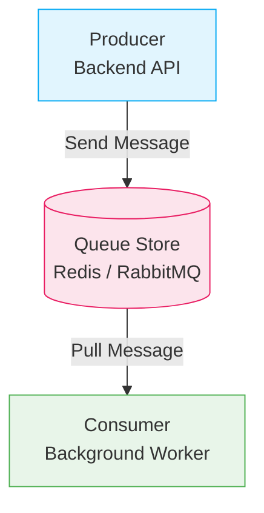
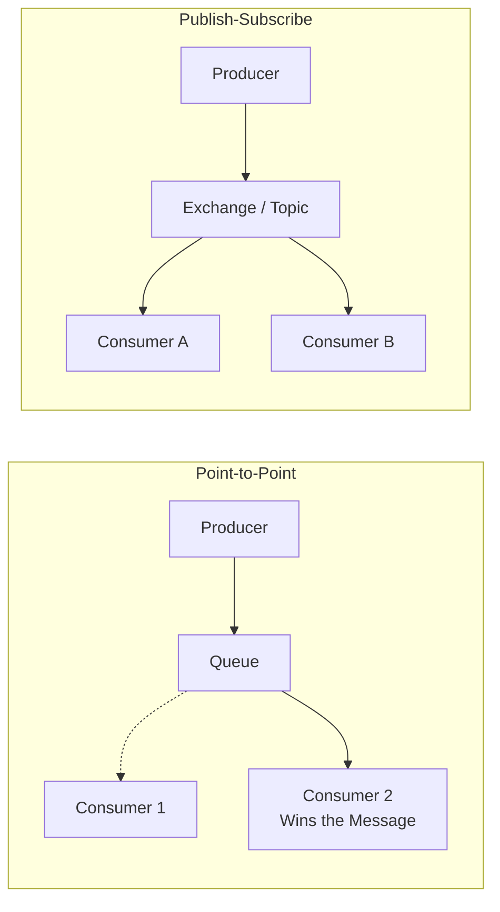

# Day 24: Message Queues (RabbitMQ, Kafka Basics)
*(Detailed, step-by-step, from first principles — with definitions, simple language, intuition, diagrams, and production Node.js examples)*

***

## SECTION 1: INTUITION (What is a Queue?)

Think of a **coffee shop**:

### Scenario: No Queue (Direct)
```text
Customer 1: "I want coffee" → Waiter makes coffee (5 min) → Done
Customer 2: "I want coffee" → Waiter makes coffee (5 min) → Done
Customer 3: "I want coffee" → Waiter makes coffee (5 min) → Done
```
**Problem**: Customer 3 waits 15 minutes. The waiter is overwhelmed and can only handle one person at a time.

### Scenario: With Queue
```text
Customer 1: "I want coffee" → Order #1 → Queue
Customer 2: "I want coffee" → Order #2 → Queue
Customer 3: "I want coffee" → Order #3 → Queue

Waiter: "Taking orders... ✅ All orders accepted"

Barista: "Processing orders..."
  - Make Order #1 (5 min)
  - Make Order #2 (5 min)
  - Make Order #3 (5 min)

Customer 1: Gets coffee (5 min)
Customer 2: Gets coffee (10 min)
Customer 3: Gets coffee (15 min)
```
**Benefit**: Customers don't stand blocked at the counter waiting for the waiter. The Barista processes them efficiently in order. The entire system is organized.

***

### In Backend Systems:

**Queue** = a data structure that:
1. Stores messages or jobs.
2. Processes them sequentially in order.
3. Serves one message at a time (or in batches) to a consumer.

> [!TIP]
> **Simple Analogy:**  
> - **Queue** = A physical line where messages "wait" their turn.  
> - **Producer** (Sender) drops a message into the line.  
> - **Consumer** (Receiver) picks up the next message in line and processes it.  
> - It functions exactly like placing an order ticket on a kitchen counter line.

***

## SECTION 2: THEORY (Why Queues Exist?)

### 2.1 Definition

A **Message Queue** is a storage system that:
1. **Stores** messages (that the producer sends).
2. **Delivers** messages (that the consumer receives).
3. **Processes** generally in order (FIFO = First In, First Out).

**Key properties**:
- **Asynchronous**: The producer doesn't wait for the consumer to finish.
- **Buffer**: It securely stores messages even if the consumer is slow or down.
- **Reliable**: Messages are not lost (if configured correctly), even if the consumer crashes mid-processing.

***

### 2.2 Why Queues Exist?

#### Problems solved by queues:

1. **Decoupling**:
   - The producer and consumer don't need to know each other or be online at the same time.
   - Producer sends → Queue stores → Consumer receives.
   - There is no direct HTTP connection between them.

2. **Load Balancing**:
   - Many producers → One queue → Multiple consumers.
   - The queue distributes work evenly across available worker servers.

3. **Buffering**:
   - The producer sends 10,000 messages instantly.
   - The consumer can only process 100 per second.
   - The queue safely stores the rest, preventing the consumer from crashing due to memory overload.

4. **Reliability**:
   - If a consumer crashes, the messages stay safely in the queue.
   - When the consumer restarts, it picks up exactly where it left off.

5. **Scalability**:
   - Need faster processing? Just add more consumer servers (workers).
   - The queue automatically distributes the work among the new servers.

***

### 2.3 Queue Patterns

#### Pattern 1: Point-to-Point (Work Queues)
```text
Producer → Queue → Consumer 1 (gets the message)
                     ↓
                   Consumer 2 (does NOT get the message)
```
- **One message → One consumer.**
- Good for: Background jobs where a task should only happen once (e.g., charging a credit card).

***

#### Pattern 2: Publish-Subscribe (Pub/Sub)
```text
Producer → Topic/Exchange → Consumer 1 (gets a copy)
                              ↓
                            Consumer 2 (gets a copy)
```
- **One message → All subscribed consumers.**
- Good for: Events, notifications, broadcasting (e.g., notifying the analytics, email, and SMS services).

***

## SECTION 3: VISUAL DIAGRAMS

### Diagram 1: Queue Architecture



***

### Diagram 2: Point-to-Point vs Publish-Subscribe



***

## SECTION 4: RABBITMQ vs KAFKA

These are the two most prominent message brokers in the industry.

### 4.1 RabbitMQ

**Definition**:  
RabbitMQ is a traditional **message broker** that:
- Stores messages in dedicated queues.
- Deletes them once they are successfully consumed.
- Supports highly complex routing logic.

**Characteristics**:
- **Queue-based**: Messages are isolated into distinct queues.
- **Push/Pull**: Consumers actively pull or are pushed messages.
- **Smart Broker, Dumb Consumer**: RabbitMQ handles all the complex routing and tracking of what is consumed.
- **Fast**: Very low latency.
- **Good for**: Jobs, tasks, work distribution where order and delivery guarantees are paramount.

**Use cases**:
- Background jobs (emails, PDF generation).
- Task queues (order processing).
- Work distribution (load balancing across workers).

***

### 4.2 Kafka

**Definition**:  
Apache Kafka is a **distributed event streaming platform** that:
- Stores messages as an append-only log in "topics".
- Streams events to consumers without deleting them immediately.
- Built for massive, unrelenting data throughput.

**Characteristics**:
- **Topic-based**: Messages are appended to a log.
- **Pull-based**: Consumers track their own "offset" (position in the log) and pull data.
- **Dumb Broker, Smart Consumer**: Kafka just stores logs rapidly. The consumer is responsible for remembering what it has read.
- **High Throughput**: Capable of millions of messages per second.
- **Good for**: Events, logs, data pipelines.

**Use cases**:
- Event streaming (user activity tracking, clickstreams).
- Log aggregation (centralizing server logs).
- Real-time analytics dashboards.
- Massive data pipelines (ETL).

***

### 4.3 RabbitMQ vs Kafka Table

| Feature | RabbitMQ | Kafka |
|---------|----------|-------|
| **Architecture Pattern** | Smart Broker / Dumb Consumer | Dumb Broker / Smart Consumer |
| **Throughput** | Medium (~50K msg/sec) | Extremely High (1M+ msg/sec) |
| **Latency** | Low (<10ms) | Medium (10-100ms) |
| **Message Retention** | Deleted after consumption | Retained for days/weeks (replayable) |
| **Routing Flexibility**| Complex (Direct, Fanout, Topic, Headers) | Simple (Topics and Partitions) |
| **Best For** | Background Jobs, Task Queues | Event Sourcing, Activity Streams |

> ✅ **[Principal Engineer Note]: The Smart/Dumb Architecture Tradeoff**
> *The fundamental difference between RabbitMQ and Kafka is where the "Brain" lives. RabbitMQ is a "Smart Broker". It keeps track of exactly who consumed what, in RAM. This makes tracking easy but limits throughput because the broker is doing heavy bookkeeping. Kafka is a "Dumb Broker". It just blindly appends bytes to a text file on a hard drive as fast as possible. The Consumer is the "Smart" one; it must remember its own `offset` (which line of the file it read last). This shifted complexity allows Kafka to achieve millions of messages per second.*

***

### 4.4 When to Use Which?

**Use RabbitMQ if**:
- You are distributing discrete tasks to background workers.
- You need complex routing (e.g., routing errors to one queue, warnings to another).
- You want the broker to manage message tracking (acknowledgments).
- Sub-millisecond latency is critical.

**Use Kafka if**:
- You are building an Event-Driven Architecture (EDA).
- You are dealing with a firehose of data (metrics, logs, IoT sensors).
- You need the ability to "replay" historical messages.
- Multiple independent services need to read the same stream of data.

***

## SECTION 5: PRODUCTION NODE.JS EXAMPLES

### 5.1 RabbitMQ Example (Node.js + `amqplib`)

**Install**:
```bash
npm install amqplib
```

**Producer (Sender)**:
```javascript
const amqp = require('amqplib');

async function sendEmailJob(to, subject, body) {
  // 1. Connect to RabbitMQ Server
  const conn = await amqp.connect('amqp://localhost');
  const channel = await conn.createChannel();
  
  const queueName = 'email-queue';
  
  // 2. Ensure queue exists (durable: true means it survives broker restarts)
  await channel.assertQueue(queueName, { durable: true });
  
  // 3. Send message as a Buffer
  const message = JSON.stringify({ to, subject, body });
  channel.sendToQueue(queueName, Buffer.from(message), { 
    persistent: true // Ensure message is saved to disk
  });
  
  console.log('Email job queued!');
  
  // Close connection gracefully
  setTimeout(() => conn.close(), 500);
}

sendEmailJob('user@example.com', 'Welcome!', 'Welcome to our platform!');
```

**Consumer (Worker)**:
```javascript
const amqp = require('amqplib');

async function consumeEmailJobs() {
  const conn = await amqp.connect('amqp://localhost');
  const channel = await conn.createChannel();
  
  const queueName = 'email-queue';
  await channel.assertQueue(queueName, { durable: true });
  
  // Only give 1 message to this worker at a time (Load balancing)
  channel.prefetch(1); 
  
  console.log('Listening for email jobs...');
  
  // 4. Consume messages
  channel.consume(queueName, async (msg) => {
    if (msg !== null) {
      const { to, subject, body } = JSON.parse(msg.content.toString());
      
      try {
        // Simulate sending email
        await simulateEmailSend(to, subject, body);
        console.log(`Email sent successfully to ${to}`);
        
        // 5. Acknowledge success - RabbitMQ will now delete it
        channel.ack(msg);
      } catch (err) {
        console.error("Failed to send email");
        // Nack (Negative Acknowledgement) - put it back in queue to retry
        channel.nack(msg);
      }
    }
  });
}

consumeEmailJobs();
```

***

### 5.2 Kafka Example (Node.js + `kafkajs`)

**Install**:
```bash
npm install kafkajs
```

**Producer (Sender)**:
```javascript
const { Kafka } = require('kafkajs');

const kafka = new Kafka({
  clientId: 'user-service',
  brokers: ['localhost:9092']
});

const producer = kafka.producer();

async function emitSignupEvent(userId, email) {
  await producer.connect();
  
  // Send an event to the topic
  await producer.send({
    topic: 'user-events',
    messages: [
      {
        key: userId, // Key ensures messages for same user go to same partition (ordering)
        value: JSON.stringify({ event: 'USER_SIGNED_UP', userId, email })
      }
    ]
  });
  
  console.log('Signup event emitted to Kafka!');
  await producer.disconnect();
}
```

**Consumer (Receiver)**:
```javascript
const { Kafka } = require('kafkajs');

const kafka = new Kafka({
  clientId: 'analytics-service',
  brokers: ['localhost:9092']
});

// Group ID ensures load balancing among multiple instances of this service
const consumer = kafka.consumer({ groupId: 'analytics-group' });

async function consumeUserEvents() {
  await consumer.connect();
  
  // Subscribe to the topic
  await consumer.subscribe({ topic: 'user-events', fromBeginning: true });
  
  console.log('Listening for user events...');
  
  await consumer.run({
    eachMessage: async ({ topic, partition, message }) => {
      const eventData = JSON.parse(message.value.toString());
      
      console.log(`Received Event: ${eventData.event} for User: ${eventData.userId}`);
      // Update analytics database...
    }
  });
}

consumeUserEvents();
```

***

## SECTION 6: COMMON MISTAKES

### Mistake 1: Forgetting Message Acknowledgment (Ack)
```javascript
// BAD - No ack
channel.consume('queue', async (msg) => {
  processMessage(msg);
  // RabbitMQ keeps this message marked as 'unacked' forever. Memory leak!
});

// GOOD - With ack
channel.consume('queue', async (msg) => {
  await processMessage(msg);
  channel.ack(msg); // Safely remove from queue
});
```

***

### Mistake 2: Dropping Failed Messages Silently
```javascript
// BAD - No retry mechanism
channel.consume('queue', async (msg) => {
  processMessage(msg);
  // If processMessage throws an error, the message is lost if auto-ack is true.
});

// GOOD - Negative Acknowledgement
channel.consume('queue', async (msg) => {
  try {
    await processMessage(msg);
    channel.ack(msg);
  } catch (err) {
    // Requeue the message so another worker can try, or route to a Dead Letter Queue
    channel.reject(msg, false); 
  }
});
```

> ✅ **[Principal Engineer Note]: The Poison Pill Problem**
> *If a Producer accidentally sends a message with malformed JSON (`{ "user": "raj", broken_json `), the Consumer's `JSON.parse(msg)` will crash. If you just `nack(msg)` and put it back in the queue, another consumer will pick it up, crash, and put it back. This creates an infinite loop that brings down your entire worker cluster in seconds. This is called a **Poison Pill**. You MUST configure a **Dead Letter Queue (DLQ)**. Tell RabbitMQ: "If this message fails 3 times, move it to the DLQ and stop retrying." Engineers can then manually inspect the DLQ later.*

***

### Mistake 3: Relying Strictly on Ordering Across Partitions
In modern distributed systems (like Kafka or RabbitMQ with multiple consumers), strict global ordering is very hard. 
- **Rule of Thumb**: Design your workers to be **idempotent** (processing the same message twice causes no harm) and to handle messages independently without assuming strict chronological delivery.

***

## SECTION 7: INTERVIEW PREPARATION

### Conceptual Questions
1. **What is a message broker? Why do we use it in a microservices architecture?**
2. **Explain the architectural differences between RabbitMQ and Kafka.**
3. **When would you explicitly choose RabbitMQ over Kafka, and vice versa?**
4. **What is Point-to-Point vs Publish-Subscribe messaging?**
5. **How does a queue provide fault tolerance if a database goes down temporarily?**

### Technical/Deep Dive Questions
6. **What is message acknowledgment (ack) and why is it crucial?**
7. **What is a Dead Letter Queue (DLQ) in RabbitMQ?** *(Answer: A queue where messages that fail to process multiple times are sent for manual inspection).*
8. **Why does Kafka have much higher throughput than RabbitMQ?** *(Answer: Kafka simply appends to sequential logs on disk without tracking individual message acks for every consumer).*
9. **How do you ensure strict ordering in Kafka?** *(Answer: By routing related messages to the exact same Partition using a specific Message Key).*

***
