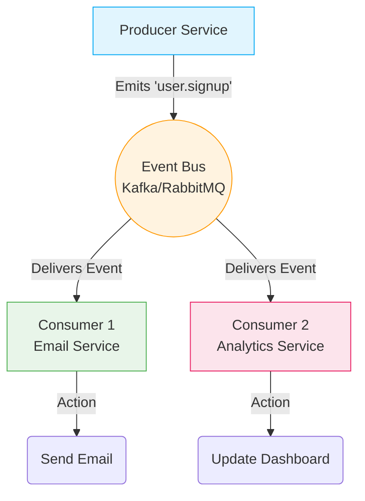

# Day 25: Event-Driven Architecture (Producers, Consumers, Events)
*(Detailed, step-by-step, from first principles — with definitions, simple language, intuition, diagrams, and production Node.js examples)*

***

## SECTION 1: INTUITION (What is Event-Driven Architecture?)

Think of a **restaurant notification system**:

### Scenario: No Events (Blocking / Polling)
```text
Customer: "I want food"
Chef: Cooking...
Customer: "Is it ready?"
Chef: "No, wait 10 min"
Customer: "Is it ready?"
Chef: "No, wait 5 min"
Customer: "Is it ready?"
Chef: "Yes! Come and get it"
```
**Problem**: The customer wastes time and energy repeatedly asking (polling). The chef gets annoyed responding to requests instead of cooking.

### Scenario: With Events (Non-Blocking)
```text
Customer: "I want food"
Chef: Cooking...
Chef: "I'll notify you when ready" (Promises to emit an event)

[Time passes. Customer relaxes.]

[Event Emitted: "Food Ready" via buzzer]
Customer: Gets buzzer notification → Goes to kitchen
```
**Benefit**: The customer doesn't ask repeatedly. The chef broadcasts a notification exactly when the state changes. The system is highly efficient.

***

### In Backend Systems:

An **Event** is simply a digital signal that "something happened in the past":
- A user signed up.
- An order was created.
- A payment succeeded.

**Event-Driven Architecture (EDA)** is a system where:
- **Producers** emit events to the universe.
- **Consumers** listen for those specific events.
- Consumers automatically react when the event occurs.

> [!TIP]
> **Simple Analogy:**  
> - **Event** = A signal that "a fact has occurred".  
> - **Producer** = The service that shouts the fact (e.g., "A user signed up!").  
> - **Consumer** = The service that is listening and reacts (e.g., "I heard a user signed up, I'll send them a welcome email!").  
> - It is exactly like a restaurant buzzer vibrating when your food is ready.

***

## SECTION 2: THEORY (Event-Driven Architecture)

### 2.1 Definition

An **Event** is an immutable record of a fact. It usually looks like this in JSON:
```json
{
  "eventId": "evt_987654",
  "type": "user.signup",
  "data": {
    "userId": "123",
    "email": "user@example.com"
  },
  "timestamp": "2026-07-10T12:00:00Z"
}
```

**Event-Driven Architecture (EDA)** is a software design pattern where decoupled services communicate asynchronously by producing and consuming events.

**Key properties**:
- **Asynchronous**: The producer fires the event and immediately moves on. It doesn't wait for a response.
- **Decoupled**: The producer does not know who is listening. It just emits the fact.
- **Extensible**: You can add 5 new consumer services tomorrow without changing a single line of code in the producer.

***

### 2.2 Event Components

#### 1. **Producer**:
- The microservice or module that triggers the event.
- It doesn't care who consumes the event.
- Example: The Authentication API that creates the user.

#### 2. **Event Payload**:
- The actual data describing what happened.
- Has a `type` and a `payload`.

#### 3. **Consumer**:
- The microservice or worker listening for the event.
- Reacts when the event happens.
- Example: The Notification Service sending a welcome email.

#### 4. **Event Bus / Message Broker**:
- The infrastructure that routes the events from producers to consumers.
- Example: Kafka, RabbitMQ, AWS EventBridge.

***

### 2.3 Event Flow



> ✅ **[Principal Engineer Note]: The Reality of Eventual Consistency**
> *When you adopt EDA, you are abandoning Strict Consistency (ACID). If a user completes an order, the Order API returns 200 OK instantly. However, the Inventory API might take 200ms to process the `order.created` event. For those 200 milliseconds, the system is technically inconsistent! The Order exists, but the stock hasn't decreased yet. This is called **Eventual Consistency**. You must design frontends to hide this delay (e.g. optimistic UI updates) and train stakeholders to accept that data is temporarily out of sync.*

***

## SECTION 3: VISUAL DIAGRAMS

### Diagram 1: Request-Response vs Event-Driven

**Request-Response (Tight Coupling)**
```text
Order API ──(HTTP POST)──> Inventory API
          ──(HTTP POST)──> Shipping API
          ──(HTTP POST)──> Email API
(Order API must know about all 3 services and handle their failures)
```

**Event-Driven (Loose Coupling)**
```text
Order API ──(Emits 'order.created')──> EVENT BUS
                                          │
                                          ├─> Inventory API (Listens)
                                          ├─> Shipping API (Listens)
                                          └─> Email API (Listens)
(Order API knows nothing about the other services)
```

***

## SECTION 4: PRODUCTION MERN EXAMPLES

### 4.1 Example: User Signup Events

**Producer (Auth API)**:
```javascript
app.post('/signup', async (req, res) => {
  const { email, name } = req.body;
  
  // 1. Create user in database (Primary action)
  const user = await createUser({ email, name });
  
  // 2. Emit event to the Event Bus (Kafka/RabbitMQ)
  await eventBus.publish('user.signup', {
    userId: user.id,
    email: user.email,
    name: user.name,
    timestamp: new Date()
  });
  
  // 3. Return immediately
  res.json({ success: true, userId: user.id });
});
```

**Consumer 1 (Notification Service)**:
```javascript
// This service only cares about sending emails
eventBus.subscribe('user.signup', async (event) => {
  const { userId, email, name } = event.data;
  
  await sendWelcomeEmail({ email, name });
  console.log(`Welcome email sent to ${email}`);
});
```

**Consumer 2 (Analytics Service)**:
```javascript
// This service only cares about tracking metrics
eventBus.subscribe('user.signup', async (event) => {
  const { userId, email, timestamp } = event.data;
  
  await insertIntoDataWarehouse({
    eventType: 'signup',
    userId,
    timestamp
  });
  console.log(`Analytics updated for ${userId}`);
});
```

***

### 4.2 Example: Order Created Events (E-Commerce)

**Producer (Order Service)**:
```javascript
app.post('/order', async (req, res) => {
  const { userId, productId, amount } = req.body;
  
  const order = await createOrder({ userId, productId, amount });
  
  await eventBus.publish('order.created', {
    orderId: order.id,
    userId: order.userId,
    productId: order.productId,
    amount: order.amount,
  });
  
  res.json({ success: true, orderId: order.id });
});
```

**Consumer 1 (Inventory Service)**:
```javascript
eventBus.subscribe('order.created', async (event) => {
  const { productId, amount } = event.data;
  
  // Decrease stock safely
  await decreaseInventory(productId, amount);
});
```

**Consumer 2 (Payment Service)**:
```javascript
eventBus.subscribe('order.created', async (event) => {
  const { orderId, amount } = event.data;
  
  // Trigger payment gateway
  await processPayment({ orderId, amount });
});
```

***

## SECTION 5: COMMON MISTAKES

### Mistake 1: Not Handling Failed Events Intelligently
```javascript
// BAD - Silent Failure
eventBus.subscribe('user.signup', async (event) => {
  sendEmail(event.data); // If SMTP fails, the error is swallowed and lost.
});

// GOOD - Try/Catch with Retries/DLQ
eventBus.subscribe('user.signup', async (event) => {
  try {
    await sendEmail(event.data);
  } catch (err) {
    console.error('Failed to send email:', err);
    // Push this specific event to a Dead Letter Queue or trigger a retry mechanism
    await pushToDeadLetterQueue(event);
  }
});
```

> ✅ **[Principal Engineer Note]: The Dual-Write Problem (Outbox Pattern)**
> *Look at Section 4.1. The API saves the user to MongoDB, and THEN publishes to the Event Bus. What if the server crashes exactly between step 1 and step 2? The user exists in the DB, but the event is NEVER fired. The Welcome Email is never sent! This is the "Dual-Write Problem". At scale, we solve this using the **Transactional Outbox Pattern**: You save the user AND the event into MongoDB in the same ACID transaction. A separate process (like Debezium) reads the MongoDB replication log and securely forwards the event to Kafka.*

***

### Mistake 2: Circular Event Dependencies
```javascript
// BAD - Infinite Loop
eventBus.subscribe('user.updated', () => {
  // Causes a database update, which triggers 'user.updated' again
  eventBus.publish('user.updated'); 
});

// GOOD - Strict unidirectional flow
// Ensure consumers emit distinct events (e.g., 'profile.synced') that don't trigger their own listeners.
```

***

### Mistake 3: Breaking Event Schemas
```javascript
// BAD - Mutating the schema unexpectedly
eventBus.publish('user.signup', { id, email }); // Old format
// ... 6 months later ...
eventBus.publish('user.signup', { userId, contactEmail }); // New format breaks consumers!

// GOOD - Version your events
eventBus.publish('user.signup.v1', { id, email });
eventBus.publish('user.signup.v2', { userId, contactEmail });
```

***

## SECTION 6: INTERVIEW PREPARATION

### Conceptual Questions
1. **What is Event-Driven Architecture and why do microservices heavily rely on it?**
2. **What is the difference between a Producer and a Consumer?**
3. **What are the primary benefits of EDA over synchronous REST API calls between microservices?**
4. **How does EDA handle temporary outages in consumer services?** *(Answer: The Event Bus holds the events until the consumer is back online, ensuring no data is lost).*
5. **What is an Idempotent Consumer?** *(Answer: A consumer that can process the exact same event multiple times without causing duplicate side effects, like charging a credit card twice).*

### System Design Questions
6. **Design an Event-Driven system for a ride-sharing app (Uber). What events occur when a user requests a ride?**
7. **If the Email Service is down for 3 hours, what happens to the `user.signup` events emitted by the Auth Service?**
8. **How do you prevent circular dependencies in complex Event-Driven systems?**

***

## SECTION 7: ACTIVE LEARNING - YOUR TURN

### Conceptual Checkpoint:
1. **Explain the structural difference between `Request-Response` and `Event-Driven` in your own words.**
2. **If you have one Producer and three different Consumers listening to the same event, is this Point-to-Point or Publish-Subscribe?**
3. **Why must you version your event payloads in a production system?**

### System Design Scenario:
**You are building Netflix's video processing pipeline.**
When an admin uploads a raw `.mp4` file, it needs to be:
- Converted to 1080p, 720p, and 480p.
- Scanned for inappropriate content.
- Watermarked with the Netflix logo.

**Questions:**
- Which service is the Producer?
- What event should be emitted?
- Who are the Consumers?
- What happens if the Watermarking Consumer crashes halfway through?

***
