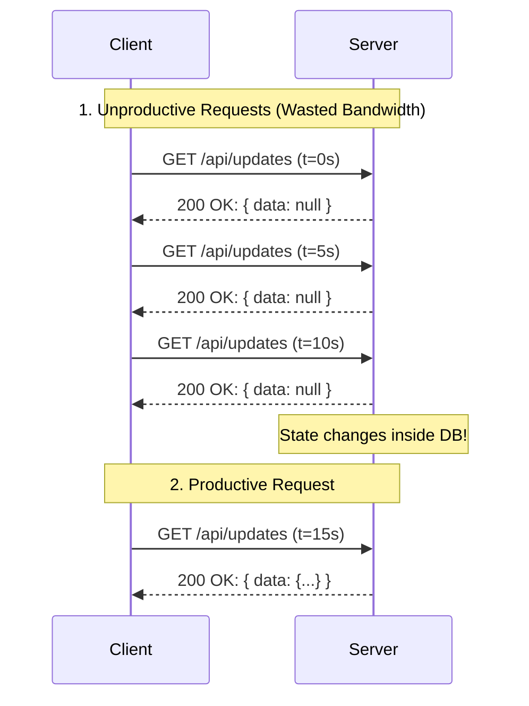

# Day 26: Polling Fundamentals
*(Detailed, step-by-step, from first principles — with definitions, simple analogies, system diagrams, and production Node.js examples)*

***

## SECTION 1: INTUITION (What is Polling?)

Think of checking your **email** or waiting for a **delivery**:

### Scenario 1: Polling (Active Asking)
```text
You: "Is there any new mail?" → Check mailbox → No new mail.
You: "Is there any new mail?" → Check mailbox → No new mail.
You: "Is there any new mail?" → Check mailbox → Yes! New mail.
You: Read the mail.
```
**How it works**: You are initiating the check repeatedly. If nothing is there, you've wasted a trip to the mailbox. 

***

### Scenario 2: Push (Not Polling)
```text
You: "I want to receive my mail."
Postman: "I'll knock on your door when new mail arrives."
[Time passes, you relax inside]
[Knock on door!] → You: Read the mail.
```
**How it works**: The server (postman) notifies you only when a state change happens.

***

### In Web Development:

**Polling** = The client repeatedly sends HTTP requests to the server to check for state changes:
```text
Client → GET /api/updates → Server: { hasUpdates: false }
Client → GET /api/updates → Server: { hasUpdates: false }
Client → GET /api/updates → Server: { hasUpdates: true, data: {...} }
```

> [!TIP]
> **Simple Analogy:**  
> - **Polling** is like the classic road trip question from a child: *"Are we there yet? Are we there yet?"*
> - The parent (Server) repeatedly checks the map and responds *"No"* until they finally reach the destination and respond *"Yes!"*.

***

## SECTION 2: THEORY (Why Polling Exists?)

### 2.1 Definition

**Polling** (often called Short Polling) is a client-server communication technique where:
1. The **Client** repeatedly requests data from the **Server** at a fixed interval (e.g., every 5 seconds).
2. The **Server** immediately responds with the current state (either new data or an empty response).
3. The **Connection** is closed immediately after the response.

**Key properties**:
- **Stateless & Simple**: Built directly on standard HTTP request/response cycles.
- **Predictable**: Network traffic occurs at known, fixed intervals.
- **High Overhead**: Creates massive amounts of empty "dummy" traffic when the data hasn't changed.

***

### 2.2 Why Polling Exists?

Despite its inefficiency, Short Polling is still used today. Why?

1. **Extreme Simplicity**:
   - Implementing polling requires no special infrastructure. A simple `setInterval()` loop in JavaScript and a standard Express.js route are all that's needed.
   
2. **Universal Compatibility**:
   - It works on every browser, every mobile device, and through every firewall and proxy server. It's just standard HTTP traffic.

3. **Inherent Resilience**:
   - If a request drops due to network failure, the client simply tries again in the next interval. There's no complex connection state to restore.

***

### 2.3 When to Use Polling?

**Use polling for**:
- **Low-frequency updates**: Checking if a heavy background job (like video rendering) finished, updating every 30 seconds.
- **Stateless/Legacy architectures**: Systems that cannot support persistent connections.
- **Small-scale applications**: Dashboards with 10 concurrent users where overhead doesn't matter.

**Don't use polling for**:
- **High-frequency / Low-latency requirements**: Chat applications, multiplayer gaming, or live collaborative editors.
- **Massive scale**: If 100,000 users poll every second, your server will face 100,000 requests per second (RPS) of pure noise.

***

## SECTION 3: VISUAL DIAGRAMS

### Diagram 1: The Inefficiency of Short Polling



***

## SECTION 4: PRODUCTION EXAMPLES

### 4.1 Example: Background Job Status Polling

If a user requests a data export (CSV generation), it might take 2 minutes. We don't want to use WebSockets for this rare event. We use polling.

**Frontend (React)**:
```javascript
import { useState, useEffect } from 'react';

function ExportButton({ jobId }) {
  const [status, setStatus] = useState('processing');

  useEffect(() => {
    // Prevent polling if job is already done
    if (status === 'completed' || status === 'failed') return;

    const pollInterval = setInterval(async () => {
      try {
        const res = await fetch(`/api/jobs/${jobId}/status`);
        const data = await res.json();
        
        setStatus(data.status); // e.g., 'processing', 'completed'
        
        if (data.status === 'completed') {
          clearInterval(pollInterval); // Cleanup!
          downloadFile(data.fileUrl);
        }
      } catch (err) {
        console.error("Polling error", err);
      }
    }, 5000); // Check every 5 seconds
    
    // Cleanup interval on component unmount
    return () => clearInterval(pollInterval);
  }, [jobId, status]);

  return <div>Export Status: {status}</div>;
}
```

**Backend (Node.js / Express)**:
```javascript
app.get('/api/jobs/:jobId/status', async (req, res) => {
  const { jobId } = req.params;
  
  // Quick database lookup (ideally from Redis for speed)
  const job = await redis.get(`job:${jobId}`);
  
  if (!job) {
    return res.status(404).json({ error: "Job not found" });
  }
  
  // Immediately return current state
  res.json(JSON.parse(job));
});
```

***

## SECTION 5: ARCHITECTURAL OPTIMIZATIONS

If you MUST use short polling at scale, you must optimize it. 

### Optimization 1: State Tracking (Cursor / Last ID)
Never return the full dataset. Always ask for "data since my last check".

**Frontend**:
```javascript
let lastSeenId = 0;

setInterval(async () => {
  // Only ask for updates newer than what we have
  const res = await fetch(`/api/feed?after_id=${lastSeenId}`);
  const newItems = await res.json();
  
  if (newItems.length > 0) {
    lastSeenId = newItems[newItems.length - 1].id;
    appendFeed(newItems);
  }
}, 5000);
```

### Optimization 2: Caching the Endpoint
Because polling endpoints are hit repeatedly by thousands of users, they should **never** query the primary relational database directly.

**Backend**:
```javascript
// BAD: Hitting PostgreSQL every 5 seconds per user
app.get('/api/global-announcement', async (req, res) => {
  const data = await pg.query('SELECT * FROM announcements ORDER BY id DESC LIMIT 1');
  res.json(data);
});

// GOOD: Hitting Redis (In-Memory)
app.get('/api/global-announcement', async (req, res) => {
  const data = await redis.get('latest_announcement');
  res.json(JSON.parse(data));
});
```

> ✅ **[Principal Engineer Note]: HTTP ETags and `304 Not Modified`**
> *Even if you hit Redis, you are still sending the full JSON payload over the network every 5 seconds. To save massive amounts of egress bandwidth costs, use **ETags**. The server hashes the response (e.g., `W/"1a2b3c"`) and sends it in the `ETag` header. Next time the client polls, it sends `If-None-Match: W/"1a2b3c"`. The server checks the hash, sees it hasn't changed, and returns a completely empty `304 Not Modified` response. Express.js actually does this automatically if you use `res.json()`, but you must ensure it isn't disabled!*

***

## SECTION 6: COMMON MISTAKES

### Mistake 1: Polling Too Frequently
```javascript
// BAD - Aggressive polling DDOS's your own server
setInterval(pollData, 500); // 120 requests a minute per user!

// GOOD - Reasonable cadence
setInterval(pollData, 10000); // 6 requests a minute
```

### Mistake 2: Missing Cleanup (Memory Leaks in React)
```javascript
// BAD - Interval runs forever even if user navigates away
useEffect(() => {
  setInterval(fetchData, 5000); 
}, []);

// GOOD - Clear interval on unmount
useEffect(() => {
  const timer = setInterval(fetchData, 5000);
  return () => clearInterval(timer);
}, []);
```

### Mistake 3: Network Stacking (Thundering Herd)
If the server takes 6 seconds to respond, but the interval is 5 seconds, the client will fire a second request before the first one finishes. This creates a cascade of overlapping requests.
**Solution**: Use `setTimeout` recursively instead of `setInterval`.

```javascript
async function safePoll() {
  await fetch('/api/data'); // Wait for this to finish
  setTimeout(safePoll, 5000); // Then wait 5 seconds before the next
}
safePoll();
```

> ✅ **[Principal Engineer Note]: The Mobile Battery Killer**
> *Never use Short Polling if your client is a mobile app. Mobile network radios (4G/5G) have "tail times"—they stay fully powered on for 10-15 seconds after any network activity. If you poll every 5 seconds, the radio NEVER goes to sleep. You will drain a user's battery in hours and get your app uninstalled. Always use Push Notifications (APNs/FCM) or WebSockets for mobile!*

***

## SECTION 7: INTERVIEW PREPARATION

### Conceptual Questions
1. **What is the fundamental difference between Polling and Push architecture?**
2. **What happens to the server's CPU and Network Bandwidth when 100,000 clients poll every 1 second?** *(Answer: The server handles 100K RPS. Assuming a 1KB header payload, that's 100MB/s of pure HTTP overhead just to say "No updates").*
3. **How does recursive `setTimeout` solve polling stack issues better than `setInterval`?**

### System Design Scenario
*Company: Basecamp / Trello*
"We have a project dashboard. When a manager updates a task's status, the employees looking at the dashboard should see it update within 15 seconds. WebSockets are too complex for our current infrastructure. How do you design this?"
*(Expected Answer: Implement Short Polling every 15 seconds. To protect the database, use Redis as a caching layer for the dashboard state. Use recursive setTimeout on the frontend).*

***
