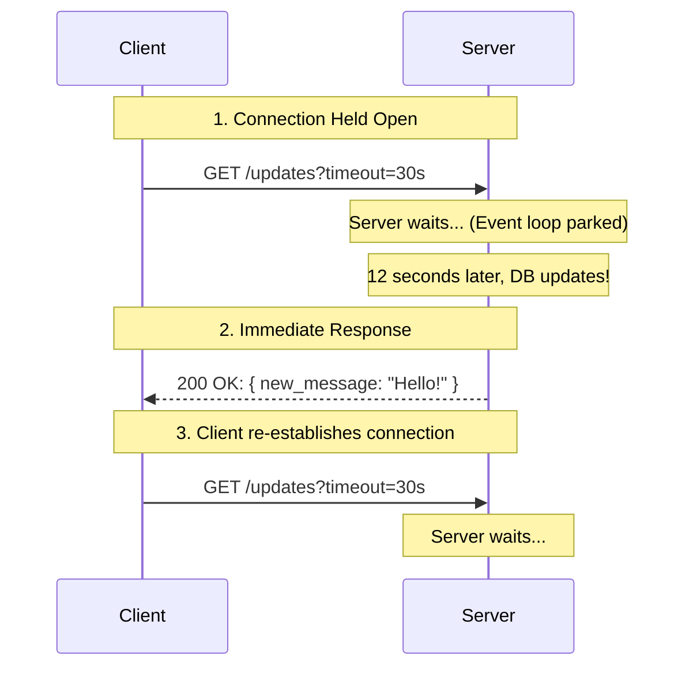

# Day 27: Long Polling
*(Detailed, step-by-step, from first principles — with definitions, simple analogies, system diagrams, and production Node.js examples)*

***

## SECTION 1: INTUITION (What is Long Polling?)

Think of ordering food at a **restaurant**:

### Scenario 1: Short Polling (Aggressive)
```text
Customer: "Is my food ready?" → Waiter: "No."
Customer (1 min later): "Is my food ready?" → Waiter: "No."
Customer (1 min later): "Is my food ready?" → Waiter: "No."
```
The customer wastes their own energy asking, and wastes the waiter's time responding.

***

### Scenario 2: Long Polling (Patient Waiting)
```text
Customer: "Is my food ready? I will stand right here and wait until it is."
Waiter: "Okay, I will go check and not come back until the chef hands it to me."
[Time passes... Waiter stands at the kitchen window]
[Chef finishes food, hands to Waiter]
Waiter returns to Customer: "Here is your food!"
```
The customer asks ONCE. The waiter actively holds the request open until there is an actual update to provide.

***

### In Web Development:

**Long Polling** = The client makes an HTTP request, but the server purposefully **delays** the response until new data is available (or a timeout occurs).

```text
Client → GET /api/updates (Waits...)
Server → (Checks DB... nothing... waits...)
Server → (Data arrives via event!)
Server → { hasUpdates: true, data: {...} } 
Client → Immediately makes another long-poll request to wait for the next update.
```

> [!TIP]
> **Simple Analogy:**  
> - **Long Polling** is like calling customer service and being put on hold. The line stays open, and you wait silently until an agent finally picks up.

***

## SECTION 2: THEORY (Why Long Polling Exists?)

### 2.1 Definition

**Long Polling** is a communication technique designed to emulate server-push using standard HTTP:
1. **Client** makes a request to the **Server** (usually with a specified timeout, e.g., 30 seconds).
2. **Server** receives the request but *does not respond immediately* if there is no new data. It holds the connection open.
3. When data finally becomes available, the **Server** responds.
4. If no data arrives before the timeout expires, the Server responds with an empty message.
5. Immediately upon receiving a response, the **Client** initiates a new request.

**Key properties**:
- **Fewer Wasted Requests**: Eliminates the "empty" HTTP traffic of short polling.
- **Lower Latency**: The moment data arrives on the server, it is instantly pushed down the open connection to the client.
- **Resource Heavy on Server**: The server must keep thousands of HTTP connections open simultaneously.

***

### 2.2 How Long Polling Works Internally



***

## SECTION 3: PRODUCTION EXAMPLES (MERN STACK)

Implementing Long Polling requires asynchronous programming. Node.js (with its Event Loop) is spectacularly good at this compared to thread-blocking languages like Java or PHP.

### 3.1 Backend: Holding the Connection in Express.js

We will use Node's `EventEmitter` to signal when new data arrives, allowing the Express route to resolve.

```javascript
const express = require('express');
const EventEmitter = require('events');

const app = express();
const messageEmitter = new EventEmitter();

// In-memory store for demo purposes
let latestMessage = null;

// The Long Polling Endpoint
app.get('/api/messages/poll', async (req, res) => {
  // 1. If we already have a message they haven't seen, return immediately
  if (latestMessage) {
    const msg = latestMessage;
    latestMessage = null; // Clear it so we don't send it twice
    return res.json({ message: msg });
  }

  // 2. Set a maximum timeout (e.g., 20 seconds) to prevent infinite holding
  const timeoutId = setTimeout(() => {
    // Timeout reached, no new messages
    messageEmitter.removeListener('new_message', messageHandler);
    res.status(204).end(); // 204 No Content
  }, 20000);

  // 3. Define what happens when a new message event occurs
  const messageHandler = (newMsg) => {
    clearTimeout(timeoutId); // Cancel the timeout
    res.json({ message: newMsg }); // Send the response!
  };

  // 4. Attach the listener and wait
  messageEmitter.once('new_message', messageHandler);
});

// A standard endpoint to simulate another user sending a message
app.post('/api/messages', express.json(), (req, res) => {
  const { text } = req.body;
  
  // Emit the event to wake up the waiting Long Polling requests
  messageEmitter.emit('new_message', text);
  
  res.json({ success: true });
});

app.listen(3000, () => console.log('Long Polling server running'));
```

> ✅ **[Principal Engineer Note]: Ephemeral Port Exhaustion**
> *Holding 50,000 HTTP connections open on a single Node.js server sounds great because V8 uses little RAM. However, Linux has a hard limit of ~65,000 TCP ports available per IP address. If 65,000 users long-poll your server, the OS runs out of ports, and the 65,001st user gets a "Connection Refused" error, even if CPU is at 2%. In production, you must scale horizontally behind a load balancer to distribute the TCP connections!*

### 3.2 Frontend: The Recursive Re-connection

**React / Vanilla JavaScript**:
```javascript
async function startLongPolling() {
  try {
    // 1. Make the request (this will hang for up to 20 seconds)
    const response = await fetch('/api/messages/poll');
    
    if (response.status === 200) {
      const data = await response.json();
      console.log("New Message Arrived instantly:", data.message);
      // Handle the UI update
    } else if (response.status === 204) {
      console.log("Timeout reached, no new data. Reconnecting...");
    }
  } catch (err) {
    // Network error (e.g., wifi dropped)
    console.error("Connection lost", err);
    // Wait 5 seconds before trying again to avoid spamming reconnects
    await new Promise(resolve => setTimeout(resolve, 5000));
  } finally {
    // 2. RECURSION: Immediately start the next long poll
    startLongPolling();
  }
}

// Start it on app load
startLongPolling();
```

***

## SECTION 4: TRADE-OFFS & COMMON MISTAKES

### 4.1 Trade-offs vs WebSockets

**Pros of Long Polling:**
- Works over strictly locked-down corporate firewalls (it's just standard HTTP).
- Easy to load balance (standard HTTP routing works perfectly).
- Automatic reconnection logic is simple.

**Cons of Long Polling:**
- **High Header Overhead**: Every single message requires establishing a full HTTP request, sending HTTP headers, parsing them, etc.
- **Unidirectional**: The server can push to the client, but the client must open a *separate* standard HTTP POST request to send data back to the server.

> ✅ **[Principal Engineer Note]: The Reconnect Blind Spot**
> *Look at the sequence diagram again. When a Long Poll times out and returns `204`, the client takes maybe 50-100 milliseconds to re-establish the next Long Poll. What happens if a chat message arrives at the server during those 50 milliseconds? The server tries to emit it, but the client isn't connected! The message is lost forever. To fix this in production, the client must send a `?last_message_id=987` query param on every reconnect. The server must check a Redis queue for any messages > 987 and return them immediately before parking the connection.*

***

### 4.2 Common Mistake: Blocking Threads
If you implement Long Polling in a synchronous environment (like standard PHP or Python Django without async), every waiting client consumes a full OS Thread.
- **10,000 waiting clients = 10,000 blocked threads = Server Crashes.**
- **Node.js Fix**: Because Node is asynchronous and uses an Event Loop, 10,000 waiting clients just means 10,000 parked Promises. It takes almost zero CPU to maintain.

### 4.3 Common Mistake: Infinite Timeouts
```javascript
// BAD - Never timing out
app.get('/api/updates', (req, res) => {
  emitter.once('update', (data) => res.json(data));
});
```
*Why it's bad*: Cloud load balancers (like AWS ALB or NGINX) will aggressively kill idle HTTP connections after ~60 seconds. You must gracefully timeout the request *before* the load balancer cuts the connection abruptly. (Standard practice: 20-30 seconds).

***

## SECTION 5: INTERVIEW PREPARATION

### Conceptual Questions
1. **Explain the lifecycle of a Long Polling request.**
2. **Why does Node.js excel at Long Polling compared to traditional multi-threaded languages?** *(Answer: Because Node is single-threaded and non-blocking. Waiting for an event doesn't block the thread; it simply registers a callback in the Event Loop's memory, taking minimal RAM).*
3. **What is a 204 No Content response, and why is it useful in Long Polling?** *(Answer: It indicates the server processed the request successfully but there is no new data to return, allowing the client to gracefully reconnect).*

### System Design Scenario
*Company: Slack (Early days)*
"We need to push chat messages to users with zero delay. Corporate firewalls block WebSocket traffic for 10% of our enterprise clients. How do we ensure they still get real-time chat?"
*(Expected Answer: Use WebSockets as the primary connection. Implement Long Polling as a fallback mechanism. If the WebSocket handshake fails, gracefully degrade to sending long-polling HTTP requests).*

***
