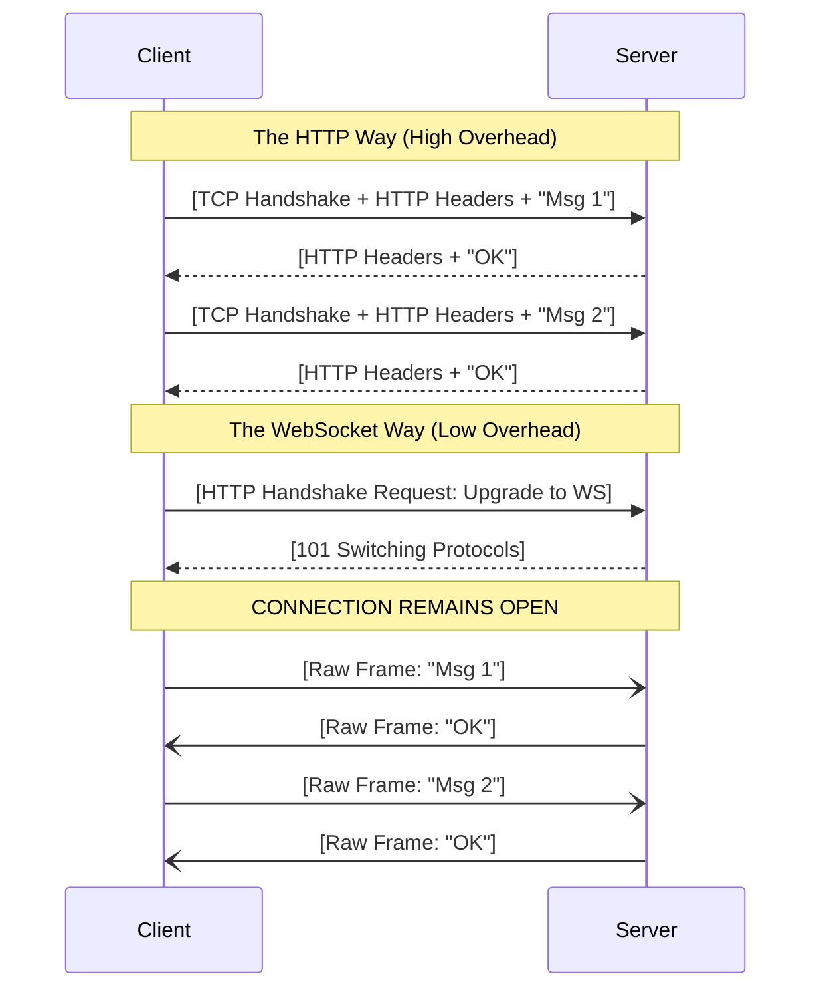

# Day 28: WebSockets
*(Detailed, step-by-step, from first principles — with definitions, simple analogies, system diagrams, and production Node.js examples)*

***

## SECTION 1: INTUITION (What are WebSockets?)

Think of making a **phone call** versus sending **letters**:

### Scenario 1: HTTP (Sending Letters)
```text
You write: "Hello?" → Mail it.
Wait 3 days.
Friend reads, writes: "Hi, how are you?" → Mails it.
Wait 3 days.
You write: "Good, bye!" → Mail it.
```
Every single message requires an envelope (headers), a stamp (TCP handshake), and a complete delivery journey.

***

### Scenario 2: WebSocket (Phone Call)
```text
You dial the number: "Can we talk?" → Friend: "Yes!"
[Connection is now OPEN]
You: "How are you?" 
Friend (Instantly): "Good!"
Friend: "What's up?" 
You: "Just working."
You: "Talk later, bye." 
[Connection hangs up]
```
You establish the connection *once*. After that, both of you can speak at any time, instantly, without dialing the number again.

***

### In Web Development:

**WebSocket** is a protocol providing full-duplex (two-way), persistent communication channels over a single TCP connection.

```text
Client → (HTTP Upgrade Request) → Server
[Protocol upgraded from HTTP to WebSocket. Connection stays OPEN]

Client → Sends binary/text frame → Server (No headers needed!)
Server → Sends binary/text frame → Client (Instantly!)
```

> [!TIP]
> **Simple Analogy:**  
> - **WebSocket** is exactly like keeping a phone line open. There is no need to hang up and redial every time you want to say a word. Both the server and the client can speak simultaneously.

***

## SECTION 2: THEORY (Why WebSockets Exist?)

### 2.1 Definition

**WebSocket** (`ws://` or `wss://` for secure) is a distinct protocol from HTTP, but it is designed to work over HTTP ports (80 and 443) and bypass firewalls.

1. **Persistent**: The TCP connection stays open indefinitely until the client or server drops it.
2. **Bidirectional**: The Server can push data to the Client without the Client asking for it. The Client can push data to the Server at any time.
3. **Low Latency & Low Overhead**: Once the connection is established, data is sent in lightweight "frames" without massive HTTP headers, cookies, or authorization tokens in every message.

***

### 2.2 The WebSocket Handshake

WebSockets start their life as a standard HTTP request! 

1. The client sends an HTTP GET request asking to **Upgrade** the connection.
```http
GET /chat HTTP/1.1
Host: server.example.com
Upgrade: websocket
Connection: Upgrade
Sec-WebSocket-Key: dGhlIHNhbXBsZSBub25jZQ==
```
2. The server agrees and replies with a `101 Switching Protocols` status.
```http
HTTP/1.1 101 Switching Protocols
Upgrade: websocket
Connection: Upgrade
Sec-WebSocket-Accept: s3pPLMBiTxaQ9kYGzzhZRbK+xOo=
```
3. The HTTP connection is now "upgraded". It is no longer HTTP; it is a raw WebSocket tunnel.

> ✅ **[Principal Engineer Note]: Load Balancers and The 60-Second Kill**
> *In production, your Node.js app sits behind a Load Balancer (AWS ALB, Nginx). By default, load balancers expect HTTP requests to finish quickly. If they don't explicitly support or aren't configured for the `101 Switching Protocols` WebSocket upgrade, they will treat your WebSocket like a stuck HTTP request and forcefully sever the connection after their 60-second Idle Timeout. You MUST explicitly configure your Load Balancer/Ingress to allow WebSockets!*

***

## SECTION 3: VISUAL DIAGRAMS

### Diagram 1: HTTP vs WebSocket Overhead



***

## SECTION 4: PRODUCTION EXAMPLES (MERN STACK)

We will use the native `ws` library for Node.js, which is incredibly fast and standard. (Note: `socket.io` is a popular wrapper that adds auto-reconnect and fallbacks, but `ws` teaches you the fundamentals).

### 4.1 Server Setup (Node.js + `ws`)

**Install**:
```bash
npm install ws
```

**Backend Code (`server.js`)**:
```javascript
const express = require('express');
const { WebSocketServer } = require('ws');
const http = require('http');

const app = express();
// We must manually create an HTTP server to share it with the WebSocket server
const server = http.createServer(app); 

// Initialize the WebSocket Server attached to our HTTP server
const wss = new WebSocketServer({ server });

wss.on('connection', (socket, req) => {
  console.log('New client connected from IP:', req.socket.remoteAddress);
  
  // Send a welcome message immediately upon connection
  socket.send(JSON.stringify({ type: 'WELCOME', message: 'Connected to server!' }));
  
  // Listen for messages from THIS specific client
  socket.on('message', (rawBuffer) => {
    // Data arrives as a raw Buffer. Convert it to a string/JSON.
    const messageStr = rawBuffer.toString();
    const data = JSON.parse(messageStr);
    
    console.log('Received:', data);
    
    // Example: Broadcasting to EVERY connected client (Live Chat feature)
    if (data.type === 'CHAT_MSG') {
      wss.clients.forEach((client) => {
        // Ensure the client connection is still fully open
        if (client.readyState === socket.OPEN) {
          client.send(JSON.stringify({ type: 'NEW_MSG', text: data.text }));
        }
      });
    }
  });
  
  socket.on('close', () => {
    console.log('Client disconnected');
  });
});

server.listen(3000, () => console.log('HTTP & WS Server on port 3000'));
```

***

### 4.2 Client Setup (Vanilla JS / React)

The browser has a built-in `WebSocket` object. No libraries are needed!

**Frontend Code**:
```javascript
// 1. Initiate the connection (Notice the ws:// protocol)
const socket = new WebSocket('ws://localhost:3000');

// 2. Event: Connection established
socket.onopen = () => {
  console.log('Successfully connected to WebSocket server');
  
  // Send a message to the server
  socket.send(JSON.stringify({ 
    type: 'CHAT_MSG', 
    text: 'Hello everyone!' 
  }));
};

// 3. Event: Server pushed data to us
socket.onmessage = (event) => {
  const data = JSON.parse(event.data);
  
  if (data.type === 'WELCOME') {
    console.log("Server says:", data.message);
  } else if (data.type === 'NEW_MSG') {
    console.log("New chat message:", data.text);
    // Update React state here: setMessages([...messages, data.text])
  }
};

// 4. Event: Connection dropped
socket.onclose = () => {
  console.log('Disconnected from server');
  // Logic to reconnect could go here
};

// 5. Event: Network Error
socket.onerror = (error) => {
  console.error('WebSocket Error:', error);
};
```

***

## SECTION 5: COMMON MISTAKES

### Mistake 1: Ignoring Dropped Connections (Zombie Sockets)
TCP connections can drop silently (e.g., a user's phone switches from WiFi to Cellular). The server might not realize the client is gone, leading to memory leaks.
**Fix (Ping/Pong)**: The server must periodically "ping" clients. If the client doesn't "pong" back, the server forcefully closes the socket.

```javascript
// Ping/Pong Implementation on Server
setInterval(() => {
  wss.clients.forEach((ws) => {
    if (ws.isAlive === false) return ws.terminate();
    
    ws.isAlive = false; // Mark dead
    ws.ping(); // Send ping. The client will automatically respond with a pong.
  });
}, 30000);

wss.on('connection', (ws) => {
  ws.isAlive = true;
  ws.on('pong', () => { ws.isAlive = true; }); // Mark alive when pong received
});
```

### Mistake 2: Scaling State in Memory
If you run two Node.js servers (Server A and Server B) behind a load balancer:
- User 1 connects via WebSocket to Server A.
- User 2 connects via WebSocket to Server B.
- User 1 sends a message. Server A broadcasts it, but **only to the clients connected to Server A**. User 2 never gets it.
**Fix**: You must use a Pub/Sub system like **Redis** to pass messages between your Node.js servers so they can broadcast to their respective clients. (We will cover this in Day 29: Chat Architecture).

### Mistake 3: Sending Heavy Payloads
WebSockets are designed for fast, lightweight JSON or Binary frames. Do not send Base64 encoded images or 10MB JSON blobs over a WebSocket. It will clog the single TCP tunnel.
**Fix**: Upload heavy files via standard HTTP POST routes, and only send the *URL* of the uploaded file over the WebSocket.

> ✅ **[Principal Engineer Note]: The Authentication Trap**
> *The standard browser `new WebSocket('ws://...')` API does NOT allow you to append custom HTTP headers like `Authorization: Bearer <token>`. This trips up many developers trying to secure their sockets. You have two production solutions: 1. Pass the token securely in the URL query string (`?token=xyz`) over WSS (TLS encrypts the URL path). 2. Establish the connection unauthenticated, and require the client to immediately send an `{ type: 'AUTH', token: 'xyz' }` frame. If they don't send it within 3 seconds, terminate the socket.*

***

## SECTION 6: INTERVIEW PREPARATION

### Conceptual Questions
1. **Explain the WebSocket Handshake process.** *(Answer: It begins as a standard HTTP GET request with an 'Upgrade: websocket' header. If the server accepts, it responds with a 101 status code, and the TCP connection is kept alive for binary framing).*
2. **Why do we need a Ping/Pong heartbeat mechanism in WebSockets?**
3. **What is the difference between WebSockets and Server-Sent Events (SSE)?** *(Answer: WebSockets are bidirectional. SSE is unidirectional—the server can stream updates to the client, but the client cannot send data back over that same stream).*

### System Design Scenario
*Company: Robinhood / Binance*
"We need to stream live stock market ticker prices to a dashboard. Prices change 10 times a second. Should we use Polling, Long Polling, or WebSockets?"
*(Expected Answer: WebSockets. Polling 10 times a second would generate massive HTTP header overhead and destroy the server. WebSockets maintain a persistent connection, allowing the server to stream the price changes instantly with minimal byte overhead).*

***
