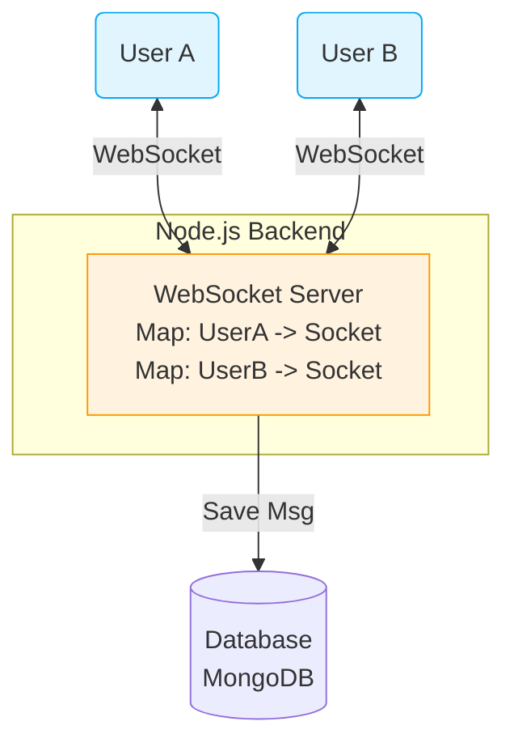
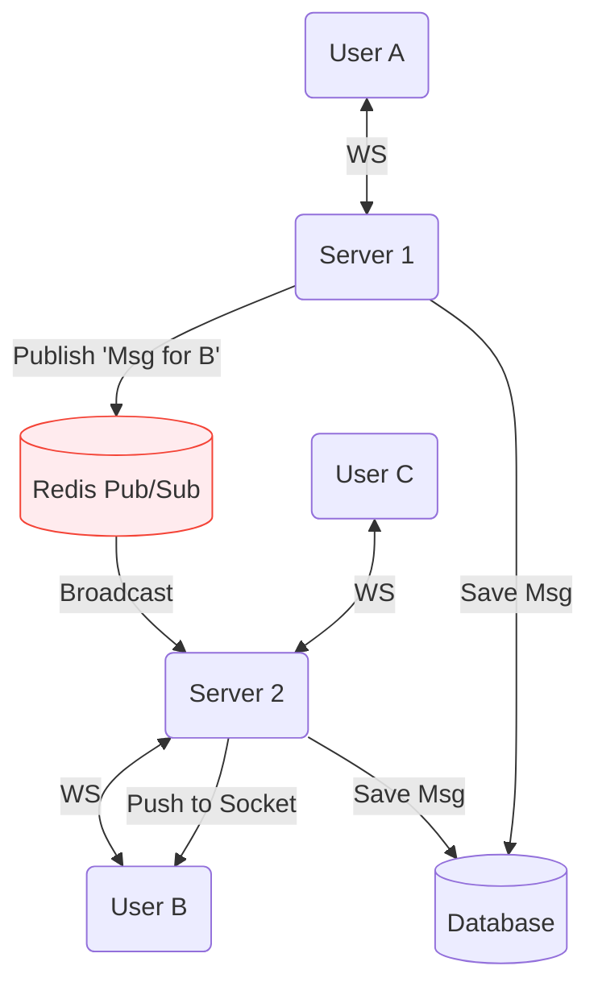

# Day 29: Real-Time Chat Architecture
*(Detailed, step-by-step, from first principles — with definitions, system diagrams, scaling techniques, and production Node.js examples)*

***

## SECTION 1: INTUITION (Chat Architecture)

Think of a **national phone network**:

### Scenario: Direct Calling (Impossible at Scale)
```text
Person A attempts to string a physical wire directly to Person B.
If Person A wants to talk to 10 friends, they string 10 physical wires.
```
This is how Peer-to-Peer (P2P) works. It doesn't scale for large groups and requires both people to be online simultaneously.

### Scenario: Centralized Routing
```text
Person A connects a wire to the Central Telephone Exchange (Server).
Person B connects to the Central Telephone Exchange.
Person A says "Call B". 
The Exchange routes the voice to Person B's wire.
```
This is how modern chat applications work. The Server sits in the middle, managing connections, saving histories, and routing messages.

***

## SECTION 2: THEORY (Core Chat Components)

A modern chat system (like WhatsApp, Slack, or Discord) requires four primary components to function reliably:

1. **The Client (Web/Mobile App)**: Maintains a persistent WebSocket connection to the server. Responsible for rendering the UI and handling local network drops.
2. **The Connection Manager (WebSocket Server)**: Holds thousands of open TCP connections. It routes incoming messages to the correct destination sockets.
3. **The Database (MongoDB / PostgreSQL)**: Persistently stores the chat history so users can read messages sent while they were offline.
4. **The Pub/Sub Message Broker (Redis)**: Essential for scaling. It broadcasts messages between *multiple* WebSocket servers.

***

## SECTION 3: VISUAL DIAGRAMS

### Diagram 1: Single-Server Architecture (The Basics)

If you only have one Node.js server, architecture is simple. The server simply holds a `Map` of all connected users.



### Diagram 2: Multi-Server Architecture (Production Scale)

When you scale to millions of users, one server cannot hold all the connections. You put a Load Balancer in front of multiple servers. 
**Problem**: User A connects to Server 1. User B connects to Server 2. If User A sends a message to User B, Server 1 doesn't have User B's socket!
**Solution**: Redis Pub/Sub.



> ✅ **[Principal Engineer Note]: The Fan-Out Problem (Group Chats)**
> *In a 1-to-1 chat, sending a message is $O(1)$. But imagine a Discord server with 50,000 online members. When you send a message, the Node.js server must serialize the JSON and loop over 50,000 sockets to push the frame. Doing this in a single `forEach` loop blocks the V8 Event Loop for several milliseconds, freezing the entire server! At scale, large Group Chat Fan-Outs are offloaded to background workers (or specialized languages like Erlang/Go) rather than running directly on the main Node.js thread.*

***

## SECTION 4: PRODUCTION MERN EXAMPLE (Single Server)

Let's build the core backend logic for a 1-to-1 chat system using Node.js, the `ws` library, and MongoDB.

### 4.1 Backend Setup

**Install dependencies**:
```bash
npm install ws mongoose
```

**Server Code (`chat-server.js`)**:
```javascript
const WebSocket = require('ws');
const mongoose = require('mongoose');

// 1. Connect to MongoDB
mongoose.connect('mongodb://localhost/chatapp');

// 2. Define the Message Schema
const messageSchema = new mongoose.Schema({
  senderId: { type: String, required: true },
  receiverId: { type: String, required: true },
  text: { type: String, required: true },
  timestamp: { type: Date, default: Date.now },
  delivered: { type: Boolean, default: false }
});
const Message = mongoose.model('Message', messageSchema);

// 3. Initialize WebSocket Server
const wss = new WebSocket.Server({ port: 3000 });

// 4. In-Memory Map to track which User ID belongs to which Socket
// Key: userId (String) -> Value: WebSocket object
const activeUsers = new Map();

wss.on('connection', (socket) => {
  let currentUserId = null;
  
  socket.on('message', async (rawMsg) => {
    const data = JSON.parse(rawMsg.toString());
    
    // ACTION: User authenticates their socket
    if (data.type === 'AUTH') {
      currentUserId = data.userId;
      activeUsers.set(currentUserId, socket);
      console.log(`User ${currentUserId} is online.`);
      return;
    }
    
    // ACTION: User sends a private message
    if (data.type === 'PRIVATE_MESSAGE') {
      const { toUserId, text } = data;
      
      // Step A: Save the message to MongoDB immediately (Persistence)
      const newMsg = await Message.create({
        senderId: currentUserId,
        receiverId: toUserId,
        text: text
      });
      
      // Step B: Check if the recipient is currently online in our Map
      const recipientSocket = activeUsers.get(toUserId);
      
      if (recipientSocket && recipientSocket.readyState === WebSocket.OPEN) {
        // Step C: Push the message to the recipient's socket
        recipientSocket.send(JSON.stringify({
          type: 'NEW_MESSAGE',
          messageId: newMsg._id,
          senderId: currentUserId,
          text: text,
          timestamp: newMsg.timestamp
        }));
        
        // Optional: Update DB to mark as delivered
        await Message.updateOne({ _id: newMsg._id }, { delivered: true });
      } else {
        // Recipient is offline. The message is safely in the DB.
        // They will fetch it via a standard REST API when they log in next.
        console.log(`User ${toUserId} is offline. Message saved for later.`);
      }
    }
  });
  
  // Cleanup when a user disconnects
  socket.on('close', () => {
    if (currentUserId) {
      activeUsers.delete(currentUserId);
      console.log(`User ${currentUserId} went offline.`);
    }
  });
});
```

***

### 4.2 Frontend Core Logic (React)

```javascript
import { useEffect, useState, useRef } from 'react';

function ChatInterface({ myUserId, friendUserId }) {
  const [messages, setMessages] = useState([]);
  const [inputText, setInputText] = useState("");
  const ws = useRef(null);

  useEffect(() => {
    // 1. Establish Connection
    ws.current = new WebSocket('ws://localhost:3000');
    
    ws.current.onopen = () => {
      // 2. Authenticate the connection
      ws.current.send(JSON.stringify({ type: 'AUTH', userId: myUserId }));
      
      // Optional: Fetch historical offline messages via REST API here
      // fetch(`/api/messages?with=${friendUserId}`)...
    };
    
    // 3. Listen for incoming messages
    ws.current.onmessage = (event) => {
      const data = JSON.parse(event.data);
      if (data.type === 'NEW_MESSAGE' && data.senderId === friendUserId) {
        setMessages(prev => [...prev, data]);
      }
    };

    return () => {
      ws.current.close(); // Cleanup on unmount
    };
  }, [myUserId, friendUserId]);

  const sendMessage = () => {
    if (!inputText) return;
    
    // Append my own message to the UI instantly (Optimistic UI update)
    setMessages(prev => [...prev, { text: inputText, senderId: myUserId }]);
    
    // Send to server
    ws.current.send(JSON.stringify({
      type: 'PRIVATE_MESSAGE',
      toUserId: friendUserId,
      text: inputText
    }));
    
    setInputText("");
  };

  return (
    <div>
      <div className="chat-window">
        {messages.map((m, i) => (
          <div key={i} style={{ textAlign: m.senderId === myUserId ? 'right' : 'left' }}>
            {m.text}
          </div>
        ))}
      </div>
      <input value={inputText} onChange={e => setInputText(e.target.value)} />
      <button onClick={sendMessage}>Send</button>
    </div>
  );
}
```

***

## SECTION 5: COMMON MISTAKES & SCALING CHALLENGES

### Mistake 1: Relying Exclusively on WebSockets for Everything
WebSockets are for *real-time events*. They are terrible for querying historical data (e.g., scrolling up to see messages from last month).
**Solution**: Use a Hybrid approach. Use standard HTTP GET requests (REST APIs) to load chat history. Use WebSockets only for new messages that arrive while the user is actively viewing the screen.

### Mistake 2: Failing to Handle Reconnections (Missing Messages)
If a user goes through a tunnel, their 4G drops for 10 seconds. The WebSocket disconnects. When they emerge, the socket reconnects. But what about messages sent during those 10 seconds?
**Solution**: Every client must track the `lastMessageId` they successfully received. Upon reconnection, the client makes an HTTP request: `GET /api/sync?after=lastMessageId` to pull down anything they missed while offline, *before* relying on the WebSocket again.

### Mistake 3: Storing WebSocket Objects in Redis
You cannot store a WebSocket connection object in a database or Redis. A socket represents a physical TCP port bound to a specific CPU/RAM instance. 
**Solution**: This is why we use Pub/Sub. Redis doesn't hold the socket; it just broadcasts a JSON string to all servers. The server that *does* have the socket in its local RAM pushes it to the user.

> ✅ **[Principal Engineer Note]: The Disconnect Storm (Thundering Herd)**
> *If your Node.js server crashes, all 10,000 connected clients will trigger their `socket.onclose` event and immediately try to reconnect. 10,000 simultaneous TCP handshakes will instantly DDoS your replacement server, crashing it too. You MUST implement **Exponential Backoff with Jitter** on the frontend. This means the client waits `(Math.random() * 2000) + 1000` ms before reconnecting, spreading the 10,000 reconnections over several seconds.*

***

## SECTION 6: INTERVIEW PREPARATION

### Conceptual Questions
1. **How do you handle a scenario where User A sends a message to User B, but User B is completely offline?** *(Answer: The WebSocket server saves the message to the primary Database. When User B opens the app later, they fetch missed messages via a standard REST API).*
2. **Why do we need Redis Pub/Sub in a multi-server chat architecture?** *(Answer: Because WebSockets are stateful and tied to specific servers. If User A is on Server 1 and User B is on Server 2, Server 1 uses Redis to publish the message so Server 2 can hear it and forward it to User B).*
3. **What is an Optimistic UI update in chat apps?** *(Answer: Showing the message on the sender's screen the instant they hit "Send", before the server even confirms it. It makes the app feel lightning fast).*

### System Design Scenario
*Company: Meta (WhatsApp/Messenger)*
"Design WhatsApp. Specifically, how do you handle read receipts (the two blue ticks)?"
*(Expected Answer: When User B receives the message, their client fires a `MESSAGE_DELIVERED` event over the WebSocket. When User B opens the chat window, their client fires a `MESSAGE_READ` event. The server routes these events back to User A's socket, updating User A's UI to show the blue ticks. Simultaneously, the server updates the `read: true` boolean in the Database).*

***
