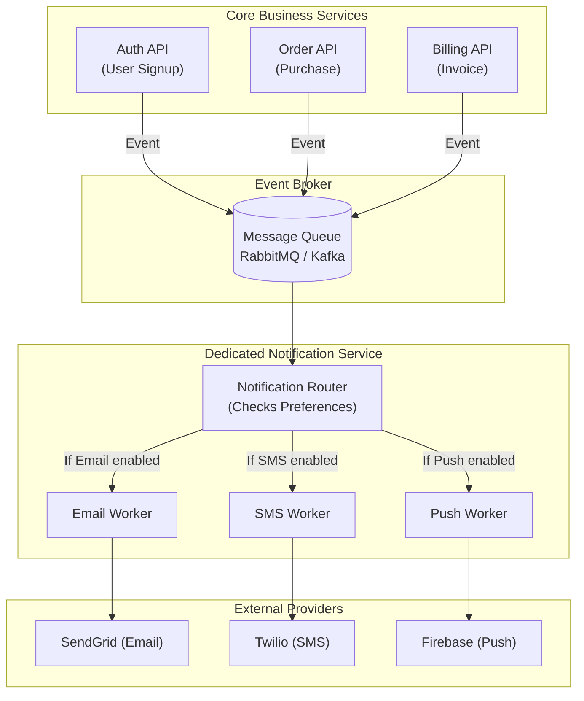

# Day 30: Notification Systems Architecture
*(Detailed, step-by-step, from first principles — with definitions, system diagrams, scaling techniques, and production Node.js examples)*

***

## SECTION 1: INTUITION (Notification Systems)

Think of a **Post Office Network**:

### Scenario: Direct Delivery (Unscalable)
```text
You write a letter and drive to your friend's house yourself to deliver it. 
Then you drive to your coworker's house to deliver another letter.
```
This is how poorly designed monolithic backends work. The core API pauses what it's doing to send emails one by one.

### Scenario: Dedicated Notification Infrastructure
```text
You drop all your letters into a Mailbox (The Queue).
The Post Office (Notification Service) collects them.
The Post Office sorts them and assigns specialized drivers: 
- Driver 1 delivers local mail (Push Notifications).
- Driver 2 delivers packages (Emails).
- Driver 3 delivers express envelopes (SMS).
```
Your core application doesn't care how or when it's delivered. It just drops it in the box and goes back to work.

***

## SECTION 2: THEORY (Notification Channels & Components)

### 2.1 The Four Primary Channels

1. **Push Notifications (FCM / APNs)**: Alerts that pop up on mobile devices (iOS/Android) or Web Browsers, even when the app is closed. Requires device tokens.
2. **Email Notifications (SMTP / SendGrid / SES)**: Long-form, high-latency communication. Best for receipts, marketing, and formal alerts.
3. **SMS Notifications (Twilio / AWS SNS)**: Urgent, short-form communication. Costs money per message. Best for OTPs (One Time Passwords) and critical alerts.
4. **In-App Notifications (WebSockets)**: The "bell icon" inside your app. Only visible when the user has the app open.

### 2.2 The Notification Service

A dedicated Notification Service acts as a central hub. Instead of your `OrderService`, `AuthService`, and `BillingService` all writing custom code to send emails, they all emit events to the Notification Service.

***

## SECTION 3: VISUAL DIAGRAMS

### Diagram 1: Centralized Notification Architecture



***

## SECTION 4: PRODUCTION MERN EXAMPLES

We will use **BullMQ** (backed by Redis) as our job queue to handle the heavy lifting asynchronously in Node.js.

### 4.1 Triggering a Notification

Your core backend (e.g., the Orders API) should never send emails directly. It adds the job to a queue.

**Backend (`order-api.js`)**:
```javascript
const express = require('express');
const { Queue } = require('bullmq');
const Redis = require('ioredis');

const app = express();
const connection = new Redis('redis://127.0.0.1:6379');

// Initialize Queues for different priority channels
const emailQueue = new Queue('email-queue', { connection });
const pushQueue = new Queue('push-queue', { connection });

app.post('/api/orders', async (req, res) => {
  const { userId, items, total } = req.body;
  
  // 1. Process Order (Primary Business Logic)
  const order = await processPaymentAndSaveOrder(userId, items, total);
  const user = await getUser(userId);
  
  // 2. Offload Notifications to Queues
  
  // High Priority: Push Notification to their phone
  await pushQueue.add('order-shipped-push', {
    deviceToken: user.fcmToken,
    title: 'Order Confirmed!',
    body: `Your order for $${total} is being processed.`
  });
  
  // Lower Priority: Email Receipt
  await emailQueue.add('order-receipt-email', {
    to: user.email,
    subject: 'Your Receipt',
    html: `<h1>Thank you for your order of $${total}</h1>...`
  });
  
  // 3. Respond to user instantly! (No waiting for SMTP servers)
  res.json({ success: true, orderId: order._id });
});
```

***

### 4.2 The Dedicated Workers (Notification Service)

These run in background processes (or entirely different servers).

**Worker Node (`notification-workers.js`)**:
```javascript
const { Worker } = require('bullmq');
const Redis = require('ioredis');
const sendGrid = require('@sendgrid/mail'); // Example provider
const admin = require('firebase-admin'); // Firebase for Push

sendGrid.setApiKey(process.env.SENDGRID_API_KEY);
const connection = new Redis('redis://127.0.0.1:6379');

// 1. Email Worker
const emailWorker = new Worker('email-queue', async (job) => {
  const { to, subject, html } = job.data;
  
  console.log(`Sending email to ${to}...`);
  
  // Actual network call to SendGrid
  await sendGrid.send({
    from: 'noreply@myapp.com',
    to: to,
    subject: subject,
    html: html
  });
  
  console.log('Email sent successfully!');
}, { 
  connection,
  concurrency: 10, // Process 10 emails simultaneously
  limiter: { max: 100, duration: 1000 } // Respect SendGrid API Rate limits!
});

// 2. Push Notification Worker
const pushWorker = new Worker('push-queue', async (job) => {
  const { deviceToken, title, body } = job.data;
  
  console.log(`Sending Push Notification...`);
  
  await admin.messaging().send({
    token: deviceToken,
    notification: { title, body }
  });
}, { connection });

// Handle failures gracefully
emailWorker.on('failed', (job, err) => {
  console.error(`Email Job ${job.id} failed:`, err.message);
  // BullMQ will automatically retry if configured!
});
```

> ✅ **[Principal Engineer Note]: The Thundering Herd of Retries**
> *If SendGrid's API goes down for 5 minutes, 10,000 email jobs will fail. If you configure BullMQ to just "retry 5 times", all 10,000 jobs will instantly retry the millisecond SendGrid comes back online, effectively DDOSing SendGrid and getting your IP permanently banned. You MUST configure **Exponential Backoff with Jitter** (e.g., wait 2s, then 4s, then 8s, plus a random math jitter) to spread the retry load out safely.*

***

## SECTION 5: COMMON MISTAKES & ADVANCED CHALLENGES

### Mistake 1: Ignoring User Preferences
```javascript
// BAD - Spamming the user
pushQueue.add('marketing-push', { ... });

// GOOD - Checking preferences before enqueueing
const prefs = await getUserPreferences(userId);
if (prefs.allowMarketingPush) {
  pushQueue.add('marketing-push', { ... });
}
```

### Mistake 2: Missing Rate Limiting and Throttling
If you try to send 50,000 emails at exactly 12:00 PM, AWS SES or SendGrid will ban your account or drop requests for exceeding API limits.
**Solution**: Queue systems (like BullMQ) have built-in `limiter` options to enforce things like "Max 50 jobs per second". Use them.

### Mistake 3: No Deduplication (Sending things twice)
Network glitches happen. If a worker sends an email, but crashes right before acknowledging the job, the queue will restart the job, and the user gets two identical emails.
**Solution**: Use a unique `jobId` (like the order ID) when adding to the queue.

```javascript
// BullMQ ensures jobs with the same ID are never processed twice
await emailQueue.add('order-receipt', data, { jobId: `receipt-${order._id}` });
```

> ✅ **[Principal Engineer Note]: Idempotency at the Provider Level**
> *Setting a `jobId` in BullMQ only prevents BullMQ from duplicating the job internally. But what if the worker successfully calls `sendGrid.send()`, SendGrid fires the email, but the network drops BEFORE SendGrid's HTTP 200 OK reaches your worker? The worker thinks it failed, and retries. BullMQ allows the retry because the job wasn't completed! The user gets two emails. To solve this, you must pass a unique `Idempotency-Key` header IN the HTTP request to SendGrid/Stripe/FCM so the provider knows to ignore the duplicate.*

***

## SECTION 6: INTERVIEW PREPARATION

### Conceptual Questions
1. **Why must notifications be handled asynchronously via queues?** *(Answer: Because external APIs like SMTP servers or Apple Push Notification servers are slow and prone to failure. Blocking the main Node.js event loop to send an email will destroy API response times).*
2. **What is a Dead Letter Queue (DLQ) in the context of notifications?** *(Answer: If an email job fails 5 times (maybe the email address is violently rejected by the provider), it is moved to a DLQ for a human engineer to inspect, rather than clogging up the main queue forever).*
3. **How do you handle a scenario where you need to notify 1 Million users of a new feature?** *(Answer: Batching. Instead of looping 1 million times and making 1 million API calls, chunk them into groups of 500, create 2000 queue jobs, and utilize bulk-send APIs provided by services like FCM and SendGrid).*

### System Design Scenario
*Company: YouTube / Twitch*
"When a massive creator (10M subscribers) goes live, we need to send a push notification to all their subscribers. If we process 10,000 pushes per second, it will take 16 minutes to notify everyone. The stream will be half over! How do you solve this?"
*(Expected Answer: 1. Fan-out architecture. The main server publishes a single "User Went Live" event. 2. Multiple subscriber-routing workers pick this up, fetching chunks of followers (e.g., 0-100k, 100k-200k) and spawning sub-jobs. 3. Use massive horizontal scaling of push-workers to drain the queue in parallel. 4. Utilize Apple/Google's Multicast/Topic push APIs to send one payload that Apple distributes to millions of devices, rather than pinging Apple 10 million individual times).*

***
