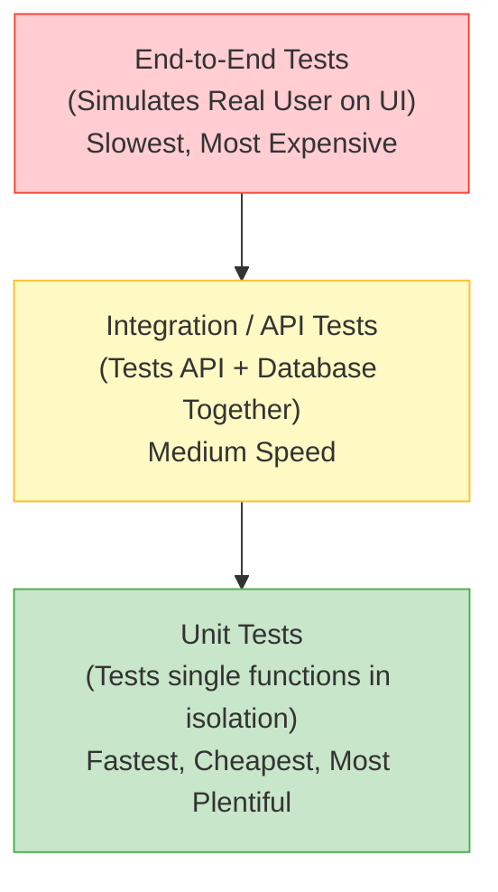

# Day 31: Why Testing Matters
*(Detailed, step-by-step, from first principles — with definitions, simple analogies, system diagrams, and production Node.js examples)*

***

## SECTION 1: INTUITION (Why Do We Test?)

Think of **building a house**:

### Scenario 1: No Testing (Deploying Blind)
```text
Builder: Builds the walls and roof rapidly.
Owner: Moves in.
[1 month later]
Owner: "The roof is leaking during the rain!" → Builder has to rip off the roof to fix it.
Owner: "The front door doesn't close!" → Builder has to tear down the doorframe.
```
**Problem**: The issues were found *after* the product was finished and being used. Fixing them now is incredibly expensive, time-consuming, and ruins the owner's trust.

***

### Scenario 2: With Testing (Continuous Verification)
```text
Builder: Builds a wall → Tests it with a level and weights → Wall is solid.
Builder: Installs a door → Tests opening/closing 50 times → Door is perfect.
Builder: Builds roof → Sprays it with a high-pressure hose → No leaks.
Owner: Moves in.
[Years pass with zero structural issues]
```
**Benefit**: Issues are found *during* the building process. Fixing a door before the frame is painted is cheap and fast.

***

### In Web Development:

**Testing** is the automated process of writing code that checks if your *actual* code works correctly. 

```javascript
// The actual business logic
function calculateTax(amount) {
  return amount * 0.20;
}

// The Test (Automation)
if (calculateTax(100) === 20) {
  console.log('✅ Test passed');
} else {
  console.log('❌ Test failed');
}
```

> [!TIP]
> **Simple Analogy:**  
> - **Testing** is like having an automated inspector check your work every time you press "Save".  
> - It ensures bugs are caught instantly by your computer, rather than weeks later by an angry user.

***

## SECTION 2: THEORY (Why Testing Exists?)

### 2.1 Definition

**Software Testing** is the process of evaluating a system to verify that it does exactly what it is supposed to do. In modern backends, this means writing automated scripts that:
1. **Execute** your functions/APIs with specific inputs.
2. **Check** the outputs against expected results.
3. **Fail loudly** if there is any mismatch.

***

### 2.2 Why Do We Write Tests?

You might think: *"Writing tests takes twice as long! I could just build features faster."* This is a beginner's trap.

1. **Bug Prevention & Regression Catching**:
   - You write a billing feature today. Six months later, a junior developer modifies the discount logic. Without tests, they might silently break the billing feature. With tests, their computer will yell at them before they can even commit the code. (This is called catching a *regression*).

2. **Fearless Refactoring**:
   - If your codebase has 100% test coverage, you can rewrite the entire database architecture. If the tests still pass, you *know* you didn't break the user experience. You can refactor with absolute confidence.

3. **Living Documentation**:
   - Tests show exactly how a function is *supposed* to be used. If you don't understand what `formatDate()` does, you just read its test file to see the expected inputs and outputs.

4. **Exponential Cost Reduction**:
   - Finding a bug while typing code: Costs $1 (takes 5 seconds).
   - Finding a bug in Production: Costs $10,000 (takes engineering time, customer support time, and lost user trust).

> ✅ **[Principal Engineer Note]: Testing as Architectural Pressure**
> *Junior engineers think testing is just about finding bugs. Senior engineers know that testing is a design tool. If you write a function and find it is incredibly difficult to test (because it reaches out to the database globally or relies on hardcoded environment variables), it means your architecture is bad. Writing tests forces you to decouple your code, use Dependency Injection, and write pure functions. The tests literally exert "pressure" on your architecture to be better.*

***

### 2.3 The Testing Pyramid

You shouldn't test everything the exact same way. We organize tests into a pyramid.



**The Golden Rule**:
- Have **Hundreds** of Unit Tests (They run in milliseconds).
- Have **Dozens** of Integration Tests (They ensure things connect properly).
- Have a **Few** E2E tests (They are slow and brittle, use them only for critical flows like User Checkout).

***

## SECTION 3: PRODUCTION EXAMPLES

Let's look at a manual testing approach vs an automated testing framework approach.

### 3.1 The Manual "Console.log" Way (Bad)

If you rely on this, you have to manually look at the terminal and verify if "50" is the right answer every time you run your app.

```javascript
// calculateTotal.js
function calculateTotal(prices, discount = 0) {
  const total = prices.reduce((sum, price) => sum + price, 0);
  return total - discount;
}

// Manual testing inside the file
console.log(calculateTotal([10, 20, 30])); // Output: 60
console.log(calculateTotal([10, 20, 30], 10)); // Output: 50
```

### 3.2 The Automated Framework Way (Jest)

In production Node.js, we use a framework like **Jest**. It provides structural blocks like `describe`, `test`, and assertions like `expect()`.

**Install**:
```bash
npm install --save-dev jest
```

**Test File (`calculateTotal.test.js`)**:
```javascript
const { calculateTotal } = require('./calculateTotal');

describe('calculateTotal Utility', () => {
  
  test('calculates the total correctly without a discount', () => {
    const result = calculateTotal([10, 20, 30]);
    // The Assertion:
    expect(result).toBe(60); 
  });

  test('applies the discount correctly', () => {
    const result = calculateTotal([10, 20, 30], 10);
    expect(result).toBe(50);
  });

  test('returns 0 for an empty cart', () => {
    const result = calculateTotal([]);
    expect(result).toBe(0);
  });
  
});
```

**Output when running `npx jest`**:
```text
PASS  ./calculateTotal.test.js
  calculateTotal Utility
    ✓ calculates the total correctly without a discount (2 ms)
    ✓ applies the discount correctly (1 ms)
    ✓ returns 0 for an empty cart (1 ms)

Test Suites: 1 passed, 1 total
Tests:       3 passed, 3 total
Time:        0.124 s
```

***

## SECTION 4: COMMON MISTAKES

### Mistake 1: Only Testing the "Happy Path"
```javascript
// BAD - Only testing when everything goes perfectly
test('calculates cart', () => {
  expect(calculateTotal([10, 20])).toBe(30);
});

// GOOD - Testing Edge Cases and Errors (The "Sad Path")
test('throws an error if string is passed instead of array', () => {
  // We wrap the function call in a callback so Jest can catch the error
  expect(() => calculateTotal("10, 20")).toThrow('Input must be an array');
});
test('handles negative prices', () => {
  expect(calculateTotal([-10, 20])).toBe(10); 
});
```

### Mistake 2: Writing Tests *After* the Code is in Production
Many developers push code to production, and then write tests a week later to satisfy their manager. By then, the bugs are already live.
**Solution**: Use **Test-Driven Development (TDD)**, or simply mandate that Pull Requests cannot be merged unless tests are included and passing.

> ✅ **[Principal Engineer Note]: The 100% Coverage Fallacy**
> *In enterprise companies, management often sets a hard rule: "You must have 100% test coverage." This is a massive mistake. To reach 100%, developers start writing useless, brittle tests just to satisfy the metric (e.g., testing that `getAge()` returns `this.age`). The true goal of testing is **Confidence**, not a metric. Focus your energy on testing complex business logic (e.g., shopping cart tax calculations) rather than basic boilerplate code.*

***

## SECTION 5: INTERVIEW PREPARATION

### Conceptual Questions
1. **What is a "Regression" in software, and how do tests prevent it?** *(Answer: A regression is when a previously working feature breaks because of new code changes. Automated tests run against the whole codebase on every commit, instantly catching if new code breaks old logic).*
2. **Explain the Testing Pyramid.** *(Answer: The pyramid illustrates that we should have a massive base of fast, cheap Unit tests, a smaller middle layer of Integration tests, and a very small peak of slow, expensive End-to-End browser tests).*
3. **What is Test Coverage?** *(Answer: A metric representing the percentage of your source code lines that are executed during your automated tests. 80% is a standard healthy target).*

### Scenario Question
*Company: Stripe*
"Your team is moving slowly because QA has to manually test the payment gateway for 3 days before every release. How do you fix this?"
*(Expected Answer: Implement an automated testing pipeline (CI/CD). Developers must write Unit and API tests for all new payment features. When code is pushed, the CI server runs all tests in seconds. This eliminates the manual QA bottleneck and allows for safe, daily deployments).*
