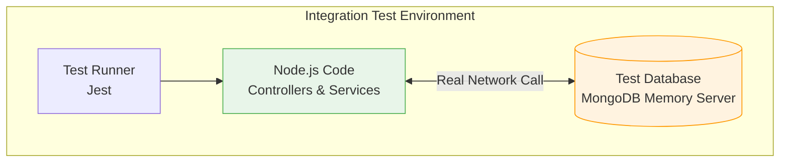

# Day 33: Integration Testing
*(Detailed, step-by-step, from first principles — with definitions, simple analogies, system diagrams, and production Node.js examples)*

***

## SECTION 1: INTUITION (What is Integration Testing?)

Think of **testing parts of a car together**:

### Scenario: The Limits of Unit Testing
```text
Engine test → OK!
Transmission test → OK!
```
But what happens when you bolt the Engine to the Transmission? Do the gears actually fit together? Does the engine output the right RPM for this specific transmission? You don't know until you connect them and turn the key.

***

### In Backend Development:

**Integration Testing** means testing how multiple distinct parts of your application (e.g., your Express Controllers, your Mongoose Models, and your actual MongoDB database) interact with each other.

```javascript
// Integration Test
test('creates a user and saves them to the database', async () => {
  // 1. Call the actual API function
  const user = await createUserService('John');
  
  // 2. Query the actual database to see if it worked
  const savedUser = await Database.findById(user.id);
  
  expect(savedUser.name).toBe('John');
});
```

> [!TIP]
> **Simple Analogy:**  
> - **Unit Testing** is testing the lightbulb and the switch separately.  
> - **Integration Testing** is wiring them together and flipping the switch to see if the room lights up.

***

## SECTION 2: THEORY (What is an Integration Test?)

### 2.1 Definition

An **Integration Test** verifies that two or more components work together correctly. In backend development, this almost always means testing how your Node.js code interacts with a persistent state store (like a Database, Redis cache, or File System).

**Key properties**:
- **Medium Speed**: Takes a few seconds to run (because it requires network I/O to a database).
- **Uses Real Dependencies**: Unlike Unit Tests, Integration Tests connect to a *real* test database.
- **Catches Glue-Code Bugs**: Catches errors where Component A sends a string, but Component B expects an integer.

***

### 2.2 What SHOULD You Integration Test?

**Do Test**:
- Database operations (Can my code actually insert a row into Postgres/MongoDB without violating constraints?).
- API routes talking to services.
- Code that writes/reads files to the local disk.

**Do NOT Integration Test**:
- Production Databases (NEVER run tests against production data. Always use a dedicated test database).
- Highly complex permutations of math logic (That is what Unit tests are for).

***

## SECTION 3: VISUAL DIAGRAMS

### Diagram 1: The Integration Test Architecture



Notice that the Database is **inside** the test boundary. We are actively writing to and reading from it.

***

## SECTION 4: PRODUCTION EXAMPLES (MERN STACK)

How do you safely test against a database without destroying your real data? 
**Answer:** We use an in-memory database for testing, or we create a dedicated `myapp_test` database and wipe it clean before every test.

### 4.1 Setup (Node.js + Jest + MongoDB)

We will use `mongodb-memory-server` which spins up a temporary, totally isolated MongoDB instance in your RAM just for tests. It is extremely fast.

**Install**:
```bash
npm install --save-dev jest mongodb-memory-server mongoose
```

> ✅ **[Principal Engineer Note]: Memory Servers vs Testcontainers**
> *`mongodb-memory-server` is a fantastic Node.js-specific tool. However, what if you use PostgreSQL? Or Redis? Or Kafka? In modern enterprise architectures, the gold standard is **Testcontainers**. Testcontainers is a library that programmatically spins up real Docker containers (e.g., `postgres:15-alpine`) from inside your test setup file, runs your tests against them, and destroys them. This guarantees 100% parity with your production environment, avoiding edge cases where an in-memory mock database behaves slightly differently than the real thing.*

***The Test Setup File (`db.test.js`)**:
```javascript
const mongoose = require('mongoose');
const { MongoMemoryServer } = require('mongodb-memory-server');
const { createUser, getUser } = require('./userService'); // The code we are testing

let mongoServer;

// 1. BEFORE ALL TESTS: Spin up the in-memory database
beforeAll(async () => {
  mongoServer = await MongoMemoryServer.create();
  const uri = mongoServer.getUri();
  await mongoose.connect(uri);
});

// 2. AFTER EACH TEST: Wipe the data clean!
// This prevents Test A from leaving data that breaks Test B.
afterEach(async () => {
  const collections = mongoose.connection.collections;
  for (const key in collections) {
    const collection = collections[key];
    await collection.deleteMany(); 
  }
});

// 3. AFTER ALL TESTS: Shut down the server gracefully
afterAll(async () => {
  await mongoose.disconnect();
  await mongoServer.stop();
});

// --- THE ACTUAL TESTS ---

describe('User Service Integration', () => {

  test('successfully inserts a user into the real database', async () => {
    // Action: Call our business logic
    const newUser = await createUser({ name: 'Alice', email: 'alice@test.com' });
    
    expect(newUser).toBeDefined();
    expect(newUser.name).toBe('Alice');

    // Verification: Reach directly into the DB and check if it's there
    const foundUser = await getUser(newUser._id);
    expect(foundUser.email).toBe('alice@test.com');
  });

  test('throws a database constraint error on duplicate emails', async () => {
    // Insert first user
    await createUser({ name: 'Bob', email: 'duplicate@test.com' });
    
    // Attempt to insert second user with same email
    // Expect MongoDB to throw an E11000 duplicate key error
    await expect(
      createUser({ name: 'Charlie', email: 'duplicate@test.com' })
    ).rejects.toThrow();
  });

});
```

***

## SECTION 5: COMMON MISTAKES

### Mistake 1: Not Cleaning the Database Between Tests
```javascript
// BAD
test('creates user', async () => { await createUser('Alice'); });
test('counts users', async () => { 
  const count = await countUsers();
  expect(count).toBe(0); // FAILS! Alice is still in the DB from the first test.
});
```
**Solution**: Always drop collections or rollback transactions in the `afterEach` hook. **Tests must be idempotent** (they can run in any order, 100 times, and always pass).

> ✅ **[Principal Engineer Note]: The Speed of Transactions vs Truncation**
> *Using `deleteMany()` (MongoDB) or `TRUNCATE` (SQL) in `afterEach` works, but writing to disk and deleting from disk is slow. If you have 500 integration tests, doing this 500 times adds minutes to your CI pipeline. The senior pattern is **Transaction Rollbacks**. In SQL databases, you run `BEGIN TRANSACTION` in `beforeEach()`, run the test, and then run `ROLLBACK` in `afterEach()`. The data is never actually committed to disk, meaning cleanup is instantaneous!*

### Mistake 2: Pointing Tests at Development or Production Databases
If you accidentally run `jest` and your connection string is `mongodb://localhost/myapp_prod`, your `afterEach` hook will permanently delete your entire production database.
**Solution**: Always use Environment Variables. Hardcode your code to abort if `NODE_ENV === 'production'` during a test run.

### Mistake 3: Testing 3rd Party APIs (Stripe/SendGrid)
Integration testing means integrating *your* internal components. Do not write tests that hit the real Stripe API. 
1. It costs money.
2. It requires an internet connection.
3. If Stripe goes down, your tests fail (which stops your deployments).
**Solution**: Use API Mocking (covered in Day 35) for external services.

***

## SECTION 6: INTERVIEW PREPARATION

### Conceptual Questions
1. **What is the difference between a Unit Test and an Integration Test?** *(Answer: Unit tests test logic in pure isolation (no I/O, no DB). Integration tests verify that code correctly communicates with other systems like databases or caches).*
2. **Why must we clean the database between every integration test?** *(Answer: To prevent state leakage. If tests share state, they become brittle. Test A might pass only if Test B runs before it, which defeats the purpose of reliable testing).*

### System Design Scenario
*Company: Airbnb*
"We have a booking function that inserts a reservation into PostgreSQL and updates the available dates in Redis. How do you test this function?"
*(Expected Answer: I would write an Integration Test. I would spin up a test Postgres database and a test Redis instance (e.g., using Docker Testcontainers or memory servers). The test would call the booking function, and then I would assert two things: 1. A SELECT query on Postgres returns the reservation. 2. A GET query on Redis returns the updated availability dates. Finally, I would flush the Redis cache and truncate the Postgres tables in the `afterEach` hook).*

***
