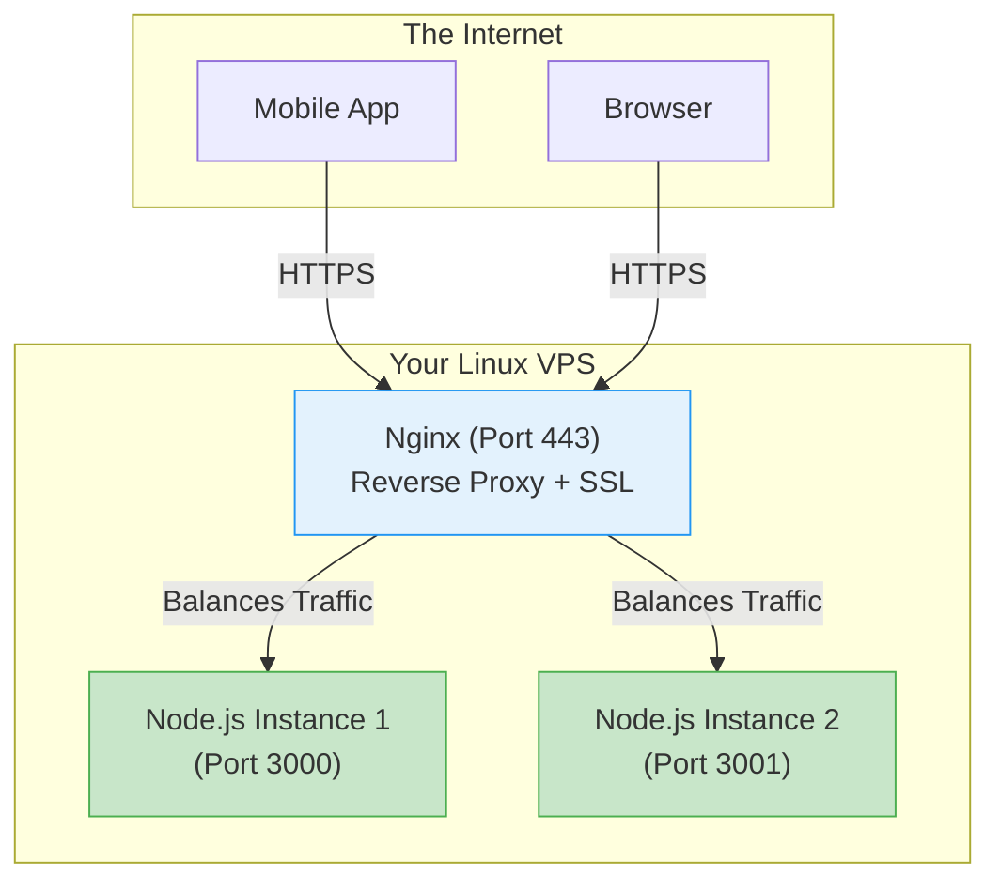

# Day 40: Production Deployment & Observability
*(Detailed, step-by-step, from first principles — with definitions, system diagrams, and production Node.js examples)*

***

## SECTION 1: INTUITION (Production Deployment)

Think of **opening a new restaurant**:

### Scenario 1: Development (Cooking at Home)
```text
You cook in your home kitchen.
If you drop a plate, you clean it up. Nobody sees.
If the stove breaks, you order a pizza.
You are the only customer.
```

### Scenario 2: Production (Opening Night)
```text
You rent a massive commercial building.
1,000 customers walk in at the exact same time.
If the stove breaks, 1,000 people leave angry reviews.
If someone sneaks into the kitchen, they steal the recipes (Security).
You hire a manager with a clipboard to track how long every dish takes (Monitoring).
```

***

### In Backend Development:

**Production** means real users are touching your code. 
- You can no longer rely on `console.log()`—you need a centralized **Logging Service**.
- You can no longer rely on `localhost:3000`—you need a **Domain**, an **SSL Certificate**, and a **Reverse Proxy (Nginx)**.
- You can no longer assume your app will stay online—you need **Health Checks** and **Metrics**.

***

## SECTION 2: DEPLOYMENT ARCHITECTURES

### 2.1 The Platform-as-a-Service (PaaS) Approach
Platforms like **Vercel, Render, and Railway** abstract the servers away. You give them your GitHub repo, and they handle the OS, the networking, and the SSL certificates.
- **Pros**: Lightning fast to deploy. Zero devops knowledge required.
- **Cons**: Extremely expensive at high scale. Less control over underlying hardware.

### 2.2 The Virtual Private Server (VPS) Approach
You rent a raw Linux computer (EC2 instance, DigitalOcean Droplet) and set up everything manually.
- **Pros**: Incredibly cheap. 100% control over the architecture.
- **Cons**: You must handle security updates, SSL renewals, and firewalls yourself.

***

## SECTION 3: VISUAL DIAGRAMS (The VPS Architecture)

If you deploy to a raw VPS, you should never expose your Node.js app directly to the open internet (Port 80). You put a **Reverse Proxy (Nginx)** in front of it.



***

## SECTION 4: PRODUCTION EXAMPLES (The VPS Setup)

### 4.1 Configuring Nginx (Reverse Proxy)

**What is a Reverse Proxy?** It is a web server that sits in front of your backend. It handles the raw HTTPS traffic, decrypts it, blocks bad requests, and forwards the clean traffic to your Node.js app running on a hidden port.

**`/etc/nginx/sites-available/myapp`**:
```nginx
server {
    # Listen on Port 80 (Standard HTTP)
    listen 80;
    server_name myapp.com www.myapp.com;

    # Forward all requests to the Node.js app running on port 3000
    location / {
        proxy_pass http://localhost:3000;
        proxy_http_version 1.1;
        proxy_set_header Upgrade $http_upgrade;
        proxy_set_header Connection 'upgrade';
        proxy_set_header Host $host;
        proxy_cache_bypass $http_upgrade;
    }
}
```

### 4.2 Configuring SSL/TLS (HTTPS)

You must encrypt traffic, or hackers can intercept user passwords on public WiFi. We use **Let's Encrypt / Certbot** to generate a free SSL certificate.

```bash
# SSH into your VPS and run:
sudo apt install certbot python3-certbot-nginx

# Certbot will automatically edit your Nginx config, add the SSL certs,
# and redirect all HTTP traffic to HTTPS.
sudo certbot --nginx -d myapp.com -d www.myapp.com
```

***

## SECTION 5: OBSERVABILITY (Monitoring & Logging)

When your app crashes in production, there is no terminal to look at. You need **Observability**.

### 5.1 Health Checks

Load balancers (and services like AWS/Render) need to know if your app is frozen. You expose a simple `/health` route. If it doesn't respond with `200 OK`, the load balancer kills the server and starts a new one.

```javascript
app.get('/health', (req, res) => {
  res.status(200).json({
    status: 'healthy',
    timestamp: new Date().toISOString(),
    uptimeSeconds: process.uptime()
  });
});
```

> ✅ **[Principal Engineer Note]: Deep vs Shallow Healthchecks**
> *The code above is a "Shallow" healthcheck. It only proves that the Node.js event loop isn't frozen. But what if the database connection drops? Node is still running, but every user request crashes! Senior engineers write "Deep" healthchecks. The `/health` route must execute a lightweight query (like `db.ping()`) to MongoDB and Redis. If those dependencies are unreachable, the route returns a `503 Service Unavailable`, forcing the Load Balancer to stop sending traffic to this broken instance.*

### 5.2 Structured Logging (Winston)

Do not use `console.log()` in production. It is synchronous (blocks the thread) and cannot be easily searched. Use a logging library like `winston` to output JSON logs.

```javascript
const winston = require('winston');

const logger = winston.createLogger({
  level: 'info',
  format: winston.format.json(),
  transports: [
    // Write all logs to a file
    new winston.transports.File({ filename: 'error.log', level: 'error' }),
    new winston.transports.File({ filename: 'combined.log' }),
  ],
});

// Usage in an API route:
app.post('/transfer', (req, res) => {
  logger.info('Transfer initiated', { userId: req.user.id, amount: req.body.amount });
  res.send('Transferring...');
});
```
These JSON logs can be sent to services like DataDog or AWS CloudWatch, where you can search: *"Show me all logs where amount > 10000"*.

> ✅ **[Principal Engineer Note]: The Danger of PII/PCI Leaks in Logs**
> *If a junior developer writes `logger.info("Incoming Request", req.body)` on a login or payment route, they just dumped raw passwords and credit card numbers into the company's Datadog account. This is a catastrophic compliance violation (GDPR/PCI-DSS). In production, you MUST configure Winston with a `format` step that automatically parses all log objects and redacts any keys named `password`, `token`, `credit_card`, or `ssn` before writing them to disk.*

***

## SECTION 6: THE INCIDENT RESPONSE PLAN

When the production database goes down at 3:00 AM, you do not panic. You follow the plan.

1. **Detect**: PagerDuty wakes you up because Datadog noticed the `/health` endpoint is failing.
2. **Acknowledge**: You reply to the alert so your team knows you are handling it.
3. **Contain**: Stop the bleeding. If the new v2.0 code deployment caused the crash, you instantly rollback to v1.9 using your CI/CD pipeline. Do not try to write a bug fix at 3:00 AM.
4. **Resolve**: In the morning, you investigate the logs, reproduce the bug locally, and write a fix.
5. **Post-Mortem**: You write a document explaining *why* it happened (Blameless Culture) and add a new Automated Test to ensure it mathematically can never happen again.

***

## SECTION 7: INTERVIEW PREPARATION

### Conceptual Questions
1. **What is a Reverse Proxy, and why do we put Nginx in front of Node.js?** *(Answer: Nginx is heavily optimized for serving static files, terminating SSL/TLS encryption, and blocking malicious traffic. It shields the single-threaded Node.js app from managing slow client connections, allowing Node to focus entirely on fast business logic).*
2. **What is a Health Check?** *(Answer: A lightweight HTTP endpoint (e.g., `/ping` or `/health`) that returns a 200 OK. Infrastructure like Kubernetes or AWS Load Balancers ping this route every 10 seconds. If it stops responding, the infrastructure automatically reboots the container).*

### System Design Scenario
*Company: Uber*
"Users are reporting that the 'Request Ride' button is spinning forever. The production terminal has 10,000 lines of `console.log` scrolling per second. How do you find the bug?"
*(Expected Answer: `console.log` is an anti-pattern in production. We must implement Structured Logging (JSON) using a library like Winston or Pino, and forward those logs to a central aggregator like Datadog or ELK stack. We ensure every log contains a `traceId`. I would search the aggregator for `ERROR` level logs containing the `traceId` of the failed ride requests to instantly pinpoint the exact function that crashed).*

***
