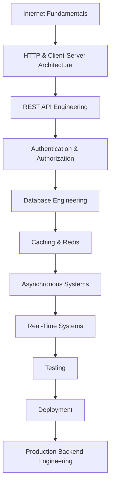

# Backend Engineering Learning Path

Welcome to the Complete Backend Engineering Handbook.

This repository follows a structured roadmap designed to take you from understanding how the Internet works to building production-ready backend systems.

Unlike traditional tutorials, we focus on learning **why things work** before learning **how to implement them**.

---

## Learning Philosophy

Backend engineering is not just about writing APIs.

A backend engineer should understand:
- How requests travel across the Internet
- How servers process requests
- How databases store information
- How authentication works
- How production systems scale
- How modern companies build reliable software

Every module builds on concepts introduced earlier. We strongly recommend following the learning path in order.

---

## Learning Flow

---

## Learning Modules

### 01. Internet Fundamentals
Learn how the Internet actually works.

**Topics include:**
- Internet
- DNS
- Domain Names
- IP Address
- Routing
- TCP/IP
- Client Server Architecture
- HTTP
- HTTPS
- TLS

---

### 02. REST API Engineering
Understand how APIs are designed.

**Topics include:**
- API Fundamentals
- REST
- Resources
- Endpoints
- CRUD
- Professional API Design
- Pagination
- Versioning
- Validation
- Security

---

### 03. Authentication & Authorization
Learn how users are authenticated securely.

**Topics include:**
- Identity
- Authentication
- Authorization
- Sessions
- Cookies
- JWT
- OAuth
- RBAC

---

### 04. Database Engineering
Learn relational databases from first principles.

**Topics include:**
- Tables
- Schema Design
- Relationships
- Normalization
- Indexes
- Query Optimization
- Transactions
- ACID
- Replication
- Partitioning

---

### 05. Caching & Redis
Learn why caching exists and how Redis improves performance.

**Topics include:**
- Redis
- Cache Aside
- Write Through
- Write Back
- Distributed Cache
- Cache Invalidation

---

### 06. Asynchronous Systems
Understand systems that don't execute everything immediately.

**Topics include:**
- Background Jobs
- Queues
- RabbitMQ
- Kafka
- Event Driven Architecture

---

### 07. Real-Time Systems
Build applications that communicate instantly.

**Topics include:**
- Polling
- Long Polling
- WebSockets
- Chat Systems
- Notifications

---

### 08. Testing
Learn how production software is tested.

**Topics include:**
- Unit Testing
- Integration Testing
- API Testing
- Mocking

---

### 09. Deployment
Deploy applications like production systems.

**Topics include:**
- Environment Variables
- Docker
- Docker Compose
- CI/CD
- Vercel
- Render
- Railway
- VPS

---

## How to Study

For every topic:
1. Read the theory.
2. Understand the intuition.
3. Study the diagrams.
4. Read the production examples.
5. Complete the assignment.
6. Build the mini project.
7. Answer the interview questions.
8. Revise using the summary.

**Do not skip exercises.**

---

## Suggested Pace

Everyone learns differently. A suggested schedule:
- 1 Topic per day
- 5–10 hours per week

> Consistency is more important than speed.

---

## Final Goal

By completing this repository, you should be able to:
- Understand how backend systems work internally.
- Build production-ready backend applications.
- Design clean REST APIs.
- Work with relational databases.
- Implement secure authentication.
- Build scalable backend architectures.
- Understand modern software engineering practices.
- Contribute effectively in startups and engineering teams.

This repository is intended to build strong backend fundamentals—not replace real-world experience. Continue building projects and reading production documentation as you grow.
