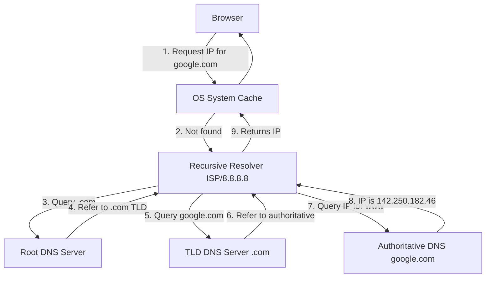
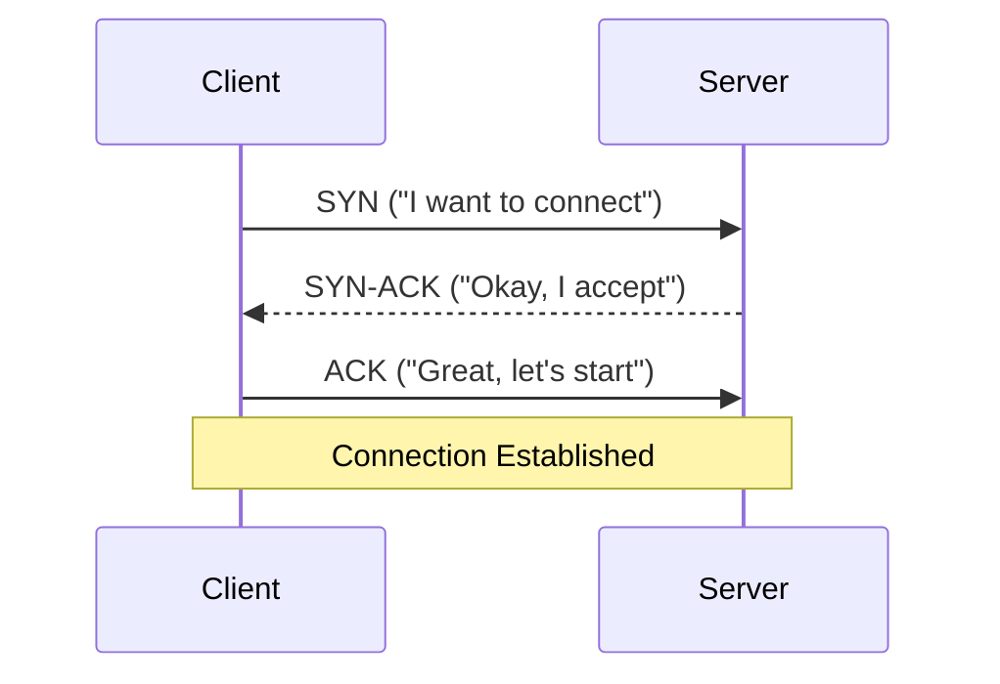
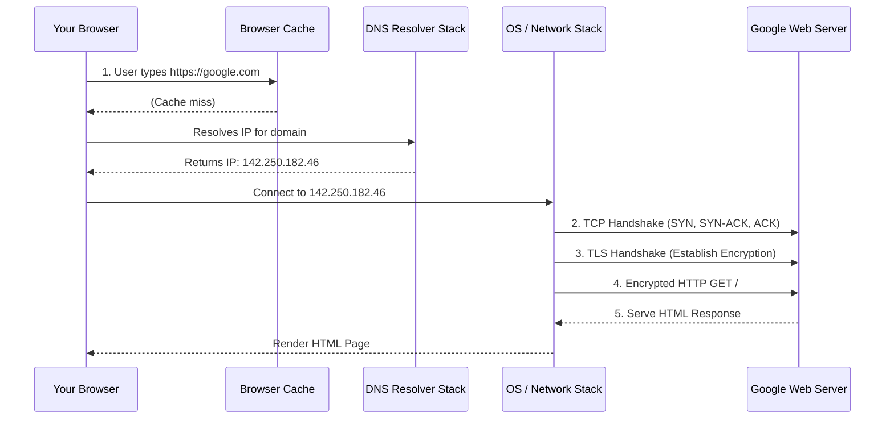
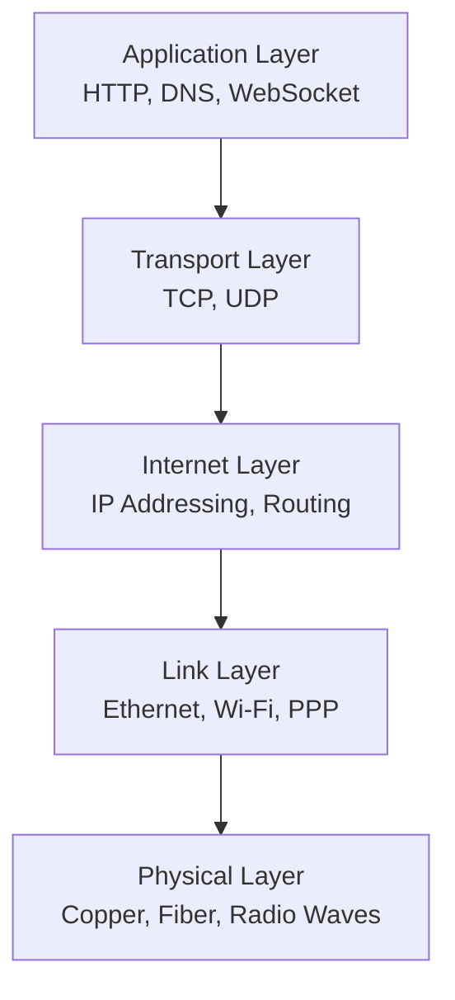

# Day 1: How the Internet Works  
*(Textbook-style, from first principles — with intuition, diagrams, production context, and Hinglish where it helps)*

***

## SECTION 1: INTUITION (The Big Picture)

**Question:** What actually happens when you type `google.com` in your browser and press Enter?

**Simple analogy:**  
Imagine you want to send a letter to a friend in another city:

1. You know their **name** (e.g., “Rahul”) but not their **address**.  
2. You go to a **phone book / directory** to find Rahul’s address → this is like **DNS**.  
3. Once you have the address, you write it on the envelope and give it to the **postal service** → this is like **IP + routing**.  
4. The postal service moves your letter through **post offices, trucks, planes** → this is like **routers, undersea cables, ISPs**.  
5. Your friend receives the letter, reads it, and may reply → this is like **server receiving HTTP request, sending response**.

In the internet world:

- Your **name** = `google.com` (domain name)  
- Your friend’s **address** = `142.250.182.46` (IP address)  
- The **phone book** = **DNS** (Domain Name System)  
- The **postal service** = **IP + TCP + routers**  
- The **letter content** = **HTTP request/response**

> [!TIP]
> **Hinglish intuition:**  
> - “Domain name” = a human-friendly naam.  
> - “IP address” = machine-friendly address.  
> - DNS = internet ka phonebook.  
> - TCP/IP = delivery system jo packets ko reliably pahunchata hai.

***

## SECTION 2: THEORY – CORE CONCEPTS

### 1. What is the Internet?

The **Internet** is a **global network of networks**:

- Millions of computers (servers, laptops, phones, IoT devices) connected via:
  - **Wires** (fiber optics, copper)
  - **Wireless** (Wi-Fi, 4G/5G, satellite)
- These are connected through:
  - **Routers** (forward packets between networks)
  - **Switches** (connect devices inside a local network)
  - **ISPs** (Internet Service Providers: Jio, Airtel, Comcast, etc.)

**Key idea:**  
No single person or company “owns” the Internet. It’s a **decentralized mesh** of networks talking to each other using standard protocols.

***

### 2. Domain Names vs IP Addresses

#### Domain Names

- Human-readable names like:
  - `google.com`
  - `amazon.in`
  - `nytimes.com`
- Purpose: easy to remember and type.
- Structure: `subdomain.domain.tld`
  - `www.google.com`:
    - `www` = subdomain
    - `google` = domain
    - `com` = top-level domain (TLD)

#### IP Addresses

- Machine-readable numerical addresses.
- Two main versions:
  - **IPv4**: `142.250.182.46` (32-bit, ~4.3 billion addresses)
  - **IPv6**: `2607:f8b0:4005:4001::1c` (128-bit, huge address space)

Every device on the Internet that communicates has an **IP address**.

> [!NOTE]
> **Analogy:**  
> - Domain name = friend’s name (“Rahul”)  
> - IP address = Rahul’s home address (“House 12, Street 5, Guwahati, Assam”)

***

### 3. DNS (Domain Name System)

**Why DNS exists:**  
Humans remember names; computers use numbers. DNS translates `google.com` → IP address.

**DNS is:**
- A **distributed database** (no single central server)
- Hierarchical:
  - Root servers
  - TLD servers (`.com`, `.in`, `.org`)
  - Authoritative name servers for each domain

**DNS resolution flow (simplified):**

1. Browser checks **cache** (has it resolved `google.com` recently?)
2. If not, OS checks **OS cache**
3. If not, request goes to **recursive resolver** (usually your ISP or a public DNS like 8.8.8.8)
4. Recursive resolver:
   - Queries **root server** → “Where is `.com`?”
   - Queries **TLD server** → “Where is `google.com`?”
   - Queries **authoritative server** → “What is IP for `www.google.com`?”
5. IP returned to browser, cached for future use.

**Visual Architecture:**



**Key facts:**

- DNS uses **UDP** (mostly) on port **53**.
- DNS responses are **cached** at multiple levels to reduce load and latency.
- DNS is **not secure by default** (can be spoofed); modern web uses **DNSSEC**, **DoH** (DNS over HTTPS), **DoT** (DNS over TLS).

***

### 4. IP Address and Routing

#### IP Address Roles

- **Public IP**: address on the Internet (e.g., your home router’s IP).
- **Private IP**: address inside a local network (e.g., `192.168.1.5` for your laptop).
- **NAT** (Network Address Translation): multiple devices share one public IP via router.

#### Routing Basics

**Routing** = deciding the path a packet takes from source to destination.

- **Routers** are devices that forward packets between networks.
- Each router has a **routing table**:
  - “If destination is in network X, send to router Y.”
- Packets hop from router to router until they reach the destination network.

**Global Internet routing:**

- IS Ps have **border routers** connecting to other ISPs.
- Routing protocols:
  - **BGP** (Border Gateway Protocol): how ISPs exchange routing information.
  - **OSPF**, **RIP**, etc.: internal routing within a network.

**Analogy:**

- You want to go from Guwahati to Mumbai.
- You take:
  - Local road → state highway → national highway → flight/train.
- Each segment is like a **hop** between routers.
- Each **router** is like a **traffic junction** deciding which road next.

**Packet journey (simplified):**

```text
Your laptop (192.168.1.5)
  |
  | Wi-Fi → Home Router (NAT, public IP)
  v
ISP Router (Jio/Airtel)
  |
  | Through backbone network
  v
Other ISP Routers
  |
  | Across undersea cables / fiber
  v
Google’s Data Center Router
  |
  v
Google Server (public IP)
```

***

### 5. TCP/IP Stack

The Internet uses a layered protocol stack. Most common model: **TCP/IP model**.

#### Layers (simplified):

1. **Application Layer**  
   - Protocols: HTTP, HTTPS, DNS, SMTP, WebSocket, etc.  
   - What your apps directly use.

2. **Transport Layer**  
   - Protocols: **TCP**, **UDP**  
   - Responsibilities:
     - Reliable delivery (TCP)
     - Flow control, congestion control
     - Port numbers to distinguish apps on same machine

3. **Internet Layer**  
   - Protocol: **IP** (IPv4/IPv6)  
   - Responsibilities:
     - Addressing (IP addresses)
     - Routing packets across networks

4. **Link Layer (Network Interface)**  
   - Ethernet, Wi-Fi, PPP, etc.  
   - Physical transmission of bits on wires/wireless.

***

### 6. TCP vs UDP (Transport Layer)

#### TCP (Transmission Control Protocol)

- **Reliable**: guarantees delivery, in-order.
- **Connection-oriented**: 3-way handshake before data.
- **Features**:
  - Retransmission of lost packets
  - Flow control (window size)
  - Congestion control
- Used by:
  - HTTP/HTTPS
  - Email (SMTP, IMAP)
  - File transfer (FTP)

**TCP 3-way handshake:**



#### UDP (User Datagram Protocol)

- **Unreliable**: no guarantee of delivery or order.
- **Connectionless**: no handshake.
- Faster, less overhead.
- Used by:
  - DNS (mostly)
  - Video streaming
  - Online games
  - VoIP

> [!WARNING]
> **Tradeoff:**  
> - TCP = reliable but slower (overhead).  
> - UDP = fast but unreliable (you handle losses if needed).

***

### 7. HTTP Request Lifecycle (From Browser to Server)

Let’s walk through what happens when you type `https://google.com` and press Enter.

#### Step-by-step (high-level):

1. **Browser checks cache**  
   - Does it already have the page? If yes and fresh, use cache.

2. **DNS resolution**  
   - Resolve `google.com` → IP address (as explained above).

3. **TCP connection**  
   - Client initiates **TCP 3-way handshake** with server at that IP on port **80** (HTTP) or **443** (HTTPS).

4. **TLS handshake (for HTTPS)**  
   - Establish secure encrypted channel.
   - Server sends certificate.
   - Client verifies certificate (trusted CA).
   - Both agree on encryption keys.

5. **HTTP request**  
   - Browser sends an HTTP request:
     ```http
     GET / HTTP/1.1
     Host: google.com
     User-Agent: Mozilla/5.0 ...
     Accept: text/html,...
     ```

6. **Server processes request**  
   - Web server (e.g., Nginx, Apache) or app server (e.g., Node.js, Django).
   - May query database, call other services, etc.
   - Generates HTTP response.

7. **HTTP response**  
   ```http
   HTTP/1.1 200 OK
   Content-Type: text/html; charset=UTF-8
   Content-Length: 12345
   ...
   <!DOCTYPE html>
   <html>...</html>
   ```

8. **Browser renders page**  
   - Parses HTML, CSS, JS.
   - Makes additional requests for images, fonts, API calls, etc.

9. **Connection may stay open**  
   - HTTP/1.1: **keep-alive** by default.
   - HTTP/2: multiplexing over one connection.
   - HTTP/3: uses QUIC over UDP.

***

## SECTION 3: VISUAL DIAGRAMS

### Diagram 1: End-to-End Journey of `google.com`



***

### Diagram 2: TCP/IP Stack Layers



***

## SECTION 4: PRODUCTION EXAMPLES (How Real Companies Use This)

### 1. How Google Handles `google.com`

- **DNS**:
  - Uses massive, globally distributed DNS infrastructure.
  - Many authoritative name servers.
  - Heavy caching at recursive resolvers.
- **IP**:
  - Uses anycast: same IP advertised from many data centers worldwide.
  - Routing (BGP) directs you to the nearest data center.
- **Load balancing**:
  - Before reaching your server, request hits load balancers.
  - Traffic split across thousands of servers.

### 2. How Startups Use DNS & CDNs

- A startup like **Zerodha**, **Razorpay**, or **Swiggy**:
  - Buys domain (e.g., `razorpay.com`) from a registrar (GoDaddy, Namecheap).
  - Configures DNS records:
    - `A` record: `razorpay.com` → IP of their server/load balancer.
    - `CNAME`: `www.razorpay.com` → `razorpay.com`.
  - Uses **CDN** (Cloudflare, AWS CloudFront):
    - DNS points to CDN.
    - CDN caches static content globally.
    - Edge nodes serve content closer to users.

**Example DNS setup (simplified):**

```text
razorpay.com.        A      34.102.136.180
www.razorpay.com.    CNAME  razorpay.com.
api.razorpay.com.    A      34.102.136.181
```

CDN configuration:

```text
User in India
  → DNS resolves to closest CDN edge (e.g., Mumbai)
  → Edge serves cached CSS/JS/images
  → Dynamic API requests go to origin server
```

***

## SECTION 5: BACKEND IMPLEMENTATION PERSPECTIVE

As a backend engineer, you won’t usually write TCP/IP code from scratch, but you must understand:

### 1. What Happens When Your Server Receives a Request

Your server (e.g., Node.js, Python, Go):

1. OS receives packets on network interface.
2. IP layer validates IP headers.
3. TCP layer reassembles stream, checks sequence numbers.
4. TCP passes data to your app on a **port** (e.g., 3000, 8080, 443).
5. Your backend framework:
   - Parses HTTP request.
   - Routes to handler based on path + method.
   - Returns HTTP response.

**Example (Node.js + Express):**

```js
const express = require('express');
const app = express();

app.get('/health', (req, res) => {
  // This handler is called after:
  // DNS → TCP → (TLS) → HTTP parsing → routing
  res.json({ status: 'ok' });
});

app.listen(3000, () => {
  console.log('Server listening on port 3000');
});
```

Under the hood:

- Node.js uses OS network stack.
- Libuv handles async I/O, including TCP.

### 2. Why This Matters for Scalability

Understanding the stack helps you:

- Debug **slow requests**:
  - DNS slow? → Check DNS provider, TTL.
  - TCP handshake slow? → Network latency, cross-region.
  - TLS slow? → Certificate issues, weak ciphers.
  - HTTP slow? → Backend logic, DB queries.
- Tune:
  - Keep-alive timeouts.
  - Connection pooling.
  - CDN usage.
  - HTTP/2 vs HTTP/1.1.

***

## SECTION 6: COMMON MISTAKES & MISCONCEPTIONS

1. **“Domain name IS the server’s address.”**  
   - False. Domain name is a **name**; IP address is the **actual address**. DNS maps name → IP.

2. **“IP address never changes.”**  
   - Many IPs are **dynamic** (change over time), especially for home users.
   - Servers often have **static IPs**, but can still change (migrations, cloud).

3. **“DNS is instant.”**  
   - DNS can be slow if:
     - No cache.
     - Remote DNS server.
     - Misconfigured TTL.
   - High-traffic sites use **anycast DNS** and heavy caching.

4. **“TCP is always better than UDP.”**  
   - Not always. For real-time video/audio/gaming, UDP is often better because:
     - Lost packets are less critical than latency.
     - You can handle loss at application level.

5. **“HTTPS is just HTTP with encryption.”**  
   - True in spirit, but:
     - Adds TLS handshake overhead.
     - Requires certificate management.
     - Enables HTTP/2, HTTP/3 in many cases.

6. **“Routing is magical.”**  
   - It’s deterministic: based on routing tables, BGP policies, metrics.
   - Misconfigured BGP can take down large parts of the Internet (happens occasionally).

***

## SECTION 7: INTERVIEW QUESTIONS

### Conceptual Questions

1. What happens when you type `google.com` in your browser and press Enter?  
   *(Expect: DNS → TCP → TLS → HTTP → server → response → render)*

2. Explain the difference between **domain name** and **IP address**. Why do we need both?

3. What is DNS? Why is it distributed instead of centralized?

4. Describe the **TCP 3-way handshake**. Why is it needed?

5. What is the difference between **TCP** and **UDP**? When would you use each?

6. What is **routing**? How do packets travel from your laptop to a server in another country?

7. What is **HTTP**? What are the main parts of an HTTP request and response?

8. What is **HTTPS**? How is it different from HTTP? What role does TLS play?

9. What is **NAT**? Why is it used?

10. What is a **CDN**, and how does it improve performance?

### System-Design-Adjacent Questions

11. Your API is slow for users in India but fast for US users. How would you debug this?  
    *(Think: DNS, latency, regional servers, CDN, routing.)*

12. How would you design DNS for a global startup with millions of users?  
    *(Think: distributed DNS, anycast, CDNs, TTL, failover.)*

13. Why do large companies use multiple DNS providers?  
    *(Think: redundancy, availability, DDoS resistance.)*

***

## SECTION 8: REVISION NOTES (Cheat Sheet)

### Core Concepts

- **Internet**: global network of networks connected via routers, ISPs, cables.
- **Domain name**: human-readable (e.g., `google.com`).
- **IP address**: machine-readable (e.g., `142.250.182.46`).
- **DNS**: translates domain names → IP addresses.
- **TCP**: reliable, connection-oriented transport.
- **UDP**: fast, unreliable, connectionless transport.
- **IP**: addresses and routes packets.
- **HTTP**: application protocol for web requests.
- **HTTPS**: HTTP + TLS (encrypted).
- **Routing**: path selection for packets using routers + protocols (BGP, OSPF).
- **CDN**: caches content globally to reduce latency.

### Key Flows

**DNS resolution (simplified):**

```text
Browser → OS → Recursive Resolver → Root → TLD → Authoritative → IP
```

**TCP handshake:**

```text
SYN → SYN-ACK → ACK
```

**HTTP request lifecycle:**

```text
URL → DNS → TCP → TLS → HTTP request → Server → HTTP response → Render
```

### Important Ports

- HTTP: **80**
- HTTPS: **443**
- DNS: **53** (mostly UDP)

***

## SECTION 9: HANDS-ON ASSIGNMENT

Do these to solidify your understanding:

### Task 1: Trace DNS Manually

Use `dig` or `nslookup`:

```bash
dig google.com
# or
nslookup google.com
```

- Observe:
  - IP address returned.
  - Query time.
  - Server used (your resolver).

Try:

```bash
dig +trace google.com
```

- See the full path: root → TLD → authoritative.

**Questions to answer:**

1. What IP(s) did you get for `google.com`?  
2. How long did the query take?  
3. Did you see multiple levels in `dig +trace`? What were they?

***

### Task 2: Inspect HTTP with Browser DevTools

1. Open Chrome/Edge/Firefox.
2. Open DevTools (F12) → **Network** tab.
3. Visit `https://google.com`.
4. Click the first request (usually `google.com`).
5. Inspect:
   - Request headers
   - Response headers
   - Status code
   - Timing (DNS, TCP, TLS, TTFB, Content Download)

**Questions:**

1. What is the status code?  
2. What HTTP method is used?  
3. Which headers are present? (e.g., `Content-Type`, `Set-Cookie`, `Cache-Control`)  
4. In the timing tab, how much time is spent on DNS, TCP, TLS, and TTFB?

***

### Task 3: Simple TCP Connection Check

Use `telnet` or `nc`:

```bash
telnet google.com 80
# or
nc -v google.com 80
```

- If connected, type:
  ```http
  GET / HTTP/1.1
  Host: google.com

  ```
- Press Enter twice.
- Observe response.

**Question:**  
What HTTP status code do you get? What headers are present?

***

### Task 4: Conceptual Write-Up

Write a short explanation (in your own words, Hinglish allowed) answering:

> “What happens when I type `google.com`?”

Include:
- DNS
- IP address
- TCP
- (Optionally) TLS
- HTTP request/response
- Server and browser

Aim for 150–250 words.

***

## SECTION 10: MINI PROJECT

**Project:** Build a simple “Internet Path Explorer” in your notebook.

### Goal

Create a document (Markdown or PDF) that visually explains the journey of a request from your browser to a server and back.

### Requirements

1. **Title**: “How the Internet Works – Day 1 Notes”.
2. **Sections**:
   - Intuition (analogy in your own words).
   - Key terms: domain, IP, DNS, TCP, IP, HTTP.
   - Diagrams:
     - One end-to-end flow (browser → DNS → server → response).
     - One DNS resolution flow.
     - One TCP/IP stack diagram.
   - Your own explanation of:
     - DNS resolution steps.
     - TCP handshake.
     - HTTP request lifecycle.
   - Answers to:
     - DNS lookup task (Task 1).
     - DevTools inspection (Task 2).
   - Interview questions:
     - Answer at least 5 conceptual questions from Section 7.

3. **Format**:
   - Use clear headings.
   - Use Mermaid diagrams, ASCII diagrams or hand-drawn scans.
   - Add Hinglish notes where it helps intuition.

This becomes your **Day 1 reference sheet** for revision before interviews.

***

## ACTIVE LEARNING MODE – YOUR TURN

Now I’ll ask you questions. Reply with your answers; I’ll review and correct.

### Conceptual Questions

1. In your own words (Hinglish allowed), what is the difference between a **domain name** and an **IP address**? Why do we need both?
2. Walk me through DNS resolution for `example.com`. Who are the key players? (Root, TLD, Authoritative, Recursive resolver.)
3. Why does TCP use a **3-way handshake**? What problem does it solve?
4. What is the main practical difference between **TCP** and **UDP** for a backend engineer building an API?
5. When you type `https://example.com`, what extra step happens compared to `http://example.com`? Why is it important?

### Debugging Task

6. Suppose a user says:  
   > “Your website loads very slowly from my city, but friends in other cities say it’s fast.”  
   
   Based on Day 1 concepts, what **3–4 components** of the stack would you check first? Why?

### Mini Design Problem

7. You’re building a startup with users across India. You want:
   - Low latency for users in different cities.
   - High availability even if one data center goes down.  
   
   Using only Day 1 concepts (DNS, IP, routing, CDN), sketch a **high-level architecture** (in text) that would help.

---

## Next Topic
[02-what-happens-when-you-type-google-com](./02-what-happens-when-you-type-google-com.md)
