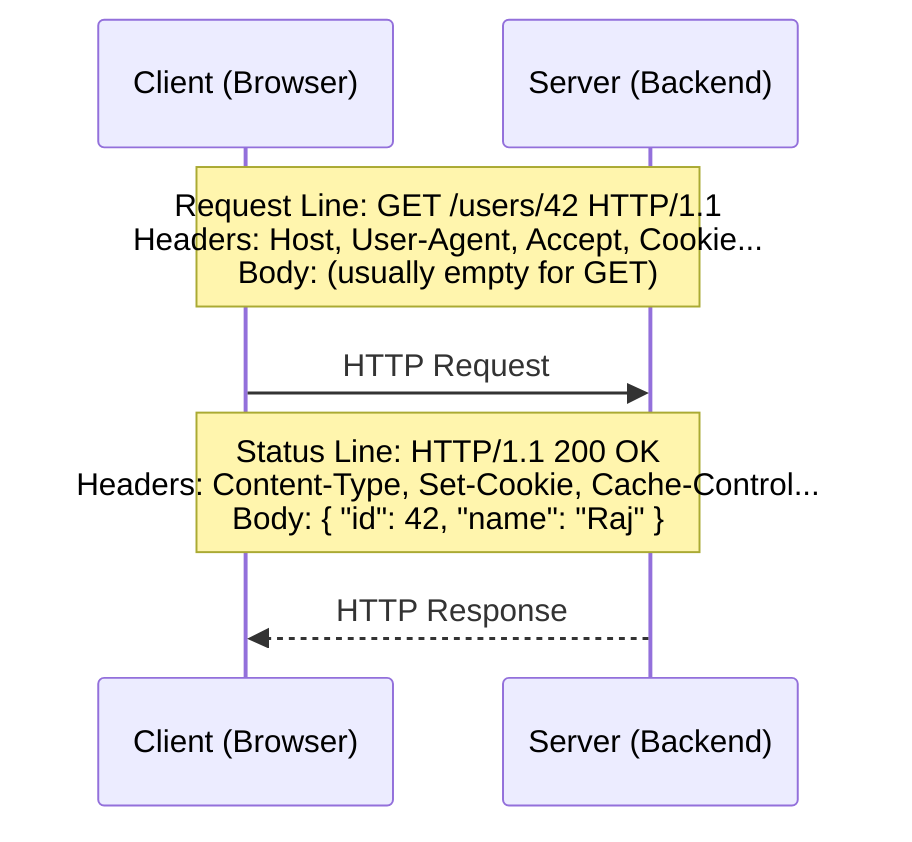
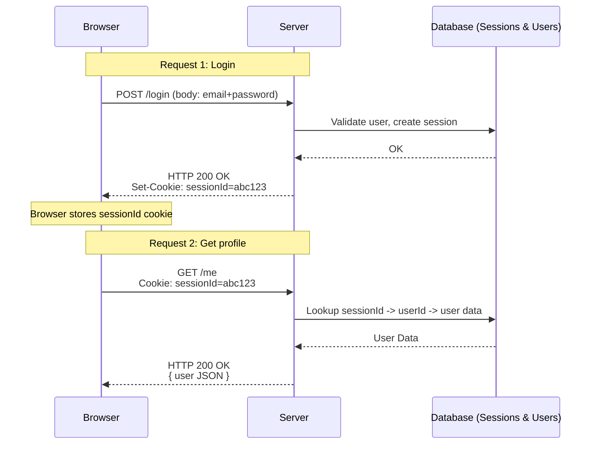
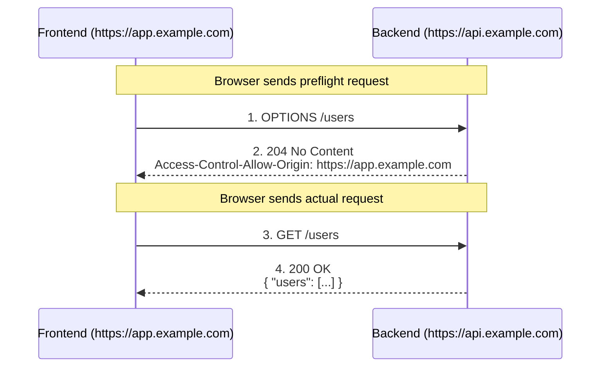

# Day 3: HTTP Deep Dive & Core Protocols
*(Textbook-style, from first principles — with intuition, diagrams, and production context)*

***

## SECTION 1: INTUITION

HTTP is like a **formal conversation protocol** between client and server:

- **Client:** “Hey server, I want to **GET** this resource at this address, here is some extra info (headers).”  
- **Server:** “Here’s the **status** of your request (200/404/500) and the data/body plus some meta info (headers).”

**Important intuitions:**

- **HTTP is stateless:** Each request is independent. The server doesn’t “remember” previous requests unless you build state using mechanisms like **cookies, sessions, or tokens**.
- **Payload agnostic:** While it is text-based, HTTP can carry any binary payload (JSON, images, video).
- **HTTPS is a tunnel:** HTTPS is simply HTTP running **inside a TLS-encrypted tunnel**, ensuring nobody can eavesdrop or tamper with the data easily.

***

## SECTION 2: THEORY

### 2.1 HTTP Request & Response Structure

An **HTTP Request** has three main parts:

1. **Request line**  
   - Format: `METHOD PATH VERSION`  
   - Example: `GET /users/42 HTTP/1.1`  
2. **Headers**  
   - Key–value metadata (e.g., `Content-Type`, `Authorization`).
3. **Body (optional)**  
   - Present in methods like `POST`, `PUT`, or `PATCH` when sending data (JSON/form data).

An **HTTP Response** has three corresponding parts:

1. **Status line**  
   - Format: `VERSION STATUS_CODE STATUS_TEXT`  
   - Example: `HTTP/1.1 200 OK`  
2. **Headers**  
   - Metadata (e.g., `Content-Type`, `Set-Cookie`, `Cache-Control`).
3. **Body (optional)**  
   - The actual payload (HTML, JSON, images, etc.).

> [!TIP]
> **Simple Analogy:**  
> Request/Status line = "The first sentence of the conversation."  
> Headers = "Contextual details."  
> Body = "Actual content or payload."

***

### 2.2 HTTP Methods (Verbs)

Common methods and their typical use in REST APIs:

- **GET**: Fetch a resource. No side effects. *(Example: `GET /users/42`)*
- **POST**: Create a new resource or perform an action. Has a body. *(Example: `POST /users`)*
- **PUT**: Replace a resource **completely**. *(Example: `PUT /users/42`)*
- **PATCH**: Partial update of a resource. *(Example: `PATCH /users/42`)*
- **DELETE**: Delete a resource. *(Example: `DELETE /users/42`)*
- **HEAD**: Same as GET but no body; used to check headers/metadata.
- **OPTIONS**: Ask the server what methods/headers are allowed (used heavily in CORS preflight).

**REST API Mapping:**
- Create → `POST`
- Read → `GET`
- Update → `PUT/PATCH`
- Delete → `DELETE`

***

### 2.3 HTTP Headers

Headers are **metadata** about the request/response. They are formatted as key–value pairs.

1. **General headers**: Apply to both request and response (e.g., `Cache-Control`, `Date`).
2. **Request headers**: From client to server.
   - `Host`: Target domain.
   - `User-Agent`: Browser info.
   - `Accept`: What formats the client accepts.
   - `Authorization`: Credentials or tokens.
   - `Content-Type`: Type of body being sent (e.g., `application/json`).
3. **Response headers**: From server to client.
   - `Content-Type`: Response body type.
   - `Content-Length`: Size of the body.
   - `Set-Cookie`: Instructs the browser to store a cookie.
   - `Access-Control-Allow-Origin`: CORS policy.
4. **Entity/Body headers**: Specific metadata about the body (e.g., `Content-Encoding`).

***

### 2.4 Cookies & Sessions

HTTP is stateless, but applications need to know “is this the same user?” across requests.

#### Cookies
- Small pieces of data stored in the browser, sent automatically with every request to that domain.
- Set by the server using the `Set-Cookie` response header.
- The browser sends cookies back via the `Cookie` request header.

**Security Flags:**
- `HttpOnly`: JavaScript cannot read the cookie (mitigates XSS).
- `Secure`: Only sent over HTTPS.
- `SameSite`: Controls cross-site sending (helps mitigate CSRF).
- `Path`, `Domain`: Defines the scope of the cookie.

#### Sessions
- A **server-side concept** to store per-user state (e.g., user ID, roles).
- **Common pattern:**
  1. **Login:** Server creates a session in the database or Redis, generating a `sessionId`. Server sets `Set-Cookie: sessionId=...`.
  2. **Subsequent Requests:** Browser sends `Cookie: sessionId=...`. Server looks up the session and attaches `req.user`.

> **Summary:** Cookies are the client-side storage mechanism. Sessions are the server-side state keyed by that cookie.

***

### 2.5 HTTP Status Codes

Status codes tell the client **what happened**.

- **1xx – Informational**: `100 Continue`, `101 Switching Protocols`.
- **2xx – Success**: 
  - `200 OK`: Request succeeded.
  - `201 Created`: Resource created.
  - `204 No Content`: Success but no body.
- **3xx – Redirection**:
  - `301 Moved Permanently`
  - `302 Found` (temporary)
  - `304 Not Modified` (use cached version)
- **4xx – Client Error**:
  - `400 Bad Request`: Invalid input.
  - `401 Unauthorized`: Not authenticated.
  - `403 Forbidden`: Authenticated but not allowed to access resource.
  - `404 Not Found`: Resource doesn’t exist.
  - `422 Unprocessable Entity`: Validation errors.
- **5xx – Server Error**:
  - `500 Internal Server Error`: Generic backend crash.
  - `502 Bad Gateway`, `503 Service Unavailable`, `504 Gateway Timeout` (Proxies/Load balancers).

***

### 2.6 CORS (Cross-Origin Resource Sharing)

Browsers enforce the **Same-Origin Policy**: a web page cannot freely make requests to a different origin (scheme + host + port).

**CORS** allows servers to declare: “Yes, I allow this other origin to call me.”

- Implemented via HTTP response headers:
  - `Access-Control-Allow-Origin: https://myfrontend.com`
  - `Access-Control-Allow-Methods: GET, POST, PUT, DELETE`

**Preflight requests (`OPTIONS`):**
For non-simple requests, the browser first sends an `OPTIONS` request to check permissions. If the server responds affirmatively, the actual request is sent.

> [!NOTE]
> CORS is a **browser-side protection**. A backend calling another backend is not restricted by CORS.

***

### 2.7 HTTPS & TLS

HTTPS is HTTP transmitted over **TLS** (Transport Layer Security).

**Goals:**
- **Confidentiality:** Data is encrypted in transit.
- **Integrity:** Data cannot be tampered with.
- **Authentication:** The client verifies the server's identity via certificates.

**TLS Handshake (Simplified):**
1. Client sends “ClientHello” (ciphers, random number).
2. Server responds with “ServerHello” (selected cipher, server certificate).
3. Client verifies the certificate.
4. Client generates a secret, encrypts it with the server’s public key, and sends it.
5. Both compute a shared symmetric key used for all further HTTP data encryption.

***

## SECTION 3: VISUAL DIAGRAMS

### Diagram 1: HTTP Request–Response



***

### Diagram 2: Stateless HTTP + Sessions



***

### Diagram 3: CORS Flow (Frontend + Backend in Different Origins)



***

## SECTION 4: PRODUCTION EXAMPLES

### Example 1: Proper Status Codes in a Real API
Consider `POST /orders` in a food delivery app:
- Valid request, order created → `201 Created`
- Invalid body → `400 Bad Request` or `422 Unprocessable Entity`
- Not logged in → `401 Unauthorized`
- Logged in but trying to access another user’s order → `403 Forbidden`
- Internal bug → `500 Internal Server Error`

### Example 2: Cookies/Sessions vs JWTs
- Traditional monoliths use **server-side sessions + cookies**.
- Microservice setups often use **JWT tokens in Authorization headers**, but still set some cookies for web flows.
- SPAs (React) frequently use `Authorization: Bearer <token>` for APIs while the backend sets `HttpOnly` cookies for refresh tokens.

### Example 3: CORS in a Frontend–Backend Split
Handling CORS correctly is a very common backend task. If the frontend is hosted at `https://app.myproduct.com` and APIs at `https://api.myproduct.com`, the backend must include:
```http
Access-Control-Allow-Origin: https://app.myproduct.com
Access-Control-Allow-Credentials: true
```

***

## SECTION 5: BACKEND IMPLEMENTATION

Let’s take a simple Express.js example to connect all the pieces.

### Example: Login Endpoint

```js
app.post('/login', async (req, res) => {
  const { email, password } = req.body; 

  const user = await findUserByEmail(email);
  if (!user) {
    return res.status(401).json({ message: 'Invalid credentials' });
  }

  const isValid = await verifyPassword(password, user.passwordHash);
  if (!isValid) {
    return res.status(401).json({ message: 'Invalid credentials' });
  }

  const sessionId = await createSession(user.id); 

  res
    .cookie('sessionId', sessionId, {
      httpOnly: true,
      secure: true,
      sameSite: 'lax'
    })
    .status(200)
    .json({ id: user.id, email: user.email });
});
```

**Things to notice:**
- **Method**: `POST`
- **Request body**: JSON (Requires `Content-Type: application/json`)
- **Status codes**: 200 for success, 401 for invalid login
- **Cookies**: Set with `HttpOnly`, `Secure`, and `SameSite` flags.

### Example: CORS Setup (Express)

```js
const cors = require('cors');

app.use(cors({
  origin: 'https://app.myproduct.com',
  credentials: true, // allow cookies
}));
```

***

## SECTION 6: COMMON MISTAKES

1. **Using wrong methods:** Using `GET` for actions that change state. (Fix: use `DELETE`/`POST`/`PUT`).
2. **Returning 200 for everything:** Makes debugging painful. (Fix: use proper 4xx/5xx codes with structured error bodies).
3. **Storing sensitive data in non-HttpOnly cookies:** Exposes tokens to XSS. (Fix: use `HttpOnly; Secure; SameSite`).
4. **CORS misconfiguration:** Using `Access-Control-Allow-Origin: *` with credentials is not allowed by browsers.
5. **Not using HTTPS in production:** Exposes passwords and tokens to network sniffing.
6. **Assuming HTTP is stateful:** Expecting the server to “remember” a logged-in user without passing cookies/tokens.

***

## SECTION 7: INTERVIEW-STYLE QUESTIONS

1. Describe the structure of an HTTP request and response.  
2. What is the difference between **GET** and **POST** semantically and practically?  
3. What are **idempotent** methods (GET, PUT, DELETE) and why do they matter?  
4. How do **cookies** and **sessions** work together to keep users logged in?  
5. Explain the meaning of these status codes: 200, 201, 204, 301, 400, 401, 403, 404, 500.  
6. What is **CORS**? Why does it exist, and how do you configure it on the backend?  
7. What is the difference between **HTTP** and **HTTPS**? What role does TLS play?  
8. What are some important security-related HTTP headers?  
9. When would you return 422 instead of 400?  
10. What is an **OPTIONS** request and where do you typically see it?

***

## SECTION 8: REVISION NOTES (CHEAT SHEET)

- **HTTP**: Stateless, request–response protocol over TCP.
- **Request**: `METHOD PATH VERSION`, headers, optional body.
- **Response**: `VERSION STATUS_CODE STATUS_TEXT`, headers, optional body.
- **Methods**: `GET` (read), `POST` (create), `PUT` (replace), `PATCH` (update), `DELETE` (remove).
- **Headers**: Metadata (`Content-Type`, `Authorization`, `Cookie`, CORS headers).
- **Cookies/Sessions**: Cookies are client-side storage; sessions are server-side state.
- **Status Codes**: 1xx (info), 2xx (success), 3xx (redirect), 4xx (client error), 5xx (server error).
- **CORS**: Browser security mechanism allowing cross-origin requests.
- **HTTPS**: HTTP over TLS ensuring encryption, integrity, and authentication.

***

## SECTION 9: HANDS-ON ASSIGNMENT

### Task 1: Inspect Real HTTP Traffic
1. Open Browser DevTools → Network tab.
2. Visit a site you use (e.g., `https://github.com`).
3. Pick one API request.
4. Write down the Method, URL, Request Headers, Status Code, and Response Headers.

### Task 2: Build a Small API with Proper Status Codes
Build a backend endpoint:
- `GET /health` → returns 200 with `{ status: 'ok' }`.
- `POST /echo` → If body is missing `message`, return 400 with `{ error: 'message is required' }`. Else return 201.

### Task 3: Simulate CORS
Serve a frontend on port 3000 and a backend on 4000. Attempt an API call to trigger a CORS error, then fix it by configuring backend CORS headers.

***

## SECTION 10: MINI PROJECT

**Design and implement a minimal auth flow:**
1. **Backend endpoints:**
   - `POST /login` (accepts email/password, sets session cookie).
   - `GET /me` (returns current user if session valid; 401 if not).
   - `POST /logout` (destroys session).
2. Use an in-memory store for sessions and apply `HttpOnly` + `Secure` cookie flags.
3. **Frontend:** Create a simple HTML form to log in and fetch the profile.

***

## ACTIVE LEARNING – YOUR TURN

To check understanding, try this:

> You are designing `POST /login` for a web app where frontend is on `https://app.example.com` and backend API is on `https://api.example.com`.  
> Describe:
> - Which HTTP method and path you’ll use.  
> - What the **request** will look like (body + important headers).  
> - What the **successful response** will look like (status code, headers, cookies).  
> - How CORS and cookies will be configured so the browser can call the API and stay logged in.
