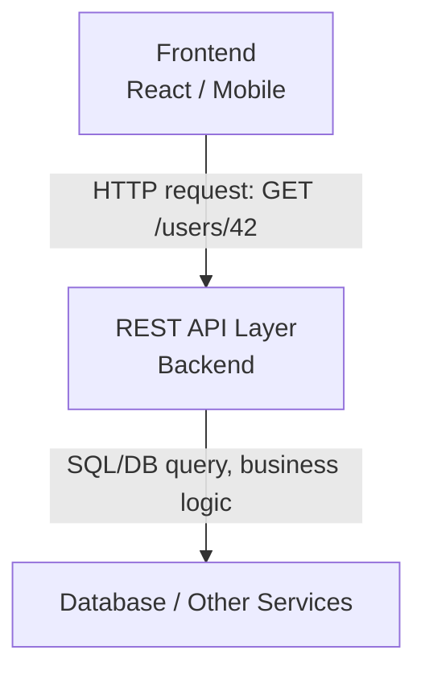

# Day 4: API Fundamentals & REST Basics
*(Textbook-style, from first principles — with intuition, diagrams, production context, and Hinglish where it helps)*

***

## SECTION 1: INTUITION

### What is an API?

**API = Application Programming Interface.**  

Intuition: An API is like a **contract or a menu** between two pieces of software.

- **Restaurant analogy:**
  - You don’t enter the kitchen.  
  - You use the **menu** (interface) and tell the waiter what you want.  
  - The kitchen has a complex process, but you don’t see it.  

Similarly:

- A client uses an **API** to ask a system to do something (get data, create an order, etc.).  
- The API hides the internal complexity (database schema, internal services, queues, etc.).

> [!TIP]
> **Hinglish Intuition:**  
> API ek **messenger + ruleset** hai jo bolta hai:  
> “Yahan se baat karo, aise baat karo, ye format use karo; andar ka kitchen tum mat dekho.”

### Web / HTTP APIs

A **Web API** is simply an API accessible over **HTTP/HTTPS**.

- **Clients:** browsers, mobile apps, other servers.  
- **Communication:** HTTP methods, URLs, headers, body.  

REST APIs are a specific **style** of designing these HTTP APIs.

***

## SECTION 2: THEORY – API FUNDAMENTALS & REST

### 2.1 API Fundamentals

Key concepts:

- **Interface / Contract**  
  - Defines:
    - Available operations (e.g., `GET /users`, `POST /orders`).  
    - Inputs (query params, JSON body).  
    - Outputs (JSON shape, status codes).  

- **Abstraction**  
  - Hides implementation details.
  - The client doesn’t need to know the database, language, or infrastructure.

- **Decoupling**  
  - Different teams can work independently:
    - The frontend team uses the API.
    - The backend team implements the API.  

- **Machine-to-machine communication**  
  - Example: A backend calling a payment gateway (Stripe) or an SMS service (Twilio).

***

### 2.2 REST: Representational State Transfer

REST is an **architectural style** for designing networked applications.

Core ideas (simplified):

1. **Client–Server:** Clear separation between the client and the server.
2. **Stateless:** Each request contains all the information needed; the server doesn’t store client context between requests.
3. **Cacheable:** Responses define whether they can be cached by the client.
4. **Uniform Interface:** A standardized way to interact: resources are identified by URIs, manipulated with standard HTTP methods, and represented in standard formats (like JSON).
5. **Layered System:** A client can’t tell if it’s talking directly to the server or via proxies and CDNs.
6. **Code on Demand (optional):** The server can send executable code to extend client functionality.

**In practice for us:**
- Think in terms of **resources** (nouns) instead of arbitrary actions (verbs).
- Use **HTTP methods** as your action verbs.
- Use consistent data representations (JSON).

***

### 2.3 Resources

A **resource** is the conceptual “thing” your API manages.

Examples: `users`, `orders`, `products`, `posts`, `comments`, `payments`.

**Resource design principles:**

- Use **nouns**, not verbs:
  - Good: `/users`, `/orders`
  - Bad: `/getUsers`, `/createOrderEndpoint`
- Collections vs Single resource:
  - Collection: `/users`  
  - Single: `/users/{id}`  

Examples for a blog API:

- **Collection:**
  - `GET /posts` → list posts.  
  - `POST /posts` → create a new post.  
- **Single:**
  - `GET /posts/123` → get post 123.  
  - `PATCH /posts/123` → update post 123.  
  - `DELETE /posts/123` → delete post 123.

***

### 2.4 Endpoints

An **endpoint** is the combination of an **HTTP method + URL path** (and often host).

Examples:
- `GET https://api.example.com/users`  
- `POST https://api.example.com/users`  
- `GET https://api.example.com/users/42`  

An endpoint is **how clients talk** to resources.

**Good endpoint design:**
- Clear, noun-based, predictable.  
- Use plural nouns for collections: `/users`, `/orders`.  
- Use path parameters for specific items: `/users/{id}`.

***

### 2.5 CRUD Mapping

CRUD stands for **Create, Read, Update, Delete**.

RESTful mapping to HTTP methods:

| CRUD    | HTTP Method | Example Path         | Meaning                         |
|---------|------------|----------------------|---------------------------------|
| Create  | POST       | `/students`          | Create a new student            |
| Read    | GET        | `/students`          | List all students               |
| Read    | GET        | `/students/{id}`     | Get one student                 |
| Update  | PUT/PATCH  | `/students/{id}`     | Update student                  |
| Delete  | DELETE     | `/students/{id}`     | Remove student                  |

**Notes:**
- Use `POST /students` for creation.
- Use `GET /students` & `GET /students/{id}` for reading.
- Use `PUT` for full replacements, `PATCH` for partial updates.
- Use `DELETE` for removal.

***

## SECTION 3: VISUAL DIAGRAMS

### Diagram 1: Concept of API Between Frontend and Backend


> The API is the **layer / interface** between the client and internal systems.

***

### Diagram 2: Resource and Endpoints for “students”

```mermaid
graph LR
    subgraph Resource: students
    direction TB
    A(Collection Endpoints)
    A --> B[POST /students<br/>create new student]
    A --> C[GET /students<br/>list students]
    
    D(Single Resource Endpoints)
    D --> E[GET /students/{id}<br/>get one student]
    D --> F[PUT /students/{id}<br/>replace student]
    D --> G[PATCH /students/{id}<br/>partial update]
    D --> H[DELETE /students/{id}<br/>delete student]
    end
```

***

### Diagram 3: Contract View

```mermaid
graph TD
    subgraph Client Knows
    A[Base URL: https://api.school.com]
    B[Endpoints: GET/POST /students]
    C[Request/Response shapes]
    end

    subgraph Client Does NOT Know
    D[Database: Postgres/MySQL]
    E[Internal Microservices]
    F[Queues, Caches]
    end
    
    Client Knows -.->|API Contract| Client Does NOT Know
```
> API = **public contract**; everything else is an implementation detail.

***

## SECTION 4: PRODUCTION EXAMPLES

### Example 1: GitHub REST API (Simplified)

GitHub exposes a large REST API. For repositories:
- `GET /users/{username}/repos` → list repos.  
- `GET /repos/{owner}/{repo}` → repo details.  
- `POST /user/repos` → create repo.  

You don’t know or care how GitHub stores repos internally; you just use the API contract.

***

### Example 2: Payment Gateway (Stripe-like)

A payment API typically offers resources like `customers`, `charges`, `payments`.
- `POST /customers` → create customer.  
- `POST /payments` → create a payment against a customer.  
- `GET /payments/{id}` → fetch payment details.  

Again, you just follow the **API docs**, not the internal architecture.

***

### Example 3: Your Own Product

Suppose you’re building a TODO app:
- **Resource**: `todos`.  
- **Endpoints**:
  - `GET /todos` → list current user’s todos.  
  - `POST /todos` → create todo.  
  - `PATCH /todos/{id}` → update text/complete flag.  
  - `DELETE /todos/{id}` → delete.  

The frontend or mobile app simply uses these endpoints.

***

## SECTION 5: BACKEND IMPLEMENTATION VIEW

### Example API Design: Users Resource

**Resource**: `users`.  

**Endpoints:**

- `POST /users`  
  - Create new user.  
  - Body: `{ "name": "Raj", "email": "raj@example.com" }`.  
  - Success: `201 Created` + created user JSON.  

- `GET /users`  
  - List users (later add pagination).  

- `GET /users/{id}`  
  - Get user by id.  

- `PATCH /users/{id}`  
  - Update subset of fields.  

- `DELETE /users/{id}`  
  - Remove user.

*(Note: We will refine this with pagination, filtering, and conventions in upcoming topics).*

***

### Implementation Sketch (Express-style)

```js
const express = require('express');
const app = express();
app.use(express.json());

// Create user
app.post('/users', async (req, res) => {
  const { name, email } = req.body;
  // TODO: validate input
  const user = await db.createUser({ name, email });
  res.status(201).json(user);
});

// List users
app.get('/users', async (req, res) => {
  const users = await db.listUsers();
  res.json(users);
});

// Get one user
app.get('/users/:id', async (req, res) => {
  const user = await db.getUser(req.params.id);
  if (!user) return res.status(404).json({ message: 'Not found' });
  res.json(user);
});
```

**Notice:**
- Endpoints are **resource-oriented** (noun-based).  
- We use **HTTP methods** correctly for CRUD.

***

## SECTION 6: COMMON MISTAKES

1. **Verb-based endpoints:**  
   - Bad: `/getAllUsers`, `/updateUser`, `/deleteUserById`.  
   - Better: `/users` (GET, POST), `/users/{id}` (GET, PATCH, DELETE).

2. **Mixing concerns in one endpoint:**  
   - Having a single endpoint do too many unrelated actions. Stick to clear resource operations.

3. **Ignoring HTTP semantics:**  
   - Using POST for reads, or GET that modifies state. This makes caching, idempotency, and infrastructure tooling much harder.

4. **Inconsistent naming:**  
   - Using `/user`, `/users`, and `/user_list` in the same API.  
   - **Fix:** Prefer consistent plural nouns like `/users`.

5. **Leaking internal DB schema:**  
   - Endpoint names directly reflecting internal table names even when not meaningful to the client. Design your API around **domain concepts** (e.g., `orders`, `payments`), not low-level database tables.

***

## SECTION 7: INTERVIEW-STYLE QUESTIONS

1. What is an API? Why do we use APIs in modern systems?
2. What is the difference between a **web API** and a **library API**?
3. What is a **resource** in a REST API? Give examples.
4. How do you map CRUD operations to HTTP methods?
5. Why is it recommended to use **nouns** (not verbs) in REST endpoints?
6. Explain the difference between `/users` and `/users/{id}`.
7. Can a REST API be stateful? What does “stateless” mean in this context?
8. What are some advantages of REST over RPC-style HTTP APIs?
9. How does REST’s “uniform interface” help with scalability and decoupling?
10. Give an example of a real-world public REST API you’ve seen/used and describe one of its resources.

***

## SECTION 8: REVISION NOTES (CHEAT SHEET)

- **API**: A contract/interface for one piece of software to talk to another.
- **Web API**: An API accessed over HTTP/HTTPS.
- **REST**: An architectural style for HTTP APIs with constraints: client–server, stateless, cacheable, layered, uniform interface.
- **Resource**: A logical “thing” your system manages (users, orders, posts).
- **Endpoints**: `METHOD + PATH` combinations used to operate on resources.
- **CRUD ↔ HTTP mapping**:
  - Create → POST  
  - Read → GET  
  - Update → PUT/PATCH  
  - Delete → DELETE
- **Best Practice:** Use plural nouns and clear resource-oriented paths: `/users`, `/users/{id}`.

***

## SECTION 9: HANDS-ON ASSIGNMENT

Design a **REST API for a simple Notes app** (no code yet, just design).

### Requirements:
Users can:
- Create notes.
- List their notes.
- View a single note.
- Update a note.
- Delete a note.

### Your tasks:
1. Define the **resource(s)** – at minimum `notes`, possibly `users`.  
2. For each resource, list endpoints with:
   - HTTP method.  
   - Path.  
   - Short description.  
3. For at least two endpoints, define:
   - Example **request body** (JSON).  
   - Example **response body** (JSON).  

> **Goal:** Keep endpoints RESTful (nouns, CRUD mapping).

***

## SECTION 10: MINI PROJECT

Take the **Notes API** you designed and implement **just two endpoints** for now:

1. `POST /notes` – create a note.  
2. `GET /notes` – list all notes (in memory is fine for now).  

**Use:**
- `Content-Type: application/json`.  
- Proper status codes (`201` for create, `200` for list).  
- Return JSON with `id`, `title`, `content`, `createdAt`.

**Example:**

```json
// POST /notes body
{ "title": "Shopping", "content": "Milk, Bread, Eggs" }

// Response
{
  "id": 1,
  "title": "Shopping",
  "content": "Milk, Bread, Eggs",
  "createdAt": "2026-06-10T15:00:00Z"
}
```

*(Note: We’ll refine this with naming, pagination, filtering, and versioning on Day 5).*

***

## ACTIVE LEARNING – YOUR TURN

To check understanding, do this:

> Design the REST API for **“students”** in a school management system, *only at the level of endpoints* (no implementation).  
> List:
> - The resource(s) you’ll use.  
> - All CRUD endpoints for `students` with HTTP method + path + 1-line description (e.g., `GET /students` – list all students).  

Try to keep them clean, RESTful, and consistent. Then we’ll review and tune the design before moving to **Day 5: Professional API Design (naming, pagination, filtering, sorting, versioning)**.
