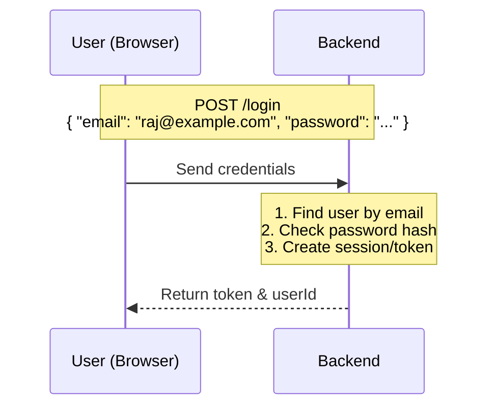
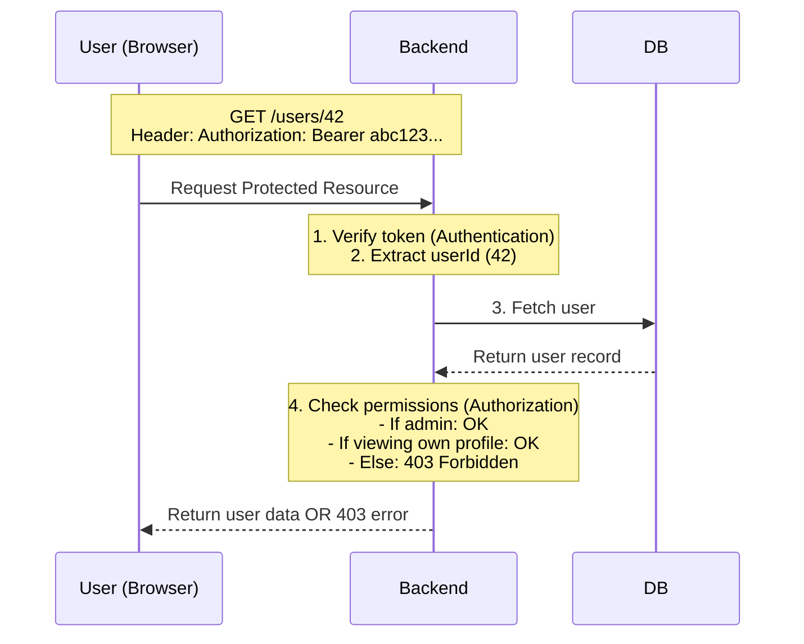
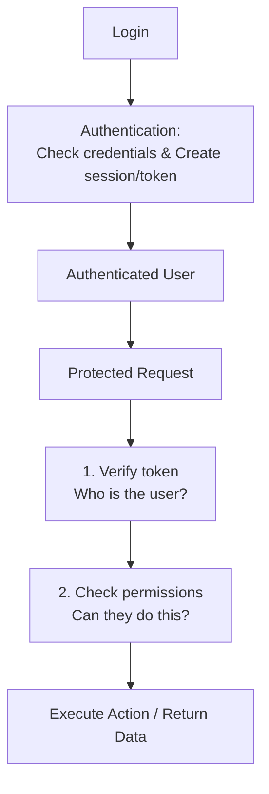

# Day 8: Authentication & Authorization Fundamentals
*(Simple language, step-by-step, from first principles — with intuition, diagrams, and production examples)*

***

## SECTION 1: INTUITION (The Big Picture)

Think of your app like a **gated office building**:

1. **Entrance gate (Authentication)**  
   - The security guard asks: “Are you allowed to enter?”  
   - You show your **ID card** (or OTP, or password).  
   - The guard checks: “Yes, you are registered.” → Lets you in.  
   - This answers: *“Who are you? Prove it.”*

2. **Inside the building (Authorization)**  
   - Now you can go to:
     - Your own office (allowed).
     - The meeting room (allowed).
     - The server room (**NOT** allowed unless you have special permission).  
   - Access control answers: *“What are you allowed to do?”*

> [!TIP]
> **Simple Analogy:**  
> - **Authentication** = "Who are you? Prove it."  
> - **Authorization** = "Should you be doing this? Let's check."

**In web apps:**
- **Authentication** = Login with a password, OTP, or Google.
- **Authorization** = An admin can delete users; a normal user cannot.

***

## SECTION 2: CORE CONCEPTS

### 2.1 Identity

**Identity** = “Your digital self” in the system.

- It is represented by a **user record** in your database:
  - `id`
  - `email`
  - `name`
  - `role` (user, admin, etc.)
  - `passwordHash` (never the plain password)

**Example row:**
```text
id: 42
email: raj@example.com
name: Raj
role: user
passwordHash: a1b2c3...
```
This user record is your **identity**.

***

### 2.2 Authentication (AuthN)

**Authentication** = The process of verifying that someone is who they claim to be.

**Common methods:**
- **Password-based**: User provides `email` + `password`. Server checks if the password matches the hash.
- **OTP-based**: User gets an OTP on email/phone, enters the OTP, and the server verifies it.
- **Third-party (OAuth)**: Login with Google, GitHub, etc.

After successful authentication, the server creates a **session** or **token**. This proves “this user is already logged in” for future requests.

> **Key Idea:** Authentication happens **once** at login. Then you get a “proof of identity” (session/token) for future requests.

***

### 2.3 Authorization (AuthZ)

**Authorization** = The process of checking if an authenticated user is allowed to do a specific action.

**Examples:**
- **Normal user**: Can view their own profile, can create posts. Cannot delete other users.
- **Admin user**: Can view all users, delete users, and change system settings.

Authorization checks happen **on every request** that needs protection.

> **Key Idea:**  
> **Authentication** = Identity.  
> **Authorization** = Permissions based on that identity.

***

## SECTION 3: WHY WE NEED BOTH

**Without authentication:**
- Anyone can access any user’s data.
- Anyone can delete any post or change any settings.
- Anyone can spam the system anonymously.

**Without authorization:**
- Every authenticated user can do admin actions.
- Users can access data they shouldn’t see.
- Users can delete resources they don’t own.

**In real companies:**
- Authentication protects **privacy**.
- Authorization protects **security and business rules**.

***

## SECTION 4: VISUAL DIAGRAMS

### Diagram 1: Login Flow (Authentication)


*This is the Authentication process.*

***

### Diagram 2: Authenticated Request Flow (with Authorization)


*Steps 1–3 = Authentication (Who are you?). Step 4 = Authorization (What can you do?).*

***

### Diagram 3: Summary Flow



***

## SECTION 5: HOW AUTHENTICATION WORKS (PASSWORD-BASED)

Let’s walk through a typical password login, step by step.

### Step 1: User Registration

1. User sends:
```http
POST /register
{
  "email": "raj@example.com",
  "password": "supersecret123"
}
```

2. **Backend Execution:**
   - Validates email format.
   - Checks password length.
   - **Hashes password** (using an algorithm like `bcrypt` or `argon2`). You never store plain passwords.
   - Saves to DB:
     ```text
     email: raj@example.com
     passwordHash: a1b2c3... (hashed)
     ```

***

### Step 2: User Login

1. User sends:
```http
POST /login
{
  "email": "raj@example.com",
  "password": "supersecret123"
}
```

2. **Backend Execution:**
   - Finds user by email. If not found → `401 Unauthorized`.
   - Hashes the provided password: `hash("supersecret123")`.
   - Compares it with the stored `passwordHash`.
   - If it matches → login successful. If not → `401 Unauthorized`.

3. **If login is successful:**
   - The backend creates a **Session** (stored in DB/Redis) OR a **Token** (like a JWT) containing user info.
   - Sends it back to the client:
     ```json
     {
       "token": "abc123...",
       "userId": 42
     }
     ```
   - OR sets a cookie:
     ```http
     Set-Cookie: sessionId=abc123; Secure; HttpOnly; SameSite=Lax
     ```

*The user is now authenticated.*

***

## SECTION 6: HOW AUTHORIZATION WORKS (PERMISSIONS)

### 6.1 Role-Based Permissions (Simplest)

Common pattern: **roles** (e.g., `user`, `admin`, `moderator`).

**Authorization Rules:**
- `user`: Can create posts, view own profile. Cannot delete other users or change settings.
- `admin`: Can do all actions, delete users, change settings, view logs.

**Code Pattern:**
```js
if (user.role !== 'admin') {
  return res.status(403).json({ message: 'Admin only' });
}
```

***

### 6.2 Ownership-Based Permissions

Another common pattern: **ownership**.

**Example:**
```text
post:
  id: 100
  userId: 42
  title: "My post"
```

**Rules:**
- User 42 can edit/delete their own post.
- User 99 cannot edit/delete this post.

**Code Pattern:**
```js
if (post.userId !== user.id) {
  return res.status(403).json({ message: 'Not your post' });
}
```

***

## SECTION 7: COMMON AUTHENTICATION METHODS

### 7.1 Password-Based Auth
- **Flow:** Register (email+password), Login (email+password). Server returns token/session.
- **Pros:** Simple, universally understood.
- **Cons:** Users forget passwords, weak passwords can be guessed, requires password reset flows.

### 7.2 OTP-Based Auth
- **Flow:** User enters email/phone. Server sends OTP. User enters OTP. Server verifies and returns token/session.
- **Used in:** Mobile-first apps (Zomato, Swiggy, Uber).
- **Pros:** No password to remember, easy on mobile.
- **Cons:** OTPs can be intercepted, dependent on Email/SMS deliverability.

### 7.3 Third-Party Auth (OAuth)
- **Flow:** User clicks “Login with Google”. Redirects to Google. Google authenticates the user and tells your app who they are. Your app creates a session.
- *(We will cover OAuth deeply on Day 11).*

***

## SECTION 8: TOKENS VS SESSIONS (PREVIEW)

Both are ways to remember “this user is logged in”.

**Sessions (Traditional)**
- Server stores the session state in a DB/Redis (`sessionId` → `userId`).
- Client sends `sessionId` in a cookie.
- Server checks DB/Redis on every request.

**Tokens (JWT - Modern)**
- Server creates a token (JWT) embedding user info (`userId`, `role`, `expiresAt`).
- The token is **cryptographically signed**.
- Client sends the token in the `Authorization` header.
- Server verifies the signature locally (no DB hit needed).

*(We will cover both deeply on Days 9–10).*

***

## SECTION 9: COMMON MISTAKES

1. **Storing plain passwords:** Massive security risk. Always store hashes.
2. **Not checking authentication on protected endpoints:** Anyone can access them. Always verify the token/session.
3. **Not checking authorization:** An authenticated user can do admin actions. Always check role/ownership.
4. **Returning too much info in errors:** Telling an attacker “Invalid password” confirms the email exists. Use generic errors like “Invalid credentials”.
5. **Hardcoding roles everywhere:** Makes code messy. Use centralized permission middleware.

***

## SECTION 10: INTERVIEW-STYLE QUESTIONS

1. What is the precise difference between **authentication** and **authorization**?
2. Why do we hash passwords instead of storing them in plain text?
3. What sequence of checks happens on every protected API request after a user logs in?
4. What is a **role**, and how does it facilitate authorization?
5. What is **ownership-based authorization**? Give a concrete example.
6. How is OTP-based auth structurally different from password-based auth?
7. What are **sessions** and **tokens** in simple terms?
8. Why is it important to check *both* authentication and authorization?
9. How would you design auth for a simple blog application?
10. What would happen if you failed to check authorization on admin endpoints?

***

## SECTION 11: REVISION NOTES (CHEAT SHEET)

- **Identity**: Your user record in the DB (`id`, `email`, `role`, `passwordHash`).
- **Authentication (AuthN)**: Verifying who you are (password, OTP, OAuth).
- **Authorization (AuthZ)**: Checking if you’re allowed to do something (role, ownership).
- **After login**: The client receives a **token** or **session** and sends it on every request.
- **Request Flow**: 
  1. Verify token/session (AuthN).
  2. Check permissions (AuthZ).
- **Security Rule**: Never store plain passwords; always **hash** (bcrypt/argon2).

***

## SECTION 12: HANDS-ON ASSIGNMENT

Design a simple **password-based auth system** for a blog app.

### Requirements
Users can:
- Register: `POST /register` (email + password).
- Login: `POST /login` (email + password).
- View their own profile: `GET /me`.
- View all posts: `GET /posts`.
- Create a post: `POST /posts`.

### Your Tasks
1. **Define Schema:** What fields will each user have in the DB? How is the password stored?
2. **Endpoint Protection:** For each endpoint:
   - Is it **authenticated** or not?
   - If authenticated, what **authorization** check is required?
3. **Write a Trace:** Provide the request headers for `GET /me` and explain how the backend verifies the token/session.

***

## SECTION 13: MINI PROJECT

Implement a **basic auth system** (password-based):

**Endpoints:**
- `POST /register`
- `POST /login`
- `GET /me` (authenticated)
- `GET /posts` (public)
- `POST /posts` (authenticated)

**Guidelines:**
- Use a simple in-memory user array (or SQLite).
- Hash passwords using the `bcrypt` library.
- For auth, generate a simple random token string and store it in the DB alongside the user.
- On each request: Check the token (Authentication), then check if the user is allowed (Authorization).

***

## ACTIVE LEARNING – YOUR TURN

Answer these in your own words:

1. In your blog app:
   - What is the **identity** of a user?
   - What is **authentication**?
   - What is **authorization**?

2. Explain the flow for:
   - A user registering.
   - A user logging in.
   - A user viewing their own profile (`GET /me`).

3. For `POST /posts`:
   - Is it authenticated or not?
   - What authorization check do you need (if any)?
