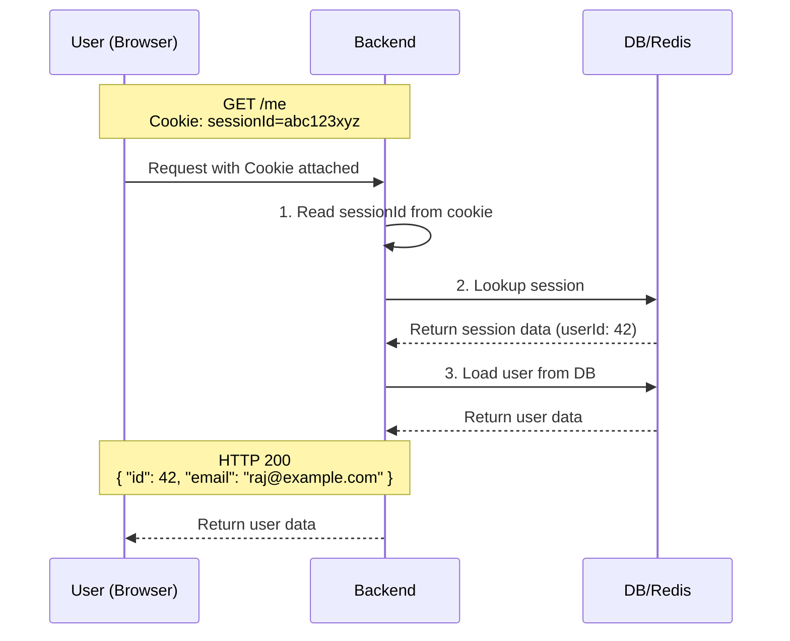
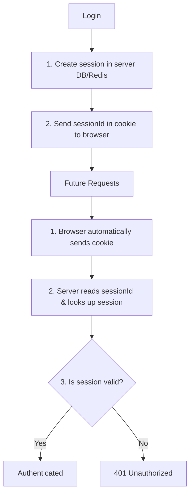

# Day 9: Sessions & Cookies
*(Simple language, step-by-step, from first principles — with intuition, diagrams, and production examples)*

***

## SECTION 1: INTUITION (Why Sessions & Cookies Exist)

Think of a **cafe**:

1. You enter, sit down, and order coffee.
2. The cafe gives you a **number tag** (e.g., “Tab 7”).
3. From now on:
   - You don’t need to say your name every time you order another item.
   - The cafe staff just looks at **Tab 7** and knows:
     - Who you are.
     - What you ordered.
     - What you’ve paid.

**In web apps:**
- **Session** = the cafe’s internal computer record for “Tab 7”.
- **Cookie** = the number tag on your wrist that you show every time.

> [!TIP]
> **Simple Analogy:**  
> - **Session** = A record inside the server: "Who is this user, and what have they done?".  
> - **Cookie** = A small piece of data in the browser that is automatically sent to the server with every request.

HTTP is **stateless**: each request is independent and forgets the previous one.  
But apps need to remember: *"This user logged in earlier, and they are still logged in."*  
This statefulness is achieved using **sessions + cookies**.

***

## SECTION 2: CORE CONCEPTS

### 2.1 What is a Session?

A **Session** is a piece of data stored on the **server** (or in Redis/DB) that represents “this user is logged in”.

**Server-side session:**
- **Stored in:**
  - Database (`users_sessions` table).
  - Redis (in-memory store, very common).
  - File system (in older PHP/Apache setups).
- **Contains:**
  - `sessionId` (a random, unguessable unique ID).
  - `userId` (who it belongs to).
  - `createdAt`, `expiresAt`.
  - Additional metadata (`role`, `lastActivity`, etc.)

**Example session record:**
```text
sessionId: abc123xyz
userId: 42
createdAt: 2026-07-06T10:00:00Z
expiresAt: 2026-07-07T10:00:00Z
role: user
```
> **Key Point:** Session data is **on the server**, not in the browser (except the ID).

***

### 2.2 What is a Cookie?

A **Cookie** is a small piece of data stored in the **browser**. The browser automatically sends it back to the server on every request to that domain.

- Set by the server via the `Set-Cookie` header.
- The browser sends it back via the `Cookie` header.

**Example Flow:**
1. Server sends:
   ```http
   Set-Cookie: sessionId=abc123xyz; Secure; HttpOnly; SameSite=Lax; Path=/
   ```
2. Browser securely stores `sessionId=abc123xyz`.
3. On the next request to the backend:
   ```http
   GET /me
   Cookie: sessionId=abc123xyz
   ```
   *The browser automatically attaches this!*

> **Key Point:** 
> - Cookie is **client-side storage**.
> - Session is **server-side storage**.
> - The cookie usually contains **only the session ID**.

***

### 2.3 How Session + Cookie Work Together

**Full Flow:**

1. **Login**:
   - User sends `email` + `password`.
   - Server verifies credentials.
   - Server creates a session in DB/Redis with a unique `sessionId`.
   - Server tells the browser to save it:
     ```http
     Set-Cookie: sessionId=abc123xyz; Secure; HttpOnly; SameSite=Lax
     ```
2. **Future requests**:
   - Browser automatically includes the cookie:
     ```http
     GET /me
     Cookie: sessionId=abc123xyz
     ```
3. **Server Verification**:
   - Reads `sessionId` from the cookie.
   - Looks up the session in DB/Redis.
   - Retrieves `userId` and `role`.
   - Now knows: *“This is user 42, role=user.”*
4. **Failure State**:
   - If the session is not found or expired, the user is **not authenticated** → `401 Unauthorized`.

***

## SECTION 3: VISUAL DIAGRAMS

### Diagram 1: Login + Session Creation

```mermaid
sequenceDiagram
    participant User as User (Browser)
    participant Backend
    participant DB as DB/Redis
    
    Note over User,Backend: POST /login<br/>{ "email": "raj@example.com", "password": "..." }
    User->>Backend: Send credentials
    
    Backend->>Backend: 1. Find user by email<br/>2. Check password hash
    
    Backend->>DB: 3. Create session record<br/>(sessionId, userId, expiresAt)
    DB-->>Backend: OK
    
    Note over Backend,User: HTTP 200<br/>Set-Cookie: sessionId=abc123xyz; Secure; HttpOnly; SameSite=Lax
    Backend-->>User: Return Response
    
    Note over User: Browser securely stores cookie
```

***

### Diagram 2: Authenticated Request with Cookie



***

### Diagram 3: Summary



***

## SECTION 4: COOKIE FLAGS & SECURITY

Cookies have **flags** (options) that control how they behave. These are critical for security.

### 4.1 `Secure`
- The cookie is sent **only over HTTPS**.
- Prevents the cookie from being sent over unencrypted HTTP (protects against network sniffing).
- **Rule:** Use **always** in production.

### 4.2 `HttpOnly`
- The cookie is **not accessible from JavaScript** (e.g., `document.cookie` returns empty).
- Prevents Cross-Site Scripting (XSS) attacks from stealing the session ID.
- **Rule:** Use **always** for session cookies.

### 4.3 `SameSite`
Controls when the cookie is sent on **cross-site requests**.
- `None`: Sent on all requests (requires `Secure`).
- `Lax`: Not sent on cross-site POSTs, but sent on top-level cross-site GETs. (Standard default).
- `Strict`: Not sent on *any* cross-site request.
- **Benefit:** Massively reduces CSRF (Cross-Site Request Forgery) risk.

### 4.4 `Path` and `Domain`
- `Path`: Which URL paths the cookie applies to (`Path=/` means the entire site).
- `Domain`: Which domains it applies to (`Domain=.example.com` includes subdomains).

> **Production Standard for Session Cookies:**
> ```http
> Set-Cookie: sessionId=abc123; Secure; HttpOnly; SameSite=Lax; Path=/
> ```

***

## SECTION 5: SESSION STORAGE OPTIONS

### 5.1 Database (SQL/NoSQL)
**Table:** `sessions`
```sql
CREATE TABLE sessions (
  session_id VARCHAR(255) PRIMARY KEY,
  user_id BIGINT NOT NULL,
  created_at TIMESTAMP NOT NULL,
  expires_at TIMESTAMP NOT NULL,
  role VARCHAR(50)
);
```
- **Pros:** Persistent, easy to query and manage.
- **Cons:** Slower than in-memory stores, adds load to your primary DB.

### 5.2 Redis (In-Memory Store)
**Redis Key-Value:**
```text
key: session:abc123xyz
value: { "userId": 42, "role": "user" }
```
- **Pros:** Extremely fast (sub-millisecond lookups), easy to set automatic TTL (Time To Live) so expired sessions clean themselves up.
- **Cons:** Data can be lost if Redis restarts (unless persistence is configured).
- *(Redis is the industry standard for production session management).*

***

## SECTION 6: SESSION LIFECYCLE

### 6.1 Creation
Occurs on successful login. Server generates the `sessionId`, stores it, and sends the `Set-Cookie` header.

### 6.2 Usage
On each request, the server reads the cookie, looks it up, and validates the `expiresAt` timestamp.

### 6.3 Renewal (Sliding Sessions)
If a user is active, extend `expiresAt`. 
- Pattern: If a request happens within the last 10 minutes of expiry, extend the session by another hour in Redis.

### 6.4 Destruction (Logout)
- Client calls `POST /logout`.
- Server **deletes** the session from DB/Redis.
- Server tells the browser to **delete the cookie** by setting it to a past date:
  ```http
  Set-Cookie: sessionId=; Secure; HttpOnly; SameSite=Lax; Path=/; Expires=Thu, 01 Jan 1970 00:00:00 GMT
  ```

***

## SECTION 7: SESSION-BASED AUTH VS TOKEN-BASED AUTH (JWT)

Both achieve the same goal: "Remember this user is logged in."

### Session-Based (Cookies + Redis/DB)
- Session state is stored on the server.
- Cookie contains only the random `sessionId`.
- **Pros:** Very easy to revoke (just delete from Redis). Great for traditional monolithic web apps.
- **Cons:** Requires central storage (Redis). Requires a DB lookup on every single request.

### Token-Based (JWT)
- Token contains the actual user info (`userId`, `role`).
- Token is cryptographically **signed** by the server.
- **Pros:** Stateless (no DB lookup needed to verify auth). Easier to scale across microservices.
- **Cons:** Hard to revoke (token is valid until expiry), larger payload sizes.

*(We will cover JWTs deeply on Day 10).*

***

## SECTION 8: COMMON MISTAKES

1. **Not using the `Secure` flag:** The cookie can be stolen over public Wi-Fi.
2. **Not using `HttpOnly`:** A simple XSS vulnerability allows a hacker to steal the session and hijack the account.
3. **Not setting `SameSite`:** Leaves your app wide open to CSRF attacks.
4. **Storing full session data IN the cookie:** Cookies are visible to the user and limited to 4KB. Store only the ID in the cookie.
5. **Not checking session expiry:** Old sessions stay valid forever. Always enforce TTLs.
6. **Not destroying the session on the server during logout:** Clearing the cookie on the client isn't enough; the session must be deleted from Redis/DB.

***

## SECTION 9: INTERVIEW-STYLE QUESTIONS

1. What is a **session**? Where is it stored?  
2. What is a **cookie**? Where is it stored?  
3. Explain exactly how a session and a cookie work together during a `GET /me` request.  
4. Why is the `Secure` flag critical for cookies?  
5. How does the `HttpOnly` flag protect against XSS?  
6. What does `SameSite` do, and what vulnerability does it mitigate?  
7. How do you securely implement a logout feature with sessions?  
8. What is the fundamental difference between session-based auth and token-based (JWT) auth?  
9. Why is Redis preferred over PostgreSQL for storing active sessions?  
10. Why is it dangerous to store a user's role or permissions directly inside a plain text cookie?

***

## SECTION 10: REVISION NOTES (CHEAT SHEET)

- **Session**: Server-side data (DB/Redis) containing `userId`, `role`, and `expiresAt`.
- **Cookie**: Client-side data (Browser). Automatically attached to requests. Usually contains just the `sessionId`.
- **Cookie Flags for Security**:
  - `Secure`: HTTPS only.
  - `HttpOnly`: Blocks JS access (blocks XSS theft).
  - `SameSite`: Blocks cross-site sending (blocks CSRF).
- **Logout**: Delete the session from the server-side store AND clear the cookie by setting its expiration to the past.

***

## SECTION 11: HANDS-ON ASSIGNMENT

Implement a **simple session-based login system**:

### Endpoints
- `POST /register`: Create user (hash password with bcrypt).
- `POST /login`: Verify password. Create session object in an in-memory map. Send cookie.
- `GET /me`: Read `sessionId` from cookie. Lookup session in the map. Return user data or 401.
- `POST /logout`: Delete session from map. Clear cookie.

### Requirements
- Set cookie with `HttpOnly`, `SameSite=Lax`, `Path=/`.
- Test it using Postman or your Browser DevTools to physically see the cookie being set and sent.

***

## SECTION 12: MINI PROJECT

Build a **session-based blog app**:
- Users can register, login, view their profile, and create posts.
- Ensure proper cookie flags are used.
- Ensure logout thoroughly clears both the server state and the browser cookie.

***

## ACTIVE LEARNING – YOUR TURN

Answer these in your own words:

1. What is a **session**? Where is it stored (browser or server)?  
2. What is a **cookie**? Where is it stored?  
3. After login:
   - What does the server do?
   - What does the browser do?
4. On a future request to `/me`:
   - What does the browser send?
   - What does the server check?
5. Why do you set `HttpOnly` and `Secure` on session cookies?
6. How do you implement logout properly?
