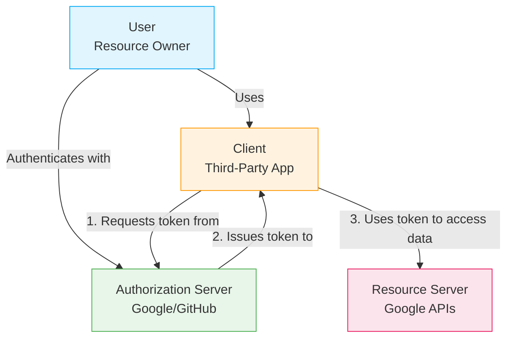
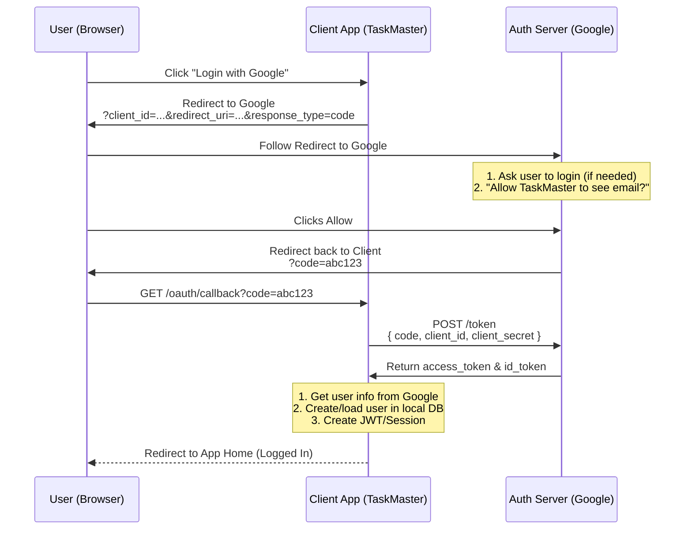

# Day 11: OAuth (Google Login, GitHub Login, OAuth Flow)
*(Simple language, step-by-step, from first principles — with Hinglish intuition, diagrams, production examples, and security best practices)*

***

## SECTION 1: INTUITION (Why OAuth Exists)

Think of a **hotel**:

1. You are a guest in the hotel.
2. You want to use:
   - The Gym.
   - The Pool.
   - The Spa.
3. You don’t want to give the receptionist at each place your **full ID + password**.
4. Instead, the main hotel desk gives you a **key card**:
   - The Gym scans the key card → *“Yes, this guest has access.”*
   - The Pool scans the key card → *“Yes.”*
   - No need to reveal your main hotel password anywhere else.

**OAuth is like that key card system:**
- You have an account on **Google** (or GitHub).
- You want to log in to a **new app** (e.g., “TaskMaster”).
- You don’t want to create a new password for TaskMaster (and you definitely don't want to give TaskMaster your Google password!).
- You click **“Login with Google”**.
- Google:
  - Verifies you.
  - Gives TaskMaster a **token** (like a key card).
  - The token says: *“This is user X, email X, name X.”*
- TaskMaster trusts Google and creates your account.

> [!TIP]
> **Hinglish Intuition:**  
> - **OAuth** = Ek “key card” system jo Google/GitHub ne aapko diya.  
> - App kehta hai: “Tumhara account Google pe already hai, bas Google mujhe ek token de de ki tum kaun ho.”  
> - Google app ko token de deta hai, aur app tumhe login karwa leta hai.

***

## SECTION 2: CORE CONCEPTS

### 2.1 What is OAuth?

**OAuth = Open Authorization** (OAuth 2.0 is the modern standard).

It’s a protocol that lets a **third-party app** (e.g., TaskMaster) access your account on another service (e.g., Google) **without ever seeing your password**.

**Key roles:**
1. **User (Resource Owner):** You (the person).
2. **Client (Third-Party App):** TaskMaster, Zoom, Slack, etc.
3. **Authorization Server:** Google, GitHub, Microsoft (the entity that verifies you).
4. **Resource Server:** Where your data actually lives (Google APIs, GitHub APIs).

**OAuth Flow at a glance:**
- Client → Authorization Server → get token.
- Client → Resource Server → use token to access data.

***

### 2.2 OAuth vs Regular Login

**Regular (Password) Login**:
- You create an account on the app.
- The app stores your password (hashed).
- You log in with an email + password directly into the app.

**OAuth Login**:
- You already have an account on Google/GitHub.
- You click “Login with Google/GitHub”.
- Google/GitHub verifies you on their own site.
- Google/GitHub tells the app: *“This is user X, email X.”*
- The app creates your account internally using that trusted info.
- You **never** give the app your Google password.

***

## SECTION 3: VISUAL DIAGRAMS

### Diagram 1: OAuth Roles



***

### Diagram 2: OAuth 2.0 Authorization Code Flow



***

## SECTION 4: OAUTH 2.0 AUTHORIZATION CODE FLOW (Step-by-Step)

This is the **most common and secure** OAuth flow for web apps.

### Pre-Setup
1. You register your app with Google (in Google Cloud Console).
   - You receive a `client_id` (public).
   - You receive a `client_secret` (private, keep this hidden!).
2. You configure a `redirect_uri` (where Google sends the user after login).
   - Example: `https://taskmaster.com/oauth/callback`.

***

### Step 1: User Clicks “Login with Google”
The client app generates a link and redirects the user:
```http
https://accounts.google.com/o/oauth2/v2/auth
?client_id=YOUR_CLIENT_ID
&redirect_uri=https://taskmaster.com/oauth/callback
&response_type=code
&scope=email profile
&state=randomString123
```
- `response_type=code`: We are asking for an **authorization code**.
- `scope`: What data we want to access (email, profile).
- `state`: A random string generated by the client to prevent CSRF attacks.

***

### Step 2: Google Verifies User
- If the user isn't logged into Google, Google asks them for their password.
- Google shows a consent screen: *“Allow TaskMaster to see your email and profile?”*
- The user clicks **Allow**.

***

### Step 3: Google Redirects Back with Code
Google redirects the user's browser back to your app:
```http
https://taskmaster.com/oauth/callback?code=abc123xyz&state=randomString123
```
- `code`: A short-lived, one-time-use authorization code.
- `state`: The client verifies this matches the original string it sent (CSRF protection).

***

### Step 4: Client Exchanges Code for Token
Your backend server makes a secure, server-to-server POST request to Google:
```http
POST https://accounts.google.com/o/oauth2/v2/token
{
  "code": "abc123xyz",
  "client_id": "YOUR_CLIENT_ID",
  "client_secret": "YOUR_CLIENT_SECRET",
  "redirect_uri": "https://taskmaster.com/oauth/callback",
  "grant_type": "authorization_code"
}
```
Google verifies the `code` and the `client_secret`. If valid, it returns:
```json
{
  "access_token": "eyJh......",
  "token_type": "Bearer",
  "expires_in": 3600,
  "scope": "email profile",
  "id_token": "eyJb......."
}
```
- `access_token`: Used to call Google APIs on behalf of the user.
- `id_token`: A JWT containing the user's identity info (email, name).

***

### Step 5: Client Gets User Info
Your backend uses the token to get the user's details:
```http
GET https://www.googleapis.com/oauth2/v2/userinfo
Authorization: Bearer access_token
```
Google returns:
```json
{
  "id": "google-user-id",
  "email": "raj@gmail.com",
  "name": "Raj",
  "picture": "https://..."
}
```

***

### Step 6: Client Creates Local Account
1. **Check if user exists:** Query your DB by `googleId` or `email`.
2. **If they don't exist:** Create a new user record in your DB.
   - `googleId`: "google-user-id"
   - `email`: "raj@gmail.com"
   - No password is saved!
3. **If they do exist:** Log them in.
4. **Issue Session/JWT:** Generate your own app's session cookie or JWT and send it to the user.

*The user is now logged in to your app via OAuth!*

***

## SECTION 5: OAUTH SCOPES

**Scope** = What data your app wants to access from Google/GitHub.

**Common scopes:**
- Google: `email`, `profile`, `openid`.
- GitHub: `user`, `repo`.

When you request `&scope=email profile`, the user sees: *“Allow TaskMaster to see your email and profile?”*
If the user denies the consent screen, the OAuth flow fails and redirects back with an error.

***

## SECTION 6: SECURITY BEST PRACTICES

### 6.1 Use Authorization Code Flow (Not Implicit)
- **Old (Implicit Flow):** Returned the access token directly in the URL. Highly insecure as it leaks in browser history.
- **New (Authorization Code Flow):** Returns a one-time `code` in the URL. The backend securely exchanges the `code` for a token via a back-channel. Always use this.

### 6.2 Use the `state` Parameter
- The `state` parameter prevents CSRF (Cross-Site Request Forgery) attacks. 
- Always generate a random string, save it in a cookie, send it to Google, and verify it matches when Google redirects back.

### 6.3 Never Expose `client_secret` in the Frontend
- The `client_secret` is essentially your app's password to Google.
- If it leaks in your React/Vue code, anyone can impersonate your app.
- **Always exchange the code for a token on your backend server.**

### 6.4 Verify `id_token` Signature
If you rely on the `id_token` (which is a JWT):
- Verify the signature using Google’s public key.
- Verify `iss` (Issuer = Google).
- Verify `aud` (Audience = Your client_id).

***

## SECTION 7: GITHUB OAUTH (Similar to Google)

The flow is almost identical:
1. Register the app with GitHub to get `client_id` and `client_secret`.
2. Redirect user to:
   ```http
   https://github.com/login/oauth/authorize?client_id=YOUR_CLIENT_ID&redirect_uri=...&scope=user:email
   ```
3. GitHub redirects back with a `code`.
4. Your backend exchanges the `code` for an access token.
5. Your backend calls the GitHub API to get user info.
6. Create/login the user locally.

***

## SECTION 8: COMMON MISTAKES

1. **Using Implicit Flow:** Puts tokens in the URL where they can be stolen.
2. **Not checking `state`:** Leaves the app vulnerable to CSRF login hijacking.
3. **Exposing `client_secret` in frontend:** Allows hackers to impersonate your application.
4. **Not verifying `id_token`:** Allows attackers to forge fake identity tokens.
5. **Not handling missing emails:** Some providers (like GitHub) might return `null` for an email depending on user privacy settings. Handle this gracefully.
6. **Creating users without checking existing emails:** Can lead to duplicate accounts or account takeover if not handled carefully.

***

## SECTION 9: INTERVIEW-STYLE QUESTIONS

1. What is OAuth? Why do we use it instead of password-based login?  
2. Who are the 4 main roles in the OAuth protocol?  
3. Describe the **Authorization Code Flow** step by step.  
4. What is the `code` in OAuth? Why don't we just return the token immediately?  
5. What are `client_id` and `client_secret`?  
6. What is a `scope` in OAuth?  
7. What is the `state` parameter and what specific attack does it prevent?  
8. How does the client get user info from Google/GitHub after receiving the token?  
9. How do you create a local user session after a successful OAuth login?  
10. Why is the Implicit Flow deprecated in modern OAuth 2.0 implementations?

***

## SECTION 10: REVISION NOTES (CHEAT SHEET)

- **OAuth**: Protocol that lets third-party apps access user data without seeing their passwords.
- **Roles**: Resource Owner (User), Client (Your App), Authorization Server (Google), Resource Server (Google API).
- **Authorization Code Flow**:
  1. Redirect to Google with `client_id`, `scope`, `state`.
  2. User approves.
  3. Google redirects back with a short-lived `code`.
  4. Backend securely exchanges `code` + `client_secret` for tokens.
  5. Backend fetches user profile and creates a local session/JWT.
- **Security**: Never expose `client_secret`. Always use the `state` parameter to prevent CSRF.

***

## SECTION 11: HANDS-ON ASSIGNMENT

Implement **Google OAuth login** for a simple app:

### Endpoints
- `GET /login/google`: Generates the URL and redirects the user to Google.
- `GET /oauth/callback`: 
  - Handles the redirect from Google (grabs the `code`).
  - Exchanges the code for a token.
  - Fetches the user info.
  - Creates a local user account in the DB.
  - Issues a local JWT/Session and redirects to the app home page.

### Requirements
- Register an OAuth app in the Google Cloud Console.
- Use the server-side Authorization Code Flow.
- Implement the `state` parameter validation.

***

## SECTION 12: MINI PROJECT

Build an **OAuth-enabled blog app**:
- Users can login with Google OR GitHub.
- Users can view their profile and create posts.
- The app should link the OAuth identity to a local DB user record.
- Issue your own JWT or Session cookie after the OAuth flow completes.

***

## ACTIVE LEARNING – YOUR TURN

Answer these in your own words (Hinglish allowed):

1. What is OAuth? Why do we use it instead of password login?  
2. What are the 4 roles in OAuth?  
3. Describe the **Authorization Code Flow** in 5–6 steps.  
4. What is `code` in OAuth? What does the client do with it?  
5. What is `client_id` and `client_secret`? Why should `client_secret` never be in the frontend?  
6. What is a `scope`?  
7. What is `state`? Why is it critically important?  
8. After getting user info from Google, how do you create a local user in your own database?
